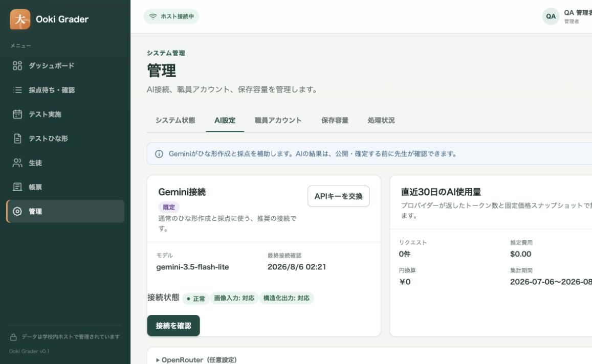
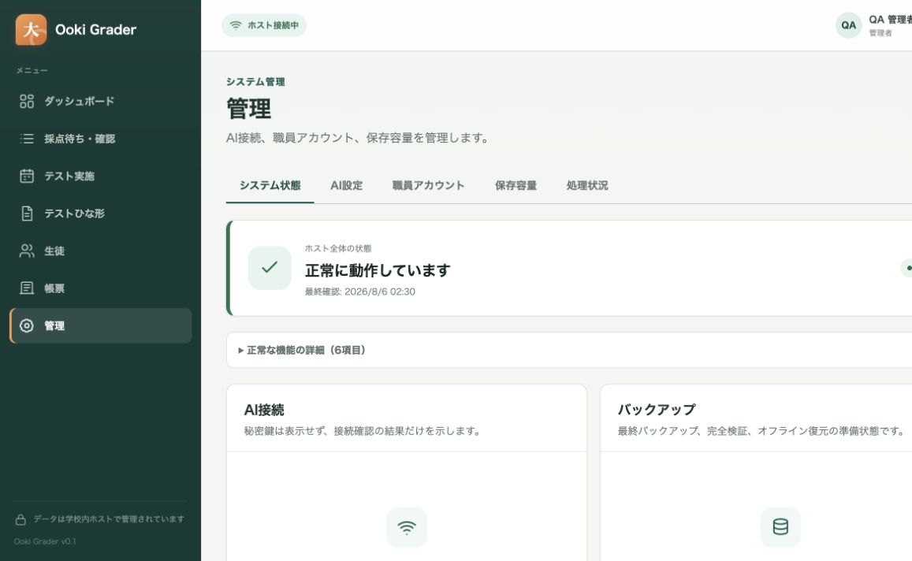

# Ooki Grader ホスト・アプリ セットアップ／運用ガイド

**対象:** 大木スクールのシステム管理者、Windows 技術担当者、バックアップ担当者  
**文書スナップショット:** 2026-08-06  
**対象モデル:** `gemini-3.5-flash-lite`  
**対象構成:** Windows 11 Pro x64 ホスト 1 台 + 校内 LAN 上の Edge / Chrome

> **重要:** この文書は、現在のリポジトリにある実装と技術担当者用スクリプトを説明するものです。現時点の実装を「本番運用可能」と宣言するものではありません。署名済みリリース、実機 Windows での一連の復旧訓練、学校の正解付き評価データによる精度承認が完了するまでは、無人の自動確定や学校記録の唯一の保管先として使用しないでください。

先生の日常操作は [日本語ユーザーガイド](../../output/pdf/ooki-grader-user-guide-ja.pdf) を参照してください。本書では、ホストの設置、Gemini／OpenRouter、TLS、バックアップ、保守、障害対応を扱います。

## 1. 最初に理解すること

Ooki Grader は、次の最小構成で動作します。

- Windows ホスト上の `OokiGrader.Host` Windows Service が、Web アプリ、API、SQLite データベース、画像・帳票ファイル、バックグラウンド処理を担当します。
- 先生は、校内 LAN の Edge または Chrome から、ホストの正式な HTTPS URL だけを開きます。
- AI を使う場合、ホストだけが `https://generativelanguage.googleapis.com/` へ HTTPS 接続します。先生の端末に API キーは保存しません。
- データベースと管理ファイルは `DataRoot`、実行ファイルは `InstallRoot`、バックアップは別の `BackupRoot` に分離します。
- ホストをインターネットへ直接公開しません。Windows Firewall は、指定した校内のプライベート IP / CIDR だけを許可します。

先生向けの AI 操作に、設問境界の座標や枠指定はありません。問題・解答欄が混在する日本語テストもページ全体から読み取り、内部で必要な詳細確認を行います。また、現行 UI には Gemini Batch、優先度、急送、キャンセル等のバッチ操作はありません。先生は「アップロード → AI 下書き → 例外だけ確認 → 公開／確定」という一つの流れを使います。

## 2. 役割分担

| 役割 | 主な担当 | してはいけないこと |
| --- | --- | --- |
| システム管理者 | 初期管理者、職員アカウント、AI 接続、システム状態、バックアップ確認 | API キーを文書・チャット・画面写真へ残す |
| Windows 技術担当者 | DNS、証明書、サービス、ACL、Firewall、更新、復元 | 稼働中 DB の手動コピー、操作マーカーの独断削除 |
| バックアップ担当者 | 暗号化保存先、完全検証、隔離復元訓練、保管期間 | 同一ディスクだけをバックアップと見なす |
| 先生 | ひな形確認、採点確認、公開・確定 | AI の提案を未確認で公開・確定する |

アプリ内の権限は、`管理者`、`先生`、`スキャン担当`、`閲覧専用` に分かれます。常用アカウントへ必要以上の管理者権限を与えないでください。最終管理者は無効化できませんが、事故対応のため、異なる担当者が管理する管理者アカウントを 2 つ用意することを推奨します。

## 3. 導入前チェックシート

作業前に、以下を紙または学校の承認済み台帳へ記録します。API キーや初期設定トークンそのものは記録しません。

| 項目 | 記入例 | 必須確認 |
| --- | --- | --- |
| リリース版 | `0.1.0` | 承認済み版と一致 |
| 配布物 SHA-256 | 管理された配布台帳の値 | 受領物と一致 |
| Authenticode 署名者の拇印 | 別経路で受領 | 対象 PC で `Valid` |
| ホスト名 | `ooki-grader.local` | 証明書 SAN、DNS、URL が完全一致 |
| ホスト固定 IP | `192.168.10.20` | DHCP 予約または固定割当 |
| 許可する校内網 | `192.168.10.0/24` | `Any` / `Internet` / `LocalSubnet` は不可 |
| HTTPS ポート | `443` | 他プロセスが未使用 |
| `InstallRoot` | `C:\Program Files\Ooki Grader` | ローカル、`Program Files` 配下 |
| `DataRoot` | `D:\OokiGraderData` | ローカル NTFS、165 GiB 以上の空き |
| `BackupRoot` | `E:\OokiGraderBackup` | DataRoot と別、暗号化済み |
| バックアップへ画像を含めるか | はい／いいえ | 復旧要件と一致 |
| 管理者責任者 | 氏名・連絡方法 | 主担当と副担当 |
| AI キー管理者 | 氏名のみ | Gemini／OpenRouter キーは学校管理アカウントで発行 |
| 保守時間帯 | 例: 日曜 18:00–20:00 | 先生へ事前通知 |
| RPO / RTO | 学校承認値 | 復元訓練で実測 |

### 3.1 ホストの最低条件

技術担当者用の事前検査は、次を確認します。

- Windows 11 Pro x64 の現行サポート対象ビルド
- 16 GiB RAM 以上（32 GiB 推奨）
- 8 論理プロセッサをパイロット目安とする
- `DataRoot` の NTFS ボリュームに 165 GiB 以上の空き
- BitLocker または学校承認の同等暗号化
- 校内プライベート IPv4、Windows のネットワークプロファイル `Private`
- Windows Time の同期、Microsoft Defender または承認済み代替製品
- 安定した電源、UPS、ホストの自動起動と再起動後点検手順
- 校内 DNS、固定アドレス、HTTPS 443、構成した外部 AI 宛ての送信 HTTPS / DNS

`InstallRoot`、`DataRoot`、`BackupRoot` は相互に包含しない別パスにします。`DataRoot` を Windows フォルダー、ユーザープロファイル、一時フォルダー、OneDrive 等の同期フォルダー、UNC 共有へ置かないでください。

## 4. リリース作成と検証

通常、学校の本番ホスト上でソースからビルドしません。管理された Windows ビルド端末でリリースを作成し、ハッシュと署名を別経路で承認します。

現在の技術担当者パッケージとセットアップ EXE は、PowerShell 7.4、.NET SDK 10、Node.js 24 以降（npm を含む）、Inno Setup 6 を使用して管理された Windows x64 ビルド端末で作成します。自己完結型パッケージを受け取る学校ホストには、ビルド用 SDK や Node.js を入れません。

```powershell
Set-Location C:\src\upgraded-ooki-grader
dotnet restore .\OokiGrader.slnx --runtime win-x64
$Version = '0.1.0'
$OutputRoot = 'C:\OokiGrader-Releases'
$SigningHook = 'C:\secure\Sign-Ooki.ps1'
$SignerThumbprint = '<承認済みコード署名証明書の拇印>'

pwsh -File .\installer\New-OokiGraderReleasePackage.ps1 `
  -Version $Version `
  -OutputRoot $OutputRoot `
  -SigningHook $SigningHook

$PackageRoot = Join-Path $OutputRoot "OokiGrader-$Version-win-x64"
pwsh -File .\installer\New-OokiGraderWindowsInstaller.ps1 `
  -PackageRoot $PackageRoot `
  -Version $Version `
  -OutputRoot $OutputRoot `
  -ExpectedSignerThumbprint $SignerThumbprint `
  -SigningHook $SigningHook
```

出力例は `C:\OokiGrader-Releases\OokiGrader-0.1.0-win-x64` です。Host とオフライン Tool は自己完結型で、`release-inventory.json` と `checksums.txt` が同梱されます。パッケージは不変として扱い、同じバージョン名へ上書きしません。

署名フックは、ペイロード内の署名対象を署名し、ビルド端末上で `Valid` を確認します。全対象の署名が成功したときだけ `productionSigningClaimed=true` が記録されます。セットアップ作成側は、完全なチェックサム一覧、余分なファイルがないこと、版、ランタイム、自己完結性、全署名対象の発行者拇印を再検査し、最後にセットアップ EXE 自体を同じ承認済み発行者で署名します。

出力は次の 3 ファイルです。

- `OokiGrader-Setup-0.1.0-x64.exe`
- `OokiGrader-Setup-0.1.0-x64.json`
- `OokiGrader-Setup-0.1.0-x64.sha256`

同じ版の出力は上書きされません。JSON には入力パッケージのファイル数、セットアップの SHA-256、署名検証状態、残る実機ゲートが記録されます。`.sha256` はセットアップ EXE と別の管理経路でも配布し、受領側で照合してください。

### 4.1 セットアップ EXE の境界

`OokiGrader.Setup.iss` と `New-OokiGraderWindowsInstaller.ps1` はリポジトリに含まれます。ただし、Inno Setup のコンパイルと Authenticode 署名は Windows 専用です。macOS 上で作成した未署名 EXE を代用品にしません。学校へ渡す前に、別のクリーンな Windows 11 Pro x64 で署名、ハッシュ、新規導入、再起動、同版修復、更新経路、アンインストールを確認します。

`-AllowUnsignedDevelopmentBuild` は隔離された開発試験専用です。本番・パイロット・先生用 PC では使用しません。

## 5. TLS 証明書と校内 DNS

### 5.1 証明書の原則

- URL、DNS、証明書の主要 DNS 名を完全に一致させます。
- 既存の学校管理 CA を使用できる場合は、その CA を優先します。
- ローカル CA を作る場合は、管理されたパイロット用途に限定し、CA 秘密鍵をホストへ放置しません。
- クライアントへ配るのは公開 CA 証明書 `.cer` だけです。ホスト秘密鍵を含む `.pfx` は配りません。
- 証明書警告を「詳細設定から続行」で回避しません。
- アプリ実行ファイルの Authenticode 署名と HTTPS 証明書は別物です。

学校 CA がある場合は、その秘密鍵を持つ証明書の拇印を指定してホスト証明書を発行します。ローカル CA を明示的に作る例は次のとおりです。

```powershell
$DnsName = 'ooki-grader.local'
$CertWork = 'C:\OokiGrader-Setup\certificates'

pwsh -File C:\OokiGrader-Releases\OokiGrader-0.1.0-win-x64\New-OokiGraderCertificate.ps1 `
  -PrimaryDnsName $DnsName `
  -OutputDirectory $CertWork `
  -CreateLocalCa `
  -AcknowledgeLocalCaPrivateKeyRisk
```

出力の `certificate-metadata.json` から、ホスト PFX のパス、公開 CA のパス、拇印を確認します。拇印は別経路で承認者へ渡します。ホスト証明書は 30 日以上有効で、TLS Server Authentication 用である必要があります。

### 5.2 クライアントの信頼設定

各承認済み Windows 端末で、管理者 PowerShell から公開 CA と、別経路で受け取った期待拇印を指定します。

```powershell
pwsh -File .\Install-OokiGraderPeerTrust.ps1 `
  -CaCertificatePath C:\OokiGrader-Trust\ooki-grader-local-ca.cer `
  -ExpectedThumbprint '<公開CAの拇印>'
```

その後、Edge / Chrome で正式 URL を開き、証明書警告がなく、証明書の DNS 名と期限が正しいことを確認します。IP アドレス直打ちや別名 URL は使用しません。

### 5.3 初期設定時のホスト内名前解決

初期管理者の作成 API はループバック接続からだけ受け付けます。一方、変更リクエストの Origin は正式 URL と完全一致する必要があります。そのため、ホスト PC 上だけは正式 DNS 名が `127.0.0.1` または `::1` へ解決されるようにし、ホスト自身でも `https://ooki-grader.local/` を開きます。校内の他端末では、同じ名前をホストの校内固定 IP へ解決します。

この分割名前解決を用意できない場合は、初期設定を開始せず、DNS 担当者へ依頼してください。`localhost`、IP アドレス、HTTP、証明書警告の回避で代用しないでください。

## 6. ホストへのインストール

### 6.1 セットアップ EXE を使う（推奨）

1. `OokiGrader-Setup-0.1.0-x64.exe`、同名の `.sha256`、承認済み発行者の拇印を別経路で受け取ります。
2. `Get-FileHash -Algorithm SHA256` と `Get-AuthenticodeSignature` で、ハッシュ、`Valid`、発行者拇印、タイムスタンプを確認します。
3. Windows PowerShell ではなく、64-bit PowerShell 7.4 以降の `pwsh.exe` がインストール済みであることを確認します。セットアップも開始前に検査し、不足時は停止します。
4. EXE を管理者として実行します。データ保存先、正式 DNS 名、HTTPS ポート、許可する校内 CIDR、秘密鍵付きホスト証明書 PFX/P12 を入力します。
5. セットアップ内の事前検査が、パッケージの全チェックサムと署名、版、OS、NTFS、容量、ポート、パス分離を確認します。失敗時は表示内容を直してから再実行します。
6. 成功後、スタートメニューの `Ooki Grader を開く` と `状態を確認` を使用し、正式 URL と readiness を確認します。

セットアップ EXE はバックアップ先を勝手に決めません。初回ログイン後に管理画面で暗号化済み保存先を設定し、手動バックアップ、完全検証、隔離復元を確認してからスケジュールを有効にします。別バージョンが既に入っている場合、セットアップは上書き更新せず、検証済みバックアップを伴う `Upgrade-OokiGrader.ps1` を案内します。アンインストールはアプリを回復領域へ退避し、`DataRoot` は削除しません。

### 6.2 事前検査（技術担当者向け手動経路）

管理者 PowerShell で、実際のパスへ置き換えて実行します。

```powershell
$PackageRoot = 'C:\OokiGrader-Releases\OokiGrader-0.1.0-win-x64'
$Version = '0.1.0'
$DataRoot = 'D:\OokiGraderData'
$BackupRoot = 'E:\OokiGraderBackup'
$SignerThumbprint = '<承認済みコード署名証明書の拇印>'

pwsh -File "$PackageRoot\Test-OokiGraderPreflight.ps1" `
  -PackageRoot $PackageRoot `
  -Version $Version `
  -DataRoot $DataRoot `
  -BackupRoot $BackupRoot `
  -HttpsPort 443 `
  -ExpectedSignerThumbprint $SignerThumbprint
```

`state` が `ready` で、`blockingFailures` が `0` であることを確認します。CPU、BitLocker、ネットワークプロファイル、時刻同期、Defender 等の非ブロッキング警告も、理由と承認者を記録せずに無視しないでください。

`-AllowUnsignedDevelopmentBuild` は隔離された開発試験専用です。本番・パイロット配布の署名不足を回避する用途には使いません。

### 6.3 検査付きインストール（技術担当者向け手動経路）

```powershell
$Version = '0.1.0'
$PackageRoot = "C:\OokiGrader-Releases\OokiGrader-$Version-win-x64"
$DataRoot = 'D:\OokiGraderData'
$BackupRoot = 'E:\OokiGraderBackup'
$HostPfx = 'C:\OokiGrader-Setup\certificates\ooki-grader-host-<thumbprint>.pfx'
$DnsName = 'ooki-grader.local'
$SchoolSubnet = @('192.168.10.0/24')
$SignerThumbprint = '<承認済みコード署名証明書の拇印>'

pwsh -File "$PackageRoot\Install-OokiGrader.ps1" `
  -PackageRoot $PackageRoot `
  -Version $Version `
  -DataRoot $DataRoot `
  -BackupRoot $BackupRoot `
  -BackupDestinationEncryptionConfirmed `
  -HostCertificatePath $HostPfx `
  -DnsName $DnsName `
  -SchoolSubnet $SchoolSubnet `
  -HttpsPort 443 `
  -ExpectedSignerThumbprint $SignerThumbprint
```

`-BackupDestinationEncryptionConfirmed` は、保存先が実際に暗号化され、担当者が確認した場合だけ指定します。インストールは、パッケージ全ファイルのチェックサム、Host / Tool の署名、パスの分離、OS・容量・ポートを検査してから、次を構成します。

- `NT SERVICE\OokiGrader.Host` の Windows Service（遅延自動起動）
- 実行ファイルとデータの NTFS ACL
- ホスト証明書と Kestrel HTTPS
- 指定した校内 CIDR だけを許可する Private-profile Firewall 規則
- `appsettings.Production.json`
- データルート内の永続インストールマニフェスト
- HTTPS の `/health/ready` 確認

成功 JSON の `state` が `installed`、`endpoint` が正式 URL であることを保存します。失敗時にサービスが停止された場合、ファイルやデータを手動削除せず、「12. 障害対応」と Repair 手順へ進みます。

### 6.4 インストール直後の確認

```powershell
Get-Service -Name OokiGrader.Host
Get-NetFirewallRule -DisplayName 'Ooki Grader HTTPS'
Get-AuthenticodeSignature "$PackageRoot\OokiGrader.Host.exe"
Invoke-WebRequest 'https://ooki-grader.local/health/live' -UseBasicParsing
Invoke-WebRequest 'https://ooki-grader.local/health/ready' -UseBasicParsing
```

次も実施します。

1. ホスト再起動後、サービスが自動起動する。
2. ホストと承認済みクライアントの双方から正式 URL を開ける。
3. 証明書警告がない。
4. 許可していない VLAN / 端末から接続できない。
5. Windows Application イベントログのソース `Ooki Grader` に重大エラーがない。

## 7. 初回起動と管理者作成

1. ホスト PC 自身で、正式 URL を開きます。初期設定画面が出ない場合は、正式名がホスト上でループバックへ解決されているか確認します。
2. 管理者 PowerShell で `DataRoot\bootstrap-token.txt` を読みます。トークンをチャット、写真、チケット、クリップボード履歴へ残しません。
3. 画面にトークン、管理者ユーザー名、表示名、12 文字以上のパスワードを入力します。学校名はこのビルドで `大木スクール` として記録されます。
4. 完了後、トークンファイルが削除され、再利用できないことを確認します。
5. 新しい管理者でログインし、`管理 > 職員アカウント` から副管理者と必要な職員だけを作ります。

初期トークンは最長 24 時間です。期限切れのまま初期設定が未完了なら、サービスの通常再起動で新しいトークンが生成されます。データベースを直接編集しないでください。

## 8. AI 接続の設定

### 8.1 Gemini API キーを登録する（推奨）

1. 学校管理の Google AI Studio アカウントで Gemini API キーを発行します。
2. Ooki Grader の `管理 > AI設定` を開きます。
3. `接続を追加` を押し、API キーを貼り付けます。
4. 通常は応答待ち時間 `75` 秒、最大同時処理数 `2` から開始します。学校の評価なしに同時処理数を上げません。
5. `暗号化して保存` 後、`接続を確認` を実行します。
6. モデルが正確に `gemini-3.5-flash-lite`、接続状態が正常、最終接続確認が現在時刻になったことを確認します。



*図: 現行 UI の例。API キーは表示されません。モデル、接続確認、利用中の AI 機能を確認します。*

Windows 本番ホストでは、API キーは Windows DPAPI の改訂付きエンベロープとして保存され、画面へ再表示されません。キーをソース、`appsettings`、PowerShell 引数、環境変数の恒久設定、スクリーンショット、ログへ入れないでください。別の Windows ホストへ復元した場合、DPAPI の性質上、キーの再入力または再ラップが必要です。

ホストは Gemini へ送る際、正規化したページ全体と必要な内部詳細画像を使用します。座標や手描き枠は不要です。「プライバシー切り抜き」は使用しないため、テスト用紙に不要な個人情報を書き込ませない運用を徹底してください。

### 8.2 OpenRouter を追加する場合

OpenRouter は任意です。Gemini 接続とは別に `接続を追加` し、プロバイダーで `OpenRouter`、学校が評価した正確なモデル ID、学校管理の API キーを入力します。送信先はアプリ内で `https://openrouter.ai/api/v1/` に固定され、任意 URL は登録できません。

`接続を確認` は、認証、指定モデル、画像入力、strict structured output、利用量情報を実リクエストで確認します。さらに、対応パラメータ必須、データ収集経路の拒否、Zero Data Retention 必須でルーティングします。どれか一つでも満たさなければ接続はブロックされ、ひな形作成・氏名読み取り・答案画像の採点用プロファイルは作られません。

DeepSeek V4 Flash（`deepseek/deepseek-v4-flash` と固定版 `deepseek/deepseek-v4-flash-0731`）はテキスト専用です。実画像試験では構造化テキスト応答には成功したものの、画像入力対応エンドポイントがなく拒否されました。現行の画像ワークフローには使用せず、既定の Gemini 3.5 Flash Lite を維持します。詳細は [比較レポート](../../output/accuracy/openrouter-deepseek-v4-vs-gemini-report-2026-08-05.md) を参照してください。

OpenRouter の候補モデルを変えるだけでも、接続テストと学校の固定評価セットを再実行します。要求モデルと実際に返されたモデル／プロバイダーを証拠に残し、Gemini への自動フォールバックや未評価モデルへのルーティングは有効にしません。

### 8.3 AI 機能を確認する

接続テスト後、`利用中のAI機能` に次が表示されることを確認します。

- ひな形の作成
- 氏名の読み取り
- 答案の AI 採点
- 採点結果の再確認

プロファイルが古い、未承認、またはモデル不一致なら有効化しません。学校の固定評価データ、期待結果、証跡ファイルの SHA-256 を使った評価記録が必要です。評価値を推測で入力しないでください。パイロット承認を行う場合も `先生確認必須` とし、自動確定を有効にしません。

価格スナップショットや予算上限を使用する場合は、選択した提供元・モデルの公式価格を管理者が確認して登録します。Gemini はトークン数と価格スナップショット、OpenRouter は応答の `usage.cost` を実費として優先し、価格スナップショットは予約上限の計算にも使用します。OpenRouter が実費を返さない場合は無料扱いせず、保守的に予約額を維持します。OpenRouter で思考費用が出力単価に含まれるモデルは、思考単価を `0` として二重計上を避けます。価格未登録のまま有効な予算ガードを使うと、費用を安全に確定できないため AI 処理が停止します。

### 8.4 最小の受入テスト

実在の生徒情報を含まない承認済みサンプルで、次を順に実行します。

1. `問題のみ（未記入）` の日本語テストをアップロードする。
2. 元画像と AI 下書きが左右に表示される。
3. 設問番号、設問文、配点、正答が元画像と一致する。
4. AI が不確かな項目は個別確認として残る。
5. 先生が確認したものだけを公開する。
6. 匿名化した答案を 1 枚アップロードし、AI 提案と教師採点を全問比較する。
7. AI 結果を未確認で確定できないことを確認する。

穴埋め問題では、同じ番号の繰り返し、1 文中の複数空欄、かな／漢字、図表参照、手書き済み答案を重点的に確認します。ひな形作成時の入力種別を誤ると正答の権威が変わるため、`問題のみ（未記入）`、`模範解答入り`、`記入済み答案（AIが正答を作成）`、`別紙の模範解答` を正しく選びます。

## 9. 日常運用

### 9.1 毎日（開校前または最初の管理者ログイン時）

1. `管理 > システム状態` を開く。
2. `ホスト全体の状態` と `対応が必要な項目` を確認する。
3. Gemini の最終接続確認とモデルを確認する。
4. 最新バックアップの完了時刻と完全検証状態を確認する。
5. `保存容量` で物理空き容量と管理対象画像の使用量を確認する。
6. `処理状況` で失敗・停止・長時間待機がないか確認する。
7. 重大な警告があれば、新しいテストの取り込みを止めて担当者へ連絡する。



*図: 隔離した開発環境の正常表示例。この画像だけで本番ホストの正常性は証明できません。本番では各項目の現在時刻、警告本文、AI 接続、バックアップ状態を確認します。*

### 9.2 毎週

- 最新バックアップで `完全検証` を実行し、結果と日時を記録する。
- `復元計画を確認` が成功することを確認する。これは復元そのものではありません。
- 失敗ジョブ、再試行待ち、AI の 429 / 5xx / 構造検証失敗を確認する。
- 使用量、予算、選択した AI 提供元側のクォータを確認する。
- Windows Update、Defender、時刻同期、UPS の状態を確認する。
- 無効化すべき職員、不要な管理者権限、期限切れの一時パスワードを確認する。

### 9.3 毎月

- 暗号化バックアップの保存先、保持世代、空き容量を確認する。
- 隔離環境での復元訓練計画と、直近の RPO / RTO 実測を確認する。
- 証明書の残存期間を確認し、60 日前から更新作業を計画する。
- Windows 再起動後のサービス自動起動と LAN クライアント接続を確認する。
- 学校の職員台帳とアプリ内アカウントを突合する。
- 選択した AI 提供元の公式情報で、モデル提供状況、価格、クォータ、データ取扱条件に変更がないか確認する。
- AI の誤り・教師修正を集計し、固定評価セットへ追加する候補を選ぶ。

## 10. バックアップと復元

### 10.1 バックアップ設定の重要点

インストール例の既定では、バックアップ時刻はローカル時刻 02:00、日次 14 日、週次 8 週、月次 12 か月です。保存先が設定済み、暗号化確認済み、書き込み可能になるまでバックアップは有効になりません。

既定の `IncludeManagedScans` は `false` です。つまり、データベース、帳票、資格情報エンベロープ等を保護しても、元の答案画像を完全には復旧できません。学校の復旧要件で画像が必要なら、容量、個人情報、3 か月の画像保持方針を確認したうえで、承認済み構成として画像を含めます。RAID、同一 PC 内の別フォルダー、稼働中 SQLite ファイルの単純コピーはバックアップではありません。

画面からの操作は次のとおりです。

1. `手動バックアップ` を実行する。
2. 完了を待ち、最新レコードを選ぶ。
3. `完全検証` を実行する。
4. 完全検証済みになった後、`復元計画を確認` を実行する。
5. バックアップ ID、相対パス、マニフェスト SHA-256、検証時刻を復旧台帳へ記録する。

### 10.2 復元はオフライン作業

復元画面の `復元計画を確認` は読み取り専用です。実際の復元は、承認された保守時間に Windows 技術担当者が行います。

1. 先生へ停止時間を通知し、新規操作がないことを確認する。
2. 管理者がメンテナンスモードに入り、閲覧専用になったことを確認する。
3. 対象バックアップを再度完全検証し、ID、相対パス、マニフェスト SHA-256 を別担当者が照合する。
4. Windows Service を明示的に停止する。復元スクリプトは、稼働中サービスを暗黙に停止しない。
5. `Restore-OokiGrader.ps1` を、`-MaintenanceConfirmed`、`-OfflineConfirmed`、バックアップ ID と完全一致する `-ConfirmRestore` を付けて実行する。
6. 復元後のオフライン health、ロールバックスナップショット、操作マーカーを確認する。
7. Gemini 資格情報を再入力または再検証する。
8. 承認済みの復元後手順で、マーカー解除、メンテナンス終了、読み取り確認、サービス再開を行う。
9. ロールバックスナップショットは復元受入完了まで保持する。

```powershell
Stop-Service -Name OokiGrader.Host

pwsh -File 'C:\Program Files\Ooki Grader\installer\Restore-OokiGrader.ps1' `
  -VersionRoot 'C:\Program Files\Ooki Grader\versions\0.1.0' `
  -DataRoot 'D:\OokiGraderData' `
  -BackupDestination 'E:\OokiGraderBackup' `
  -BackupId '<26文字のバックアップID>' `
  -BackupRelativePath 'sets/2026/08/<同じバックアップID>' `
  -BackupManifestSha256 '<64桁SHA-256>' `
  -MaintenanceConfirmed `
  -OfflineConfirmed `
  -ConfirmRestore '<同じバックアップID>'
```

復元スクリプトは、成功してもサービスを停止したままにし、メンテナンスモード、復元マーカー、ロールバックスナップショットを残します。現在のリポジトリには、この最終解除を一つの承認済みコマンドで完了する技術担当者スクリプトがありません。実機で検証済みの復元後ランブックが完成するまでは、本番復元を行わず、操作マーカーを手作業で削除しないでください。

## 11. 更新、修復、アンインストール

### 11.1 更新

更新前に必ず、次を満たします。

- 新パッケージの全チェックサムと署名を検証済み
- 先生の操作停止と保守時間を承認済み
- メンテナンスモードへ移行済み
- 更新直前のバックアップを作成し、完全検証済み
- 現行データベースの health が正常、スキーマが現行
- `restore.in-progress` / `migration.in-progress` が存在しない
- 戻し方を別担当者が確認済み

`Upgrade-OokiGrader.ps1` は新しい版を別ディレクトリへ配置し、古い版を保持します。スキーマ変更前の失敗なら旧バイナリへ戻します。スキーマ変更後の失敗では、古いバイナリを起動せず、サービスを停止して復元計画を出します。これはデータ破損を避ける安全境界です。

SQLite の一部マイグレーションはテーブル再構築と非トランザクションの外部キー PRAGMA を含むため、完全検証済みバックアップなしに更新しません。クリーン Windows で `install → reboot → upgrade → failure rollback → restore` を完走したリリースだけを学校へ配布します。

### 11.2 修復

サービス、ACL、証明書、Firewall、Production 設定が壊れた場合は、対象版、データルート、正式 DNS、証明書、校内 CIDR を確認して `Repair-OokiGrader.ps1` を使います。修復は `restore.in-progress` または `migration.in-progress` があると中断します。その場合は、通常修復でマーカーを消そうとせず、該当する復旧手順へ進みます。

```powershell
pwsh -File 'C:\Program Files\Ooki Grader\installer\Repair-OokiGrader.ps1' `
  -VersionRoot 'C:\Program Files\Ooki Grader\versions\0.1.0' `
  -DataRoot 'D:\OokiGraderData' `
  -HostCertificatePath 'D:\OokiGraderData\certificates\ooki-grader-host.pfx' `
  -SchoolSubnet '192.168.10.0/24' `
  -DnsName 'ooki-grader.local' `
  -HttpsPort 443 `
  -ExpectedSignerThumbprint '<承認済み拇印>'
```

成功後、Tool の read-only health と HTTPS readiness の両方が正常であること、正式 URL から画面を開けることを確認します。

### 11.3 アンインストール

アンインストールは、先生がオフラインであることを明示確認して実行します。スクリプトは Windows Service と Firewall 規則を削除し、アプリファイルを同一ボリュームの回復フォルダーへ移動します。`DataRoot`、バックアップ、クライアントの CA 信頼は保持し、データの破壊削除は行いません。

```powershell
pwsh -File 'C:\Program Files\Ooki Grader\installer\Uninstall-OokiGrader.ps1' `
  -InstallRoot 'C:\Program Files\Ooki Grader' `
  -DataRoot 'D:\OokiGraderData' `
  -OfflineConfirmed
```

回復フォルダーとデータは、データベース・バックアップ・保持義務を別担当者が確認するまで削除しません。廃棄は学校の記録保持・個人情報廃棄手順で別途承認します。

## 12. 障害対応

### 12.1 ログイン時に「試行回数が上限」と出る

本番既定では、同一接続元 IP のログイン API は 15 分間に 5 回までです。さらに、同じアカウントでパスワードを 5 回誤ると 15 分間ロックされます。

1. それ以上試さず、最後の試行から 15 分待つ。
2. ユーザー名の全角／半角、キーボード、Caps Lock、保存済み古いパスワードを確認する。
3. 別の管理者が `職員アカウント` からパスワードを再設定する。再設定はアカウント側ロックを解除し、既存セッションを失効させる。
4. 同一端末の IP 制限は残り得るため、再設定後も待ち時間を守る。
5. 解除目的でサービス再起動、データベース編集、制限値の恒久緩和をしない。

### 12.2 AI 接続が動かない

順番に確認します。

1. `管理 > AI設定` で既定の Gemini モデルが `gemini-3.5-flash-lite` か。OpenRouter を追加した場合は、入力した正確なモデル ID か。
2. `接続を確認` が成功し、最終確認時刻が更新されたか。
3. 4 つの AI 機能の現行プロファイルが利用可能か。
4. 価格スナップショット、日次／月次予算、選択した提供元のクォータが処理を止めていないか。
5. ホストから Gemini は `generativelanguage.googleapis.com:443`、OpenRouter は `openrouter.ai:443` の DNS / HTTPS が許可されているか。
6. `処理状況` が再試行待ちなら、同じ操作を連打せず自動再試行を待つ。
7. 429、5xx、構造検証エラー、相関 ID、発生時刻を記録する。API キーや答案画像を通常のチケットへ添付しない。

キー交換後は必ず再度 `接続を確認` します。別ホストへの復元後もキーを再入力します。OpenRouter の場合は、指定モデルが画像入力と structured output の両方に対応するかも確認します。DeepSeek V4 Flash は画像タスクに使用できません。

### 12.3 AI のひな形・採点が間違う

- 公開または確定を止め、元画像と AI 下書きを見比べる。
- 入力種別が正しいか確認する。`記入済み答案（AIが正答を作成）` では、見えている生徒解答を模範解答として扱いません。
- 設問番号の重複、複数空欄、図表、ルビ、かな／漢字、配点を確認する。
- 低信頼、記述式、不完全な項目だけを先生が修正する。
- 同じ誤りが再現したら、匿名化した入力、期待値、実測値、バージョン、モデル、プロンプト版を固定評価セットへ追加する。

先生に座標や設問枠を描かせる回避策へ戻しません。元画像が下書き画面に表示されない場合は、公開せず、再読み込み、システム状態、保存容量、元アップロードの完全性を確認し、相関 ID と時刻を技術担当者へ渡します。`DataRoot\objects` のファイルを手動で移動・削除しないでください。

### 12.4 証明書警告、403、接続不可

| 症状 | 確認 |
| --- | --- |
| 証明書警告 | 正式 DNS 名、SAN、期限、端末時刻、公開 CA の拇印と LocalMachine Root |
| `ORIGIN_REJECTED` / 403 | IP や別名ではなく、Production 設定と完全一致する正式 HTTPS URL |
| 端末だけ接続不可 | 端末 VLAN が `SchoolSubnet` に含まれるか、Private Firewall 規則、DNS |
| 全端末で接続不可 | `Get-Service OokiGrader.Host`、443 の競合、`/health/live`、イベントログ |
| 503 メンテナンス | 意図した保守中なら閲覧のみ。予定外なら担当者が保守状態と操作マーカーを確認 |

証明書を更新する場合は、同じ正式 DNS を維持して `New-OokiGraderCertificate.ps1 -Renew` で新しい版を発行し、Repair でサービス設定と ACL を更新し、全端末で警告がないことを確認します。古い証明書や CA を、移行完了前に削除しません。

### 12.5 保存容量またはバックアップ警告

- 物理空きが 5 GiB の保護予備領域へ近づくと、新規アップロードは安全側で拒否されます。
- `保存容量` から管理対象データと保持処理を確認します。Explorer から画像を直接削除しません。
- バックアップ警告は、未設定、到達不能、未検証、26 時間超、72 時間超を区別して対応します。
- バックアップ先の切断、暗号化解除、権限変更、満杯を確認します。
- バックアップ先を変更する作業は、サービス停止と構成レビューを含む承認済み保守として行います。

### 12.6 Windows Service が起動しない

```powershell
Get-Service OokiGrader.Host
Get-WinEvent -FilterHashtable @{ LogName='Application'; ProviderName='Ooki Grader' } `
  -MaxEvents 50
```

証明書ファイル、サービス ACL、データ ACL、`appsettings.Production.json`、空き容量、操作マーカーを確認します。マーカーがなければ Repair を使用します。マーカーがある場合は、直前の restore / upgrade の復旧境界に従い、Repair や手動削除で先へ進めません。

## 13. 導入受入チェックリスト

以下を全て満たし、実施者、確認者、日時、証跡 SHA-256 を記録します。

### リリースとホスト

- [ ] リリース版、配布ハッシュ、Authenticode 署名者とタイムスタンプを独立確認した
- [ ] クリーンな Windows 11 Pro x64 実機でインストールした
- [ ] `InstallRoot`、`DataRoot`、`BackupRoot` が別で、NTFS / BitLocker / ACL が正しい
- [ ] Windows Firewall が承認済み校内 CIDR だけを許可する
- [ ] 再起動後にサービスが自動起動し、`/health/live` と `/health/ready` が成功する
- [ ] UPS、時刻同期、Windows Update、Defender、固定 IP、校内 DNS の担当者が決まっている

### TLS とクライアント

- [ ] 正式 URL、DNS、証明書 SAN が一致する
- [ ] ホストと承認済み端末で証明書警告がない
- [ ] 許可外ネットワークから接続できない
- [ ] 証明書更新日と担当者を台帳へ登録した

### アカウントと AI 接続

- [ ] 初期設定トークンが削除され、管理者を 2 名用意した
- [ ] 最小権限で先生、スキャン担当、閲覧専用を割り当てた
- [ ] Gemini キーを UI からだけ登録し、文書・ログ・写真に残していない
- [ ] モデルが `gemini-3.5-flash-lite`、接続テストが成功した
- [ ] OpenRouter を構成した場合、画像対応の評価済みモデルだけが接続テストと精度ゲートを通過している
- [ ] DeepSeek V4 Flash が画像タスクに有効化されておらず、自動プロバイダー切替が無効である
- [ ] 4 つの AI 機能を承認済み評価に基づき、先生確認必須で構成した
- [ ] 匿名サンプルで、元画像表示、ひな形作成、採点、教師修正、公開／確定を確認した
- [ ] 自動採点確定と自動生徒割当が無効である

### バックアップと復旧

- [ ] 保存先の暗号化、分離、容量、アクセス権を確認した
- [ ] 管理対象画像をバックアップへ含めるか、学校が明示承認した
- [ ] 手動バックアップ、完全検証、復元計画確認が成功した
- [ ] 隔離 Windows で実データ相当の復元訓練を完走した
- [ ] DPAPI 資格情報の再入力、RPO、RTO、ロールバック、保持期間を確認した
- [ ] 復元後のマーカー解除と保守終了を含む承認済みランブックがある

### 運用引継ぎ

- [ ] 毎日／毎週／毎月の担当者と代行者を決めた
- [ ] 障害連絡先、保守時間、重大度、停止判断を文書化した
- [ ] 先生へ AI の確認責任と、座標不要の最短フローを説明した
- [ ] 本書と教師向けユーザーガイドの版を台帳へ記録した

## 14. 現時点の制限と未完了ゲート

1. **精度:** 日本語の難しい穴埋め用紙 1 種に対する複数回の実画像検証は通過していますが、科目・学年・複数ページ・多様な筆跡を網羅した統計的承認ではありません。記述採点は特に教師確認が必要です。詳細は [穴埋めひな形精度レポート](../../output/accuracy/fill-in-template-generation-report-2026-08-05.md) と [採点修正検証レポート](../../output/accuracy/grading-fix-verification-report-2026-08-05.md) を参照してください。
2. **自動化の境界:** AI は下書きと採点提案を自動化しますが、公開・確定の責任は先生にあります。自動確定と自動生徒割当は無効のままです。
3. **Windows 証跡:** クリーン Windows 11 Pro x64 で、インストール、再起動、更新、失敗時ロールバック、修復、隔離復元、アンインストールを一続きで完走する外部ゲートが残っています。
4. **署名:** Authenticode 発行者、タイムスタンプ、配布経路の運用承認は外部ゲートです。未署名ビルドを本番へ使用しません。
5. **復元終結:** 復元スクリプトは安全のためサービス停止・操作マーカー・ロールバックスナップショットを残します。承認済みの復元終結ランブックが未検証です。
6. **画像バックアップ:** 既定では管理対象答案画像をバックアップへ含めません。学校の復旧要件に合わせた明示設定と容量検証が必要です。
7. **外部 AI:** モデル提供状況、価格、クォータ、プライバシー条件は変更され得ます。Gemini と、構成した場合の OpenRouter をリリースごとに再確認します。OpenRouter の任意接続は実装済みですが、DeepSeek V4 Flash は画像非対応であり、プロバイダー自動切替は無効です。
8. **秘密情報の移行:** Windows DPAPI の資格情報は別ホストへそのまま移せるとは限りません。復元時に API キーの再入力または再ラップが必要です。
9. **画面例:** 本書の画面写真は開発用データを使った現行 UI です。表示された警告や時刻は、本番ホストの正常性・異常性を示す証跡ではありません。

実装済み範囲と残るゲートの一次資料は [実装状況](../implementation-status.md) を参照してください。
