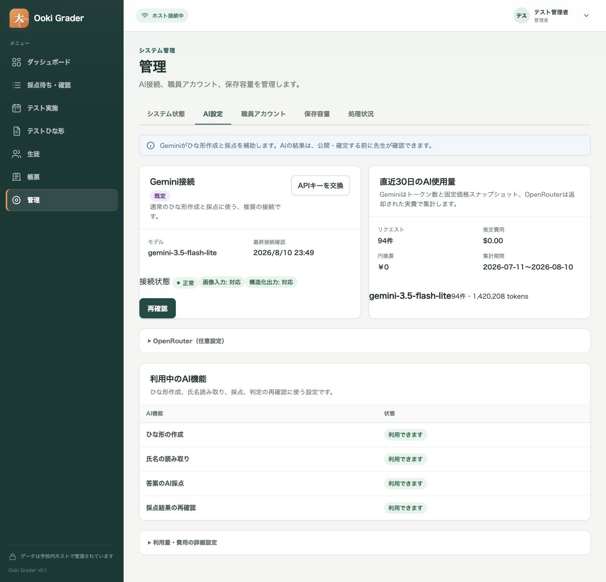
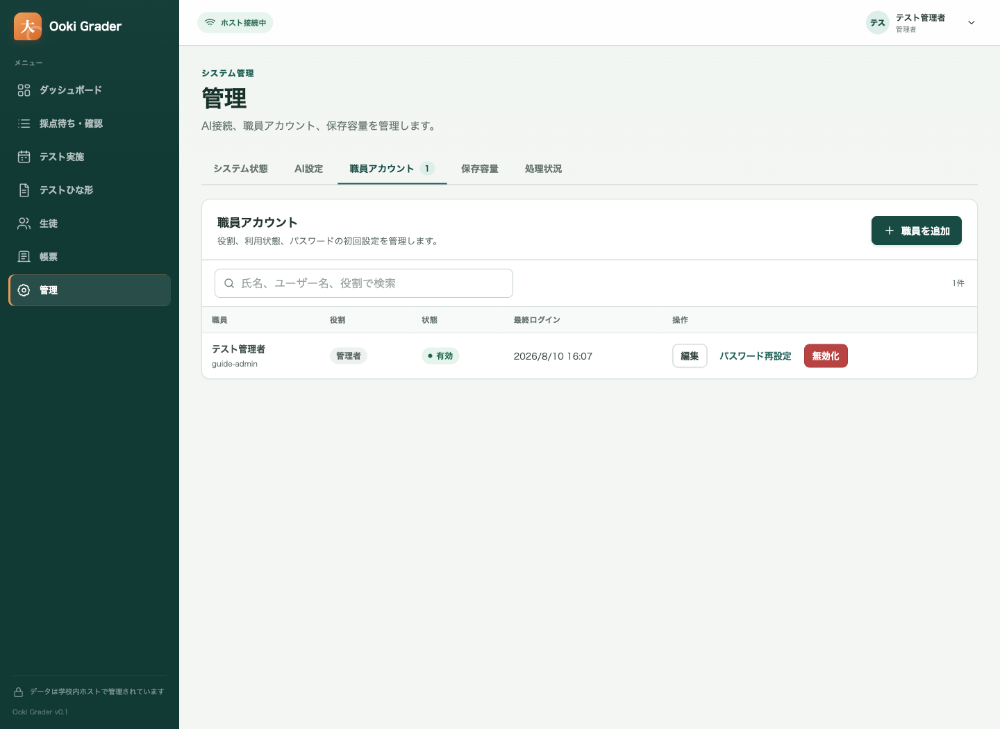
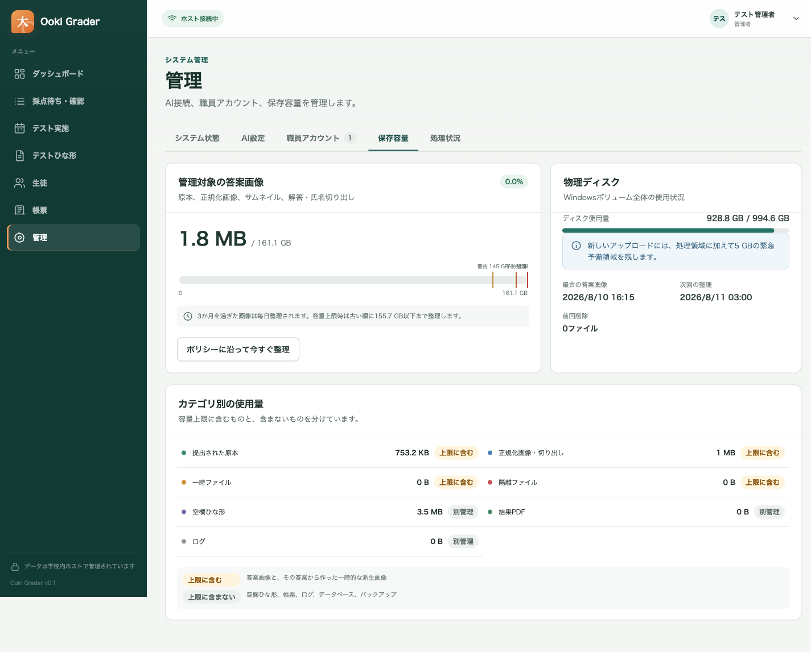
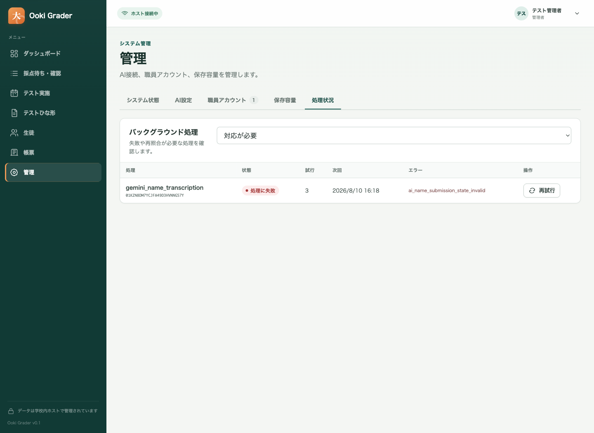
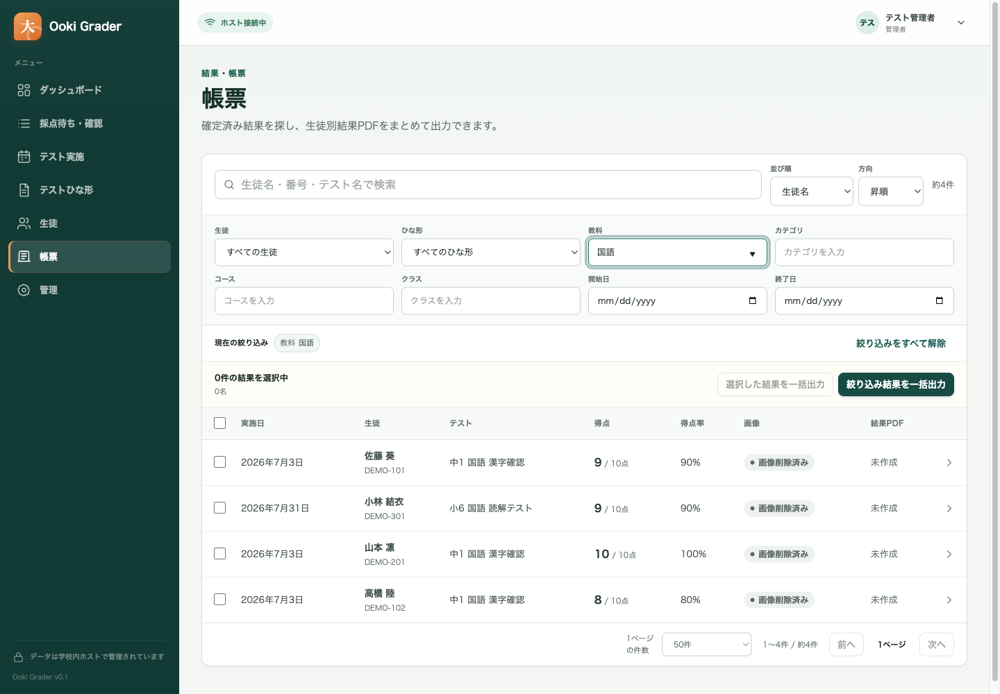
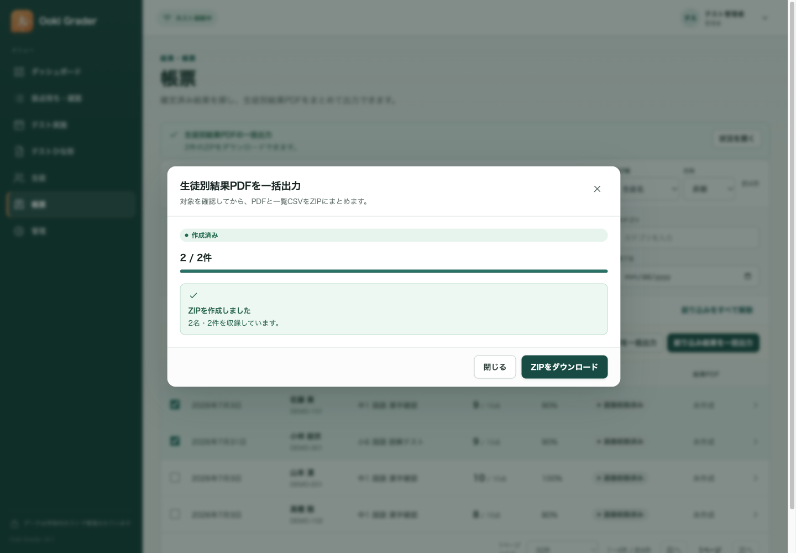

# Ooki Grader ホスト・アプリ セットアップ／運用ガイド

**対象:** 大木スクールのシステム管理者、Windows 技術担当者、バックアップ担当者  
**文書スナップショット:** 2026-08-11\
**対象モデル:** `gemini-3.5-flash-lite`  
**対象構成:** Windows 11 Pro x64 ホスト 1 台 + 校内 LAN 上の Edge / Chrome

> **重要:** この文書は、現在のリポジトリにある実装と技術担当者用スクリプトを説明するものです。現時点の実装を「無人運用可能」と宣言するものではありません。現地でのチェックサム検査、実機 Windows での一連の復旧訓練、学校の正解付き評価データによる精度承認が完了するまでは、無人の自動確定や学校記録の唯一の保管先として使用しないでください。

新規設置は [現地インストールガイド](onsite-installation-ja.md)、先生の日常操作は [日本語ユーザーガイド](../../output/pdf/ooki-grader-user-guide-ja.pdf) を参照してください。本書は設置後の管理を中心に、Gemini／OpenRouter、職員、TLS、バックアップ、保存容量、処理状況、更新、復元、障害対応を扱います。

## 1. 最初に理解すること

Ooki Grader は、次の最小構成で動作します。

- Windows ホスト上の `OokiGrader.Host` Windows Service が、Web アプリ、API、SQLite データベース、画像・帳票ファイル、バックグラウンド処理を担当します。
- 先生は、校内 LAN の Edge または Chrome から、ホストの正式な HTTPS URL だけを開きます。
- AI を使う場合、ホストだけが `https://generativelanguage.googleapis.com/` へ HTTPS 接続します。先生の端末に API キーは保存しません。
- データベースと管理ファイルは `DataRoot`、実行ファイルは `InstallRoot`、バックアップは別の `BackupRoot` に分離します。
- ホストをインターネットへ直接公開しません。Windows Firewall は、指定した校内のプライベート IP / CIDR だけを許可します。

先生向けの AI 操作に、設問境界の座標や枠指定はありません。問題・解答欄が混在する日本語テストもページ全体から読み取り、内部で必要な詳細確認を行います。また、現行 UI には Gemini Batch、優先度、急送、キャンセル等のバッチ操作はありません。先生は「アップロード → AI 下書き → 例外だけ確認 → 公開／確定」という一つの流れを使います。

## 2. 役割分担

| 役割 | 主な担当 | してはいけないこと |
| --- | --- | --- |
| システム管理者 | 初期管理者、職員アカウント、AI 接続、システム状態、バックアップ確認 | API キーを文書・チャット・画面写真へ残す |
| Windows 技術担当者 | DNS、証明書、サービス、ACL、Firewall、更新、復元 | 稼働中 DB の手動コピー、操作マーカーの独断削除 |
| バックアップ担当者 | 暗号化保存先、完全検証、隔離復元訓練、保管期間 | 同一ディスクだけをバックアップと見なす |
| 先生 | ひな形確認、答案受付開始、採点確認・確定 | AI の提案を未確認で受付開始・確定する |

アプリ内の権限は、`管理者`、`先生`、`スキャン担当`、`閲覧専用` に分かれます。常用アカウントへ必要以上の管理者権限を与えないでください。最終管理者は無効化できませんが、事故対応のため、異なる担当者が管理する管理者アカウントを 2 つ用意することを推奨します。

## 3. 導入前チェックシート

作業前に、以下を紙または学校の承認済み台帳へ記録します。API キーや初期設定トークンそのものは記録しません。

| 項目 | 記入例 | 必須確認 |
| --- | --- | --- |
| リリース版 | `0.1.0` | 承認済み版と一致 |
| 配布物 SHA-256 | 管理された配布台帳の値 | 受領物と一致 |
| 配布物の信頼方式 | 現地持込 + 全件チェックサム | 管理下の USB を直接使用 |
| ホスト名 | `ooki-grader.test` | 証明書 SAN、hosts、URL が完全一致 |
| ホスト固定 IP | `192.168.10.20` | DHCP 予約または固定割当 |
| 許可する校内網 | `192.168.10.0/24` | `Any` / `Internet` / `LocalSubnet` は不可 |
| HTTPS ポート | `443` | 他プロセスが未使用 |
| `InstallRoot` | `C:\Program Files\Ooki Grader` | ローカル、`Program Files` 配下 |
| `DataRoot` | `D:\OokiGraderData` | ローカル NTFS、165 GiB 以上の空き |
| `BackupRoot` | `E:\OokiGraderBackup` | DataRoot と別、暗号化済み |
| バックアップへ画像を含めるか | はい／いいえ | 復旧要件と一致 |
| 管理者責任者 | 氏名・連絡方法 | 主担当と副担当 |
| AI キー管理者 | 氏名のみ | Gemini／OpenRouter キーは学校管理アカウントで発行 |
| 保守時間帯 | 例: 日曜 18:00–20:00 | 先生へ事前通知 |
| RPO / RTO | 学校承認値 | 復元訓練で実測 |

### 3.1 ホストの最低条件

技術担当者用の事前検査は、次を確認します。

- Windows 11 Pro x64 の現行サポート対象ビルド
- 16 GiB RAM 以上（32 GiB 推奨）
- 8 論理プロセッサをパイロット目安とする
- `DataRoot` の NTFS ボリュームに 165 GiB 以上の空き
- BitLocker または学校承認の同等暗号化
- 校内プライベート IPv4、Windows のネットワークプロファイル `Private`
- Windows Time の同期、Microsoft Defender または承認済み代替製品
- 安定した電源、UPS、ホストの自動起動と再起動後点検手順
- 校内 DNS、固定アドレス、HTTPS 443、構成した外部 AI 宛ての送信 HTTPS / DNS

`InstallRoot`、`DataRoot`、`BackupRoot` は相互に包含しない別パスにします。`DataRoot` を Windows フォルダー、ユーザープロファイル、一時フォルダー、OneDrive 等の同期フォルダー、UNC 共有へ置かないでください。

## 4. リリース作成と検証

通常、学校のホスト上でソースからビルドしません。管理されたビルド環境で Windows x64 の自己完結型リリースフォルダーを作り、`release-inventory.json` と `checksums.txt` を含めて現地へ持ち込みます。

### 4.1 今回使用する現地持込方式

有料の Authenticode コード署名証明書は使用しません。代わりに、次の境界を守ります。

1. 設置担当者が管理する USB 等でリリースフォルダーを直接運ぶ。
2. メール、共有リンク、不明な Web サイトから同名ファイルを取り直さない。
3. `Install-OokiGraderOnSite.ps1` が、インストール前にチェックサム一覧の完全性、余分なファイル、版、Windows x64 ランタイムを検査する。
4. 未署名を受け入れる確認語 `UNSIGNED` は、配布元と物理的な管理を確認した設置担当者だけが入力する。
5. HTTPS は別の仕組みで、ホスト上に無料の専用ローカル CA を作り、ブラウザ警告のない暗号化通信を維持する。

この方式は `-AllowUnsignedDevelopmentBuild` を使う開発回避ではありません。`-AcceptChecksumVerifiedUnsignedOnSitePackage`／内部の `AllowChecksumVerifiedOnSitePackage` として、監査結果に `physically-controlled-checksum-verified-on-site-package` が残ります。

現地へ持ち込む主なファイルは次です。

- `release-inventory.json`
- `checksums.txt`
- `OokiGrader.Host.exe`
- `OokiGrader.Tool.exe`
- `Install-OokiGraderOnSite.ps1`
- `New-OokiGraderCertificate.ps1`
- `New-OokiGraderPeerTrustPackage.ps1`
- `Install-OokiGraderPeerTrust.ps1`

### 4.2 署名済みセットアップ EXE を将来使う場合

次の手順は、学校が将来 Authenticode 証明書を用意する場合の任意経路です。今回の現地設置には不要です。

現在の技術担当者パッケージとセットアップ EXE は、PowerShell 7.4、.NET SDK 10、Node.js 24 以降（npm を含む）、Inno Setup 6 を使用して管理された Windows x64 ビルド端末で作成します。自己完結型パッケージを受け取る学校ホストには、ビルド用 SDK や Node.js を入れません。

```powershell
Set-Location C:\src\upgraded-ooki-grader
dotnet restore .\OokiGrader.slnx --runtime win-x64
$Version = '0.1.0'
$OutputRoot = 'C:\OokiGrader-Releases'
$SigningHook = 'C:\secure\Sign-Ooki.ps1'
$SignerThumbprint = '<承認済みコード署名証明書の拇印>'

pwsh -File .\installer\New-OokiGraderReleasePackage.ps1 `
  -Version $Version `
  -OutputRoot $OutputRoot `
  -SigningHook $SigningHook

$PackageRoot = Join-Path $OutputRoot "OokiGrader-$Version-win-x64"
pwsh -File .\installer\New-OokiGraderWindowsInstaller.ps1 `
  -PackageRoot $PackageRoot `
  -Version $Version `
  -OutputRoot $OutputRoot `
  -ExpectedSignerThumbprint $SignerThumbprint `
  -SigningHook $SigningHook
```

出力例は `C:\OokiGrader-Releases\OokiGrader-0.1.0-win-x64` です。Host とオフライン Tool は自己完結型で、`release-inventory.json` と `checksums.txt` が同梱されます。パッケージは不変として扱い、同じバージョン名へ上書きしません。

署名フックは、ペイロード内の署名対象を署名し、ビルド端末上で `Valid` を確認します。全対象の署名が成功したときだけ `productionSigningClaimed=true` が記録されます。セットアップ作成側は、完全なチェックサム一覧、余分なファイルがないこと、版、ランタイム、自己完結性、全署名対象の発行者拇印を再検査し、最後にセットアップ EXE 自体を同じ承認済み発行者で署名します。

出力は次の 3 ファイルです。

- `OokiGrader-Setup-0.1.0-x64.exe`
- `OokiGrader-Setup-0.1.0-x64.json`
- `OokiGrader-Setup-0.1.0-x64.sha256`

同じ版の出力は上書きされません。JSON には入力パッケージのファイル数、セットアップの SHA-256、署名検証状態、残る実機ゲートが記録されます。`.sha256` はセットアップ EXE と別の管理経路でも配布し、受領側で照合してください。

### 4.3 セットアップ EXE の境界

`OokiGrader.Setup.iss` と `New-OokiGraderWindowsInstaller.ps1` はリポジトリに含まれます。ただし、Inno Setup のコンパイルと Authenticode 署名は Windows 専用です。macOS 上で作成した未署名 EXE を代用品にしません。学校へ渡す前に、別のクリーンな Windows 11 Pro x64 で署名、ハッシュ、新規導入、再起動、同版修復、更新経路、アンインストールを確認します。

`-AllowUnsignedDevelopmentBuild` は隔離された開発試験専用です。現地持込方式には、目的が明示された `Install-OokiGraderOnSite.ps1` を使用します。

## 5. TLS 証明書と校内 DNS

### 5.1 証明書の原則

- URL、DNS、証明書の主要 DNS 名を完全に一致させます。
- 標準名は `ooki-grader.test` です。ホストと職員 PC の管理対象 hosts 行でだけ解決します。
- HTTPS 用の専用ローカル CA は無料で、現地セットアップがホスト上に作ります。
- CA 秘密鍵はホストの `LocalMachine` 証明書ストアに非エクスポート可能として保存します。
- クライアントへ配るのは公開 CA 証明書 `.cer` だけです。ホスト秘密鍵を含む `.pfx` は配りません。
- 証明書警告を「詳細設定から続行」で回避しません。
- アプリ実行ファイルの Authenticode 署名と HTTPS 証明書は別物です。

通常は `Install-OokiGraderOnSite.ps1` が、次を自動で行います。

- ホスト IP と `ooki-grader.test` を SAN に含むサーバー証明書を発行
- 公開 CA をホストへ信頼登録
- ホスト用 PFX を制限された DataRoot 配下へ配置
- ホストの hosts ファイルへ `127.0.0.1 ooki-grader.test` の管理対象行を追加
- 公開 CA、正確なホスト IP、URL、チェックサムを固定した職員 PC 用パッケージを作成

`certificate-metadata.json` の `caPrivateKeyExportable` は `false` です。ホストを失うと同じ CA を別ホストへ移せないため、新しい CA を発行し、全職員 PC で新しい peer package を実行します。

### 5.2 クライアントの信頼設定

各承認済み Windows 端末で、現地セットアップが作った職員 PC 用フォルダー全体をコピーし、`Install-On-This-PC.cmd` を右クリックして `管理者として実行` します。

同コマンドは、公開 CA の SHA-256 と拇印、秘密鍵ファイルが含まれないことを検査してから、hosts 行、CA 信頼、デスクトップショートカットを構成し、実際の `/health/ready` へ接続します。職員 PC には PowerShell 7 は不要で、Windows 標準 PowerShell を使います。

その後、デスクトップの `Ooki Grader` を開き、証明書警告がないことを確認します。IP アドレス直打ちや別名 URL は使用しません。

### 5.3 初期設定時のホスト内名前解決

初期管理者の作成 API はループバック接続からだけ受け付けます。一方、変更リクエストの Origin は正式 URL と完全一致する必要があります。そのため、現地セットアップはホスト PC 上で `ooki-grader.test` を `127.0.0.1` へ、職員 PC 用パッケージでは同じ名前をホストの固定 IP へ解決します。

hosts ファイルに同じ名前の管理外行が既にある場合、スクリプトは上書きせず停止します。競合を確認してから再実行します。`localhost`、IP アドレス、HTTP、証明書警告の回避で代用しないでください。

## 6. ホストへのインストール

### 6.1 現地セットアップを使う（今回の推奨）

詳しい訪問手順と記録用チェックリストは [現地インストールガイド](onsite-installation-ja.md) を使用します。管理者 PowerShell 7.4 で、まず引数なしの対話実行を使います。DataRoot、ホスト IP、CIDR は検出値を確認してから確定します。

```powershell
Set-Location 'C:\OokiGrader-Setup\OokiGrader-0.1.0-win-x64'

pwsh -NoLogo -NoProfile -File .\Install-OokiGraderOnSite.ps1
```

暗号化済みバックアップ先を初回から構成する場合は、実際に暗号化済みであることを確認して次を使います。

```powershell
pwsh -NoLogo -NoProfile -File .\Install-OokiGraderOnSite.ps1 `
  -BackupRoot 'E:\OokiGraderBackup' `
  -BackupDestinationEncryptionConfirmed
```

自動検出できない環境だけ、`-DataRoot`、`-DnsName`、`-HostIpAddress`、`-SchoolSubnet` を明示します。

表示された URL、固定 IP、CIDR、DataRoot、BackupRoot、職員 PC 用パッケージ出力先を確認します。対話中の確認語は次の意味です。

| 確認語 | 意味 |
| --- | --- |
| `PRIVATE` | 表示された接続が信頼できる校内 LAN で、Private へ変更してよい |
| `ENCRYPTED` | BackupRoot が BitLocker 等で暗号化済み |
| `UNSIGNED` | 管理下の USB 等で直接受領し、全件チェックサム検査を受ける配布物 |
| `RESERVED` | ホスト IP が固定または DHCP 予約済み |
| `INSTALL` | 表示された構成で証明書、サービス、Firewall、データを設定してよい |

成功 JSON の `state` は `installed-and-verified` です。`peerTrustPackage` に示されたフォルダーを各職員 PC へコピーし、`Install-On-This-PC.cmd` を管理者実行します。

### 6.2 署名済みセットアップ EXE を使う（任意）

1. `OokiGrader-Setup-0.1.0-x64.exe`、同名の `.sha256`、承認済み発行者の拇印を別経路で受け取ります。
2. `Get-FileHash -Algorithm SHA256` と `Get-AuthenticodeSignature` で、ハッシュ、`Valid`、発行者拇印、タイムスタンプを確認します。
3. Windows PowerShell ではなく、64-bit PowerShell 7.4 以降の `pwsh.exe` がインストール済みであることを確認します。セットアップも開始前に検査し、不足時は停止します。
4. EXE を管理者として実行します。データ保存先、正式 DNS 名、HTTPS ポート、許可する校内 CIDR、秘密鍵付きホスト証明書 PFX/P12 を入力します。
5. セットアップ内の事前検査が、パッケージの全チェックサムと署名、版、OS、NTFS、容量、ポート、パス分離を確認します。失敗時は表示内容を直してから再実行します。
6. 成功後、スタートメニューの `Ooki Grader を開く` と `状態を確認` を使用し、正式 URL と readiness を確認します。

セットアップ EXE はバックアップ先を構成しません。バックアップ先は管理画面から変更できないため、今回の設置では `Install-OokiGraderOnSite.ps1 -BackupRoot` を使います。別バージョンが既に入っている場合、セットアップは上書き更新せず、検証済みバックアップを伴う `Upgrade-OokiGrader.ps1` を案内します。アンインストールはアプリを回復領域へ退避し、`DataRoot` は削除しません。

### 6.3 事前検査（署名済み手動経路）

管理者 PowerShell で、実際のパスへ置き換えて実行します。

```powershell
$PackageRoot = 'C:\OokiGrader-Releases\OokiGrader-0.1.0-win-x64'
$Version = '0.1.0'
$DataRoot = 'D:\OokiGraderData'
$BackupRoot = 'E:\OokiGraderBackup'
$SignerThumbprint = '<承認済みコード署名証明書の拇印>'

pwsh -File "$PackageRoot\Test-OokiGraderPreflight.ps1" `
  -PackageRoot $PackageRoot `
  -Version $Version `
  -DataRoot $DataRoot `
  -BackupRoot $BackupRoot `
  -HttpsPort 443 `
  -ExpectedSignerThumbprint $SignerThumbprint
```

`state` が `ready` で、`blockingFailures` が `0` であることを確認します。CPU、BitLocker、ネットワークプロファイル、時刻同期、Defender 等の非ブロッキング警告も、理由と承認者を記録せずに無視しないでください。

`-AllowUnsignedDevelopmentBuild` は隔離された開発試験専用です。本番・パイロット配布の署名不足を回避する用途には使いません。

### 6.4 検査付きインストール（署名済み手動経路）

```powershell
$Version = '0.1.0'
$PackageRoot = "C:\OokiGrader-Releases\OokiGrader-$Version-win-x64"
$DataRoot = 'D:\OokiGraderData'
$BackupRoot = 'E:\OokiGraderBackup'
$HostPfx = 'C:\OokiGrader-Setup\certificates\ooki-grader-host-<thumbprint>.pfx'
$DnsName = 'ooki-grader.test'
$SchoolSubnet = @('192.168.10.0/24')
$SignerThumbprint = '<承認済みコード署名証明書の拇印>'

pwsh -File "$PackageRoot\Install-OokiGrader.ps1" `
  -PackageRoot $PackageRoot `
  -Version $Version `
  -DataRoot $DataRoot `
  -BackupRoot $BackupRoot `
  -BackupDestinationEncryptionConfirmed `
  -HostCertificatePath $HostPfx `
  -DnsName $DnsName `
  -SchoolSubnet $SchoolSubnet `
  -HttpsPort 443 `
  -ExpectedSignerThumbprint $SignerThumbprint
```

`-BackupDestinationEncryptionConfirmed` は、保存先が実際に暗号化され、担当者が確認した場合だけ指定します。インストールは、パッケージ全ファイルのチェックサム、Host / Tool の署名、パスの分離、OS・容量・ポートを検査してから、次を構成します。

- `NT SERVICE\OokiGrader.Host` の Windows Service（遅延自動起動）
- 実行ファイルとデータの NTFS ACL
- ホスト証明書と Kestrel HTTPS
- 指定した校内 CIDR だけを許可する Private-profile Firewall 規則
- `appsettings.Production.json`
- データルート内の永続インストールマニフェスト
- HTTPS の `/health/ready` 確認

成功 JSON の `state` が `installed`、`endpoint` が正式 URL であることを保存します。失敗時にサービスが停止された場合、ファイルやデータを手動削除せず、「12. 障害対応」と Repair 手順へ進みます。

### 6.5 インストール直後の確認

```powershell
Get-Service -Name OokiGrader.Host
Get-NetFirewallRule -DisplayName 'Ooki Grader HTTPS'
Invoke-WebRequest 'https://ooki-grader.test/health/live' -UseBasicParsing
Invoke-WebRequest 'https://ooki-grader.test/health/ready' -UseBasicParsing
```

次も実施します。

1. ホスト再起動後、サービスが自動起動する。
2. ホストと承認済みクライアントの双方から正式 URL を開ける。
3. 証明書警告がない。
4. 許可していない VLAN / 端末から接続できない。
5. Windows Application イベントログのソース `Ooki Grader` に重大エラーがない。

## 7. 初回起動と管理者作成

1. ホスト PC 自身で、正式 URL を開きます。初期設定画面が出ない場合は、正式名がホスト上でループバックへ解決されているか確認します。
2. 管理者 PowerShell で `DataRoot\bootstrap-token.txt` を読みます。トークンをチャット、写真、チケット、クリップボード履歴へ残しません。
3. 画面にトークン、管理者ユーザー名、表示名、12 文字以上のパスワードを入力します。学校名はこのビルドで `大木スクール` として記録されます。
4. 完了後、トークンファイルが削除され、再利用できないことを確認します。
5. 新しい管理者でログインし、`管理 > 職員アカウント` から副管理者と必要な職員だけを作ります。

初期トークンは最長 24 時間です。期限切れのまま初期設定が未完了なら、サービスの通常再起動で新しいトークンが生成されます。データベースを直接編集しないでください。


*図: 現行のホスト限定初期設定画面。トークン等は空欄で、秘密情報は写していません。初期管理者作成後は通常の職員ログイン画面へ移ります。*

## 8. AI 接続の設定

### 8.1 Gemini API キーを登録する（推奨）

1. 学校管理の Google AI Studio アカウントで Gemini API キーを発行します。
2. Ooki Grader の `管理 > AI設定` を開きます。
3. 初回は `接続を追加`、交換時は `APIキーを交換` を押し、API キーを貼り付けます。
4. 通常は折りたたまれた詳細設定を変更しません。必要な場合だけ応答待ち時間と最大同時処理数を確認します。
5. `接続を確認して有効化` を押します。ホストは候補キーを保存する前に、認証、正確なモデル、画像入力、strict structured output、利用量情報、実画像タスクをサーバー側で確認します。
6. 全項目が成功したときだけ、キーが暗号化保存され、ひな形作成、氏名読み取り、答案の AI 採点、採点結果の再確認の現行設定が一括で利用可能になります。
7. モデルが正確に `gemini-3.5-flash-lite`、接続状態が正常、最終接続確認が現在時刻、4 機能がすべて `利用できます` であることを確認します。



*図: 現行 UI の例。API キーは表示されません。モデル、最終接続確認、4 つの AI 機能の利用可否を確認します。*

Windows 本番ホストでは、API キーは Windows DPAPI の改訂付きエンベロープとして保存され、画面へ再表示されません。キーをソース、`appsettings`、PowerShell 引数、環境変数の恒久設定、スクリーンショット、ログへ入れないでください。別の Windows ホストへ復元した場合、DPAPI の性質上、キーの再入力または再ラップが必要です。

接続確認の一部でも失敗した場合は、入力した候補キーを保存せず、以前の正常なキー、接続状態、4 機能の設定をそのまま維持します。交換時に結果を確定できなかった場合も同様です。失敗後に古い接続を削除したり、4 機能を手動で設定し直したりせず、エラーと相関 ID を控えて原因を直し、もう一度同じボタンから試します。

ホストは Gemini へ送る際、サーバーが決定したページ範囲の正規化済みページ全体を使用します。座標、手描き枠、分類用の追加画像は不要です。「プライバシー切り抜き」は使用しないため、テスト用紙に不要な個人情報を書き込ませない運用を徹底してください。

### 8.2 OpenRouter を追加する場合

OpenRouter は任意の上級者向け設定です。Gemini の一括有効化とは別に `接続を追加` し、プロバイダーで `OpenRouter`、学校が評価した正確なモデル ID、学校管理の API キーを入力して、まず接続を保存します。保存後に対象カードの `再確認` を手動で実行します。OpenRouter では Gemini の `接続を確認して有効化` を使用しません。送信先はアプリ内で `https://openrouter.ai/api/v1/` に固定され、任意 URL は登録できません。

`再確認` は、認証、指定モデル、画像入力、strict structured output、利用量情報を実リクエストで確認します。さらに、対応パラメータ必須、データ収集経路の拒否、Zero Data Retention 必須でルーティングします。どれか一つでも満たさなければ接続はブロックされます。合格後も、評価記録とプロファイルの有効化は上級者向けの手動手順として別に行います。

DeepSeek V4 Flash（`deepseek/deepseek-v4-flash` と固定版 `deepseek/deepseek-v4-flash-0731`）はテキスト専用です。実画像試験では構造化テキスト応答には成功したものの、画像入力対応エンドポイントがなく拒否されました。現行の画像ワークフローには使用せず、既定の Gemini 3.5 Flash Lite を維持します。詳細は [比較レポート](../../output/accuracy/openrouter-deepseek-v4-vs-gemini-report-2026-08-05.md) を参照してください。

OpenRouter の候補モデルを変えるだけでも、接続テストと学校の固定評価セットを再実行します。要求モデルと実際に返されたモデル／プロバイダーを証拠に残し、Gemini への自動フォールバックや未評価モデルへのルーティングは有効にしません。

### 8.3 AI 機能を確認する

Gemini の一括確認後、`利用中のAI機能` に次の 4 行が表示され、すべて `利用できます` であることを確認します。

- ひな形の作成
- 氏名の読み取り
- 答案の AI 採点
- 採点結果の再確認

通常の Gemini 設定では、管理者が評価記録を作成したり、パイロットを承認したり、4 機能を個別に有効化したりしません。`接続を確認` を手動実行した場合も、全能力確認の成功後に不足または古い現行設定が自動修復されます。ホスト起動時には、プロンプト、スキーマ、設定ハッシュの更新に合わせ、利用中の Gemini 設定が正確な現行版へ調整されます。実行中の処理は開始時の不変な設定を保持します。

固定評価セットと精度記録は、リリース判断や OpenRouter／モデル変更の上級運用には引き続き必要ですが、通常の Gemini 初期設定画面には表示しません。能力確認で利用可能になるのは AI の下書きと確認補助だけです。答案受付の開始、答案の生徒割当、採点結果の確定は自動化されず、先生の確認と明示操作が必要です。

価格スナップショットや予算上限を使用する場合は、選択した提供元・モデルの公式価格を管理者が確認して登録します。Gemini はトークン数と価格スナップショット、OpenRouter は応答の `usage.cost` を実費として優先し、価格スナップショットは予約上限の計算にも使用します。OpenRouter が実費を返さない場合は無料扱いせず、保守的に予約額を維持します。OpenRouter で思考費用が出力単価に含まれるモデルは、思考単価を `0` として二重計上を避けます。価格未登録のまま有効な予算ガードを使うと、費用を安全に確定できないため AI 処理が停止します。

### 8.4 最小の受入テスト

実在の生徒情報を含まない承認済みサンプルで、次を順に実行します。

1. ファイル選択欄が出る前に `試験タイプ` と `教科` が必須であることを確認する。`その他` の場合だけ `問題形式` の `通常`／`穴埋め` が出る。
2. 3 ページの合成 HOP PDF を使い、`1ページごと`、作成予定 3 件と表示され、3 件が別々の下書きになることを確認する。
3. 6 ページの合成 STEP PDF を使い、2 ページずつ 3 件、固定接尾辞 `-1`／`-2`／`-3` と表示されることを確認する。5 ページの STEP は AI 利用前に拒否されることも確認する。
4. 90 度回転した合成ページを使い、原本を変更せずローカル補正し、補正後の 1 回だけ再送されることを確認する。再び向き補正を要求された場合は 3 回目を送らず停止する。
5. 最終確認で、まずファイル名と紙面の学年証拠を解決する。学年確定後、HOP は `{教科}{学年}年HOP{連番}`（例: `理科6年HOP1`）、STEP は `{教科}{学年}年STEPセット{セット番号}-{枝番}`（例: `理科6年STEPセット2-1`）、クラス分けは `{教科}{学年}年クラス分けテスト`（例: `理科6年クラス分けテスト`）と自動表示され、編集できないことを確認する。AI が読み取った紙面名は参照用の証跡にすぎず、最終名称を変えないことも確認する。
6. `その他` だけは、AI が読み取った紙面名を初期候補として名称を編集できること、名称が未解決または重複したままでは確定できないことを確認する。
7. `確認してテンプレートを作成` で全件が一括処理され、途中の 1 件だけが作成されないこと、STEP 3 件のテンプレート／版／問題 ID が別々であることを確認する。
8. 元画像と AI 下書きを比較し、設問番号、設問文、配点、正答が一致すること、AI が不確かな項目は個別確認として残ることを確認する。すべての対応形式で `AIで判定（おすすめ）` が初期選択され、部分点の単位は通常 1 点、`先生が必ず確認` は初期状態でオフです。必要な問題だけ完全一致、数値、選択式、先生採点へ変更します。既存問題で明示した設定は自動変更されません。入力がそろったら `すべての問題を確認` を使い、残った不足項目だけを直します。
9. `受付を開始` を押し、ひな形の試験名・教科・学年・カテゴリ・コースが固定表示され、入力が実施日と任意の対象クラスだけであることを確認する。開始後は同じ操作内でひな形版が確定し、受付中の答案画面へ移ることを確認する。
10. 匿名化した答案を 1 枚アップロードし、AI 提案と教師採点を全問比較する。
11. AI 結果を未確認で確定できないことを確認する。

穴埋め問題では `その他` と `穴埋め` を先に選択し、同じ番号の繰り返し、1 文中の複数空欄、かな／漢字、図表参照を重点的に確認します。新規作成画面には旧資料区分、AI による試験タイプ判定、ページ分割、向き、STEP バリエーション、初期学年の選択肢を表示しません。

### 8.5 1 ページ PDF の答案を順番に取り込む

スキャナーが答案を 1 ページずつ別の PDF として出力する場合も、ファイル名に生徒名を付ける必要はありません。`受付を開始` したテスト実施は、その時点で確定したひな形版の答案ページ数を使用します。HOP は 1 枚、STEP は選択した登録済みバリエーション／テスト実施ごとに 2 枚です。STEP の `-1`／`-2`／`-3` は別々のテストなので、作成元の 6 ページ一式を 1 人分として取り込みません。クラス分けテストと `その他` は確定したひな形全体のページ数で、1 答案の上限は 50 ページです。`その他` は 3、4、16 ページなどでも同じ処理になります。後から新しいひな形版を確定しても、受付中のテスト実施は開始時の版を使い続けます。

1. 生徒 1 人分の全ページを、1 ページ目から最後のページまで続けてスキャンする。
2. 次の生徒へ移り、同じ順番を繰り返す。異なる試験や STEP バリエーションを同じ取り込みバッチへ混ぜない。
3. ブラウザーの一覧で自然順に並んだファイルと、`答案 1: 1/2, 2/2` のような区切りを確認する。必要なら送信前に移動、削除、差し替えを行う。
4. `この順番でページを送信` を選ぶ。画面で確定した番号が生徒ごとの所属を決める一次情報であり、並列アップロードの完了順、時刻、ファイル名では組み替えられない。
5. サーバーは各 PDF が 1 ページであることと、各ページがひな形の 1 ページ目、2 ページ目……の役割に曖昧なく一致することを外部 AI へ送らずローカルで確認する。欠落、重複、別試験、順序違い、判定不能があれば答案を作成・採点せず、確認が必要な位置を表示する。
6. 正しい組だけが 1 件の複数ページ答案になる。通常の Gemini 処理では、最初の採点送信で 1 ページ目の氏名欄と答案を同時に読み、2 チャンク目以降は氏名を読まない。名簿は AI へ送られず、教師が氏名候補と採点結果を通常どおり確認する。

氏名は答案の 1 ページ目に記入させます。2 ページ目以降は直前の 1 ページ目と同じ生徒のものとして扱う、という運用上の前提です。後続ページに生徒識別情報がなく、別の生徒のページが偶然正しい位置へ入った場合、システムだけではその入れ違いを検出できません。そのため、生徒ごとの全ページを必ず連続してスキャンし、送信前に画面の答案区切りを確認してください。

### 8.6 多ページ答案の採点上限と再試行

3～50 ページの答案も画面上は 1 件の答案です。初回採点では、正規化済みページを元の順序のまま決定的な連続チャンクへ分けます。1 チャンクは最大 32 画像で、生画像の合計は「設定上限」「12 MiB」「Gemini のシステム指示・採点指示・スキーマ・JSON 余裕を含む直列化済み 18 MiB 上限から逆算した値」の最小値以下です。Base64 化で増える分も逆算に含みます。

全チャンクが正常終了してから 1 件の採点下書きを作ります。途中で再試行しても完了済みチャンクを再利用し、同じ利用量や費用を二重計上しません。同じ設問を複数チャンクが回答した場合は、後勝ちにせず、提案点 0・教師確認必須の `ai_chunk_observation_conflict` とします。設問が 300 件を超える、指示が上限を超える、または 1 ページだけで有効な送信上限を超える場合は、画像を AI へ送る前にローカルで停止します。画像を圧縮し直すか、ひな形／採点条件を確認し、部分的な採点結果を確定しないでください。

氏名確認より先に採点が終わった場合も、採点結果は捨てず非表示のまま待機します。教師が生徒を割り当てるか `判読できない` として未特定を明示すると、その同じ採点結果が有効になり、答案を AI へ再送しません。`生徒の答案ではない` を選んだ場合は、待機中の採点を結果として使用しません。

### 8.6.1 答案別にPDFと採点結果を確認する

`採点待ち・確認` またはテスト実施の答案一覧から `この答案をまとめて確認` を開きます。STEP の 2 ページや `その他` の多ページ答案は、順番取り込み時に作られた 1 件の PDF として表示されます。問題を選ぶと、その問題の根拠ページへ移動します。PDF を表示できないブラウザーでは `ページ画像` に切り替え、縮小画像から必要な 1 ページだけを読み込みます。

右側では全問題の読み取り結果、判定（正解・一部正解・不正解・無解答・判読困難）、点数、理由を確認し、必要な項目だけ修正して保存します。保存は履歴へ追加され、以前の採点を消しません。

同じ答案の未確認項目をすべて目視確認したら、`未確認N問を一括確認` を選び、件数と注意事項を読んでチェックします。この操作は点数や読み取りを変更せず、画面を開いた時点の未確認項目だけを確認済みにします。別の先生が途中で 1 件でも変更した場合は全件を中止して再読み込みを求めます。一括確認は答案の `確定` ではありません。氏名、重複、合計点などを確認したうえで、最後に別操作で確定します。

### 8.7 採点ルールと安全な整理

ひな形の問題を開き、`採点の詳細設定` で必要な項目だけを選びます。

- `完答`: 一部だけ正しい答案にも部分点を付けず、0 点にします。読取不能や曖昧な答案は、誤答へ決め打ちせず確認待ちに残します。
- `順不同`: 正解と答案を `、`、カンマ、`／`、セミコロン、`・`、または改行で区切り、全項目を重複回数も含めて照合します。通常の空白は区切りにしません。
- `漢字必須`: 正解に漢字がある場合、ひらがな・カタカナだけの同じ読みを不正解にします。個別に認める読みだけを `漢字必須の例外（読み）` へ1行に1つ登録します。通常の `正解として認める別表記` は、この設定を上書きしません。正解に漢字がなければ、この設定による違いはありません。

公開後の版は変更しません。修正は新しい下書き版で行い、公開前に 3 項目と正解・別表記・`漢字必須の例外（読み）`・配点を確認してください。

使わなくなったひな形は一覧の `アーカイブ` を使います。これは削除ではなく、通常一覧と新しいテスト実施の選択肢から外す安全な整理です。過去の版、テスト実施、答案、採点結果、監査履歴は残ります。状態を `アーカイブ` で絞り込むと `復元` できます。AI 下書き作成中はアーカイブできないため、完了または失敗を待って再実行します。

終了済みのテスト実施は、すべての答案が確定または取消済みになり、アップロード、重複確認、順番取り込み、採点ジョブが完了してからアーカイブします。未完了の種類が表示された場合は、その作業を終えて再実行します。アーカイブ後は確認／確定キューから外れ、履歴は読取専用で残りますが、受付を再開できません。生徒は在籍終了／再開、職員は無効化／再有効化を使い、採点履歴から参照される記録を物理削除しません。

## 9. 日常運用

### 9.1 毎日（開校前または最初の管理者ログイン時）

1. `管理 > システム状態` を開く。
2. `ホスト全体の状態` と `対応が必要な項目` を確認する。
3. Gemini の最終接続確認とモデルを確認する。
4. 最新バックアップの完了時刻と完全検証状態を確認する。
5. `保存容量` で物理空き容量と管理対象画像の使用量を確認する。
6. `処理状況` で失敗・停止・長時間待機がないか確認する。
7. 重大な警告があれば、新しいテストの取り込みを止めて担当者へ連絡する。


*図: 隔離した開発環境の正常表示例。この画像だけで本番ホストの正常性は証明できません。本番では各項目の現在時刻、警告本文、AI 接続、バックアップ状態を確認します。*

### 9.2 毎週

- 最新バックアップで `完全検証` を実行し、結果と日時を記録する。
- `復元計画を確認` が成功することを確認する。これは復元そのものではありません。
- 失敗ジョブ、再試行待ち、AI の 429 / 5xx / 構造検証失敗を確認する。
- 使用量、予算、選択した AI 提供元側のクォータを確認する。
- Windows Update、Defender、時刻同期、UPS の状態を確認する。
- 無効化すべき職員、不要な管理者権限、期限切れの一時パスワードを確認する。

### 9.3 毎月

- 暗号化バックアップの保存先、保持世代、空き容量を確認する。
- 隔離環境での復元訓練計画と、直近の RPO / RTO 実測を確認する。
- 証明書の残存期間を確認し、60 日前から更新作業を計画する。
- Windows 再起動後のサービス自動起動と LAN クライアント接続を確認する。
- 学校の職員台帳とアプリ内アカウントを突合する。
- 選択した AI 提供元の公式情報で、モデル提供状況、価格、クォータ、データ取扱条件に変更がないか確認する。
- AI の誤り・教師修正を集計し、固定評価セットへ追加する候補を選ぶ。

### 9.4 職員アカウントを管理する



*図: 架空の職員を使用した現行画面。役割、状態、パスワード変更待ちを同じ一覧で確認します。*

#### 職員を追加する

1. `管理 > 職員アカウント` を開く。
2. `職員を追加` を押す。
3. ユーザー名、表示名、必要最小限の役割、一時パスワードを入力する。
4. 保存後、一時パスワードを本人へ直接渡す。
5. 本人が 24 時間以内に一度だけ使用し、新しい固有パスワードへ変更したことを確認する。

#### パスワードを再設定する

1. 本人の表示名とユーザー名を確認する。
2. `パスワード再設定` を押す。
3. 新しい一時パスワードを設定する。
4. 既存セッションが失効することを本人へ伝える。
5. 30 分以内に本人が初回変更を完了する。

#### 無効化／再有効化する

- 退職、異動、長期不使用時は削除ではなく `無効化` を使います。
- 無効化と同時にログイン中のセッションを終了します。
- 最後の有効な管理者は無効化できません。先に副管理者を用意します。
- 再有効化しても以前のセッションは戻らず、本人が改めてログインします。

### 9.5 保存容量を確認する



*図: DataRoot の管理対象データと物理空き容量を分けて表示します。Explorer から答案画像を直接削除しません。*

1. `管理 > 保存容量` を開く。
2. 管理対象画像の使用量、150 GiB 上限、物理ディスクの空きを確認する。
3. 警告がある場合は新規取込を止め、保持処理、バックアップ、DataRoot の所在を確認する。
4. `保存容量を整理` はアプリが追跡する対象だけを処理します。処理前に対象期間と件数を確認する。
5. 保持後も採点結果、訂正履歴、得点、帳票、監査来歴が残ることを確認する。

### 9.6 処理状況を確認する



*図: AI、画像準備、帳票、バックアップ等の待機・実行・失敗を確認する現行画面です。*

1. `管理 > 処理状況` を開く。
2. `失敗`、`管理者の確認が必要`、長時間の `再試行待ち` を優先して確認する。
3. ジョブ種別、対象 ID、開始／更新時刻、エラーコード、相関 ID を記録する。
4. 原因を直す前に同じ操作を連打しない。冪等キーと再試行履歴が残る同じ操作経路を使う。
5. AI 提供元の 429 / 5xx は、予算、クォータ、接続状態を確認して自動再試行を待つ。
6. 同じ失敗が繰り返す場合は新しい取込を止め、ログと時刻を技術担当者へ渡す。

### 9.7 一覧検索と生徒別結果 PDF の一括出力を管理する



*図: 教科「国語」を適用し、生徒名の昇順で並べた実画面です。検索条件、候補、適用中の条件、件数、表示件数を同じ画面で確認できます。表示データはすべて架空です。*

生徒、ひな形、実施、帳票の一覧は、検索語、複数の絞り込み、並び順、
昇順／降順、1 ページ 25／50／100／200 件を URL に保持します。候補欄は
表示中の 1 ページだけでなく、権限内の全データからホストが返した候補です。
URL を手で変更して `LIST_QUERY_INVALID` またはカーソルエラーになった場合は、
画面の `絞り込みをすべて解除` を使い、以前の長い URL を再利用しません。

先生は `帳票` で確定済み結果をチェックするか、現在の絞り込みに一致する全件を
選び、`生徒別結果PDFを一括出力` を使えます。実行前にホストが対象を再計算し、
`生徒数・結果件数` を表示します。ここで作られるのは、各答案の既存の正式な
日本語結果 PDF と `manifest.csv` をまとめた ZIP です。累積成績を再計算する
新しい成績表ではありません。

運用上の上限と確認事項は次のとおりです。

- 1 回につき最大 100 名、500 件、検証後 ZIP 512 MiB。
- 作成要求はサイト全体で最初の 3 回まで、その後は 1 分に 1 回補充されます。
  同時実行中は職員 1 人につき 2 件、サイト全体で 4 件までです。上限時の
  `BULK_EXPORT_ACTIVE_LIMIT_REACHED` は 60 秒待ち、既存ジョブの完了を確認します。
- 作成開始は先生または管理者だけ。閲覧担当者は学校方針で許可された完成物の
  閲覧に限り、新しい出力は作成しない。
- 選択後に答案が再開、取消、再割当、再確定された場合は、古い条件で混ぜず
  `BULK_EXPORT_SOURCE_SNAPSHOT_STALE` または `superseded` になります。
  `件数確認からやり直す` で最新状態を確認します。
- 絞り込み全件に未割当など出力できない答案が 1 件でも含まれる場合は、部分 ZIP
  を作らず `BULK_EXPORT_FILTER_HAS_NON_EXPORTABLE_RESULTS` で全体を止めます。
  表示された非出力件数を手掛かりに、氏名割当・確定・取消を直して再プレビューします。
- `queued`／`rendering` 中は画面を閉じてもジョブが続きます。同じボタンを
  連打せず、`管理 > 処理状況` で対象 ID と進行件数を確認します。
- `verified` の ZIP だけを配布します。展開後は生徒別フォルダー、PDF 件数、
  `manifest.csv` の答案 ID・実施日・得点を標本確認します。
- ZIP と展開した PDF は個人情報です。共有 PC のダウンロード、デスクトップ、
  印刷待ちフォルダーへ放置せず、承認済みの受け渡し後に不要な複製を削除します。
- DataRoot の `report` オブジェクトや ZIP を Explorer から直接削除・改名しません。
  帳票は設定された学校文書保持方針とバックアップ対象に従います。

監査には出力 ID、件数、版、ハッシュだけが記録されます。検索語、生徒名、元の
ファイル名が安全メタデータへ複製されていないことを、導入受入時と更新後に確認
します。



*図: 実際のバックグラウンド処理が 2 件の正式な日本語結果 PDF と一覧 CSV を検証し、ZIP をダウンロード可能にした状態です。`作成済み` と処理件数が一致するまで未完成物を配布しません。*

## 10. バックアップと復元

### 10.1 バックアップ設定の重要点

インストール例の既定では、バックアップ時刻はローカル時刻 02:00、日次 14 日、週次 8 週、月次 12 か月です。保存先が設定済み、暗号化確認済み、書き込み可能になるまでバックアップは有効になりません。

バックアップ保存先は `Install-OokiGraderOnSite.ps1 -BackupRoot` で構成します。管理画面から保存先そのものを変更する機能はありません。保存先変更は、先生の操作停止、サービス設定、ACL、暗号化、完全検証を伴う技術担当者の保守作業です。

既定の `IncludeManagedScans` は `false` です。つまり、データベース、帳票、資格情報エンベロープ等を保護しても、元の答案画像を完全には復旧できません。学校の復旧要件で画像が必要なら、容量、個人情報、3 か月の画像保持方針を確認したうえで、承認済み構成として画像を含めます。RAID、同一 PC 内の別フォルダー、稼働中 SQLite ファイルの単純コピーはバックアップではありません。

画面からの操作は次のとおりです。

1. `手動バックアップ` を実行する。
2. 完了を待ち、最新レコードを選ぶ。
3. `完全検証` を実行する。
4. 完全検証済みになった後、`復元計画を確認` を実行する。
5. バックアップ ID、相対パス、マニフェスト SHA-256、検証時刻を復旧台帳へ記録する。


*図: システム状態内のバックアップカード。保存先が構成済みの場合だけ手動バックアップを開始でき、完了後に完全検証と復元計画確認へ進みます。*

### 10.2 復元はオフライン作業

復元画面の `復元計画を確認` は読み取り専用です。実際の復元は、承認された保守時間に Windows 技術担当者が行います。

1. 先生へ停止時間を通知し、新規操作がないことを確認する。
2. 管理者がメンテナンスモードに入り、閲覧専用になったことを確認する。
3. 対象バックアップを再度完全検証し、ID、相対パス、マニフェスト SHA-256 を別担当者が照合する。
4. Windows Service を明示的に停止する。復元スクリプトは、稼働中サービスを暗黙に停止しない。
5. `Restore-OokiGrader.ps1` を、`-MaintenanceConfirmed`、`-OfflineConfirmed`、バックアップ ID と完全一致する `-ConfirmRestore` を付けて実行する。
6. 復元後のオフライン health、ロールバックスナップショット、操作マーカーを確認する。
7. Gemini 資格情報を再入力または再検証する。
8. 承認済みの復元後手順で、マーカー解除、メンテナンス終了、読み取り確認、サービス再開を行う。
9. ロールバックスナップショットは復元受入完了まで保持する。

```powershell
Stop-Service -Name OokiGrader.Host

pwsh -File 'C:\OokiGrader-Setup\OokiGrader-0.1.0-win-x64\Restore-OokiGrader.ps1' `
  -VersionRoot 'C:\Program Files\Ooki Grader\versions\0.1.0' `
  -DataRoot 'D:\OokiGraderData' `
  -BackupDestination 'E:\OokiGraderBackup' `
  -BackupId '<26文字のバックアップID>' `
  -BackupRelativePath 'sets/2026/08/<同じバックアップID>' `
  -BackupManifestSha256 '<64桁SHA-256>' `
  -MaintenanceConfirmed `
  -OfflineConfirmed `
  -AllowChecksumVerifiedOnSitePackage `
  -ConfirmRestore '<同じバックアップID>'
```

復元スクリプトは、成功してもサービスを停止したままにし、メンテナンスモード、復元マーカー、ロールバックスナップショットを残します。現在のリポジトリには、この最終解除を一つの承認済みコマンドで完了する技術担当者スクリプトがありません。実機で検証済みの復元後ランブックが完成するまでは、本番復元を行わず、操作マーカーを手作業で削除しないでください。

## 11. 更新、修復、アンインストール

> **現地持込版の境界:** 未署名の現地持込版を保守するときは、管理下の媒体と全件チェックサム検査を再確認し、`Upgrade-OokiGrader.ps1`、`Repair-OokiGrader.ps1`、`Restore-OokiGrader.ps1` の専用 `-AllowChecksumVerifiedOnSitePackage` を使います。開発用の `-AllowUnsignedDevelopmentBuild` は使用しません。両方のスイッチは同時指定できません。

### 11.1 更新

更新前に必ず、次を満たします。

- 新パッケージの全チェックサムと署名を検証済み
- 先生の操作停止と保守時間を承認済み
- メンテナンスモードへ移行済み
- 更新直前のバックアップを作成し、完全検証済み
- 現行データベースの health が正常、スキーマが現行
- `restore.in-progress` / `migration.in-progress` が存在しない
- 戻し方を別担当者が確認済み

`Upgrade-OokiGrader.ps1` は新しい版を別ディレクトリへ配置し、古い版を保持します。スキーマ変更前の失敗なら旧バイナリへ戻します。スキーマ変更後の失敗では、古いバイナリを起動せず、サービスを停止して復元計画を出します。これはデータ破損を避ける安全境界です。

次は全必須証跡を明示する実行例です。ID、相対パス、SHA-256、版、パスは管理画面の完全検証結果と設置記録から転記し、別担当者が照合します。

```powershell
$NewPackage = 'C:\OokiGrader-Releases\OokiGrader-0.2.0-win-x64'

pwsh -File "$NewPackage\Upgrade-OokiGrader.ps1" `
  -PackageRoot $NewPackage `
  -Version '0.2.0' `
  -CurrentVersionRoot 'C:\Program Files\Ooki Grader\versions\0.1.0' `
  -InstallRoot 'C:\Program Files\Ooki Grader' `
  -DataRoot 'D:\OokiGraderData' `
  -BackupDestination 'E:\OokiGraderBackup' `
  -VerifiedBackupId '<26文字のバックアップID>' `
  -VerifiedBackupRelativePath 'sets/2026/08/<同じバックアップID>' `
  -VerifiedBackupManifestSha256 '<64桁SHA-256>' `
  -MaintenanceConfirmed `
  -OfflineConfirmed `
  -FreshPreUpgradeBackupConfirmed `
  -ReadyUri 'https://ooki-grader.test/health/ready' `
  -AllowChecksumVerifiedOnSitePackage
```

SQLite の一部マイグレーションはテーブル再構築と非トランザクションの外部キー PRAGMA を含むため、完全検証済みバックアップなしに更新しません。クリーン Windows で `install → reboot → upgrade → failure rollback → restore` を完走したリリースだけを学校へ配布します。

決定的ひな形作成への更新では、`_0017_DeterministicTemplateGenerationBatches` を旧スキーマの複製で事前検証します。更新後の起動時に、Gemini の利用中プロファイルが正確な `template-extract-v2.0.0`／`template_extract_v5` と現行ハッシュへ自動調整されたことを確認し、必要なら `接続を確認` を 1 回実行して自己修復させます。別途、匿名の固定サンプルでリリース受入を行います。問題があれば `Features:Ai.TemplateGeneration` を `false` にして新しい生成だけを停止します。アップロード原本、バッチ、生成単位、監査履歴は削除しません。旧バイナリが新スキーマを読めない場合は上書き起動せず、サービス停止後に更新直前の検証済みバックアップをオフライン復元します。旧作成画面を再公開したり、失敗した HOP／STEP の一部だけを手作業で確定したりしません。

### 11.2 修復

サービス、ACL、証明書、Firewall、Production 設定が壊れた場合は、対象版、データルート、正式 DNS、証明書、校内 CIDR を確認して `Repair-OokiGrader.ps1` を使います。修復は `restore.in-progress` または `migration.in-progress` があると中断します。その場合は、通常修復でマーカーを消そうとせず、該当する復旧手順へ進みます。

```powershell
pwsh -File 'C:\OokiGrader-Setup\OokiGrader-0.1.0-win-x64\Repair-OokiGrader.ps1' `
  -VersionRoot 'C:\Program Files\Ooki Grader\versions\0.1.0' `
  -DataRoot 'D:\OokiGraderData' `
  -HostCertificatePath 'D:\OokiGraderData\certificates\ooki-grader-host.pfx' `
  -SchoolSubnet '192.168.10.0/24' `
  -DnsName 'ooki-grader.test' `
  -HttpsPort 443 `
  -AllowChecksumVerifiedOnSitePackage
```

成功後、Tool の read-only health と HTTPS readiness の両方が正常であること、正式 URL から画面を開けることを確認します。

### 11.3 アンインストール

アンインストールは、先生がオフラインであることを明示確認して実行します。スクリプトは Windows Service と Firewall 規則を削除し、アプリファイルを同一ボリュームの回復フォルダーへ移動します。`DataRoot`、バックアップ、クライアントの CA 信頼は保持し、データの破壊削除は行いません。

```powershell
pwsh -File 'C:\OokiGrader-Setup\OokiGrader-0.1.0-win-x64\Uninstall-OokiGrader.ps1' `
  -InstallRoot 'C:\Program Files\Ooki Grader' `
  -DataRoot 'D:\OokiGraderData' `
  -OfflineConfirmed
```

回復フォルダーとデータは、データベース・バックアップ・保持義務を別担当者が確認するまで削除しません。廃棄は学校の記録保持・個人情報廃棄手順で別途承認します。

## 12. 障害対応

### 12.1 ログイン時に「試行回数が上限」と出る

本番既定では、同一接続元 IP のログイン API は 15 分間に 5 回までです。さらに、同じアカウントでパスワードを 5 回誤ると 15 分間ロックされます。

1. それ以上試さず、最後の試行から 15 分待つ。
2. ユーザー名の全角／半角、キーボード、Caps Lock、保存済み古いパスワードを確認する。
3. 別の管理者が `職員アカウント` からパスワードを再設定する。再設定はアカウント側ロックを解除し、既存セッションを失効させる。
4. 同一端末の IP 制限は残り得るため、再設定後も待ち時間を守る。
5. 解除目的でサービス再起動、データベース編集、制限値の恒久緩和をしない。

### 12.2 AI 接続が動かない

順番に確認します。

1. `管理 > AI設定` で既定の Gemini モデルが `gemini-3.5-flash-lite` か。OpenRouter を追加した場合は、入力した正確なモデル ID か。
2. 初回／交換時の `接続を確認して有効化`、または既存接続の `接続を確認` が成功し、最終確認時刻が更新されたか。
3. 4 つの AI 機能がすべて `利用できます` か。1 つでも `APIキーを再設定` なら、キーと外向き接続を確認する。
4. 価格スナップショット、日次／月次予算、選択した提供元のクォータが処理を止めていないか。
5. ホストから Gemini は `generativelanguage.googleapis.com:443`、OpenRouter は `openrouter.ai:443` の DNS / HTTPS が許可されているか。
6. `処理状況` が再試行待ちなら、同じ操作を連打せず自動再試行を待つ。
7. 429、5xx、構造検証エラー、相関 ID、発生時刻を記録する。API キーや答案画像を通常のチケットへ添付しない。

キー交換は `APIキーを交換` から行い、`接続を確認して有効化` が成功した場合だけ完了します。失敗時は以前の正常なキーと 4 機能が維持されるため、古い接続を削除しません。別ホストへの復元後はキーを再入力し、同じ一括確認を完了します。既存 Gemini の `接続を確認` は、能力確認と現行プロファイルの自己修復も行います。OpenRouter の場合は、指定モデルが画像入力と structured output の両方に対応するかも確認します。DeepSeek V4 Flash は画像タスクに使用できません。

### 12.3 AI のひな形・採点が間違う

- 公開または確定を止め、元画像と AI 下書きを見比べる。
- 作成バッチの試験タイプ、教科、`その他` の問題形式、ページ範囲が意図どおりか確認する。誤っている場合は範囲を手直しせず、正しい設定でバッチを作り直す。
- 設問番号の重複、複数空欄、図表、ルビ、かな／漢字、配点を確認する。
- 低信頼、記述式、不完全な項目だけを先生が修正する。
- 同じ誤りが再現したら、匿名化した入力、期待値、実測値、バージョン、モデル、プロンプト版を固定評価セットへ追加する。

先生に座標や設問枠を描かせる回避策へ戻しません。元画像が下書き画面に表示されない場合は、公開せず、再読み込み、システム状態、保存容量、元アップロードの完全性を確認し、相関 ID と時刻を技術担当者へ渡します。`DataRoot\objects` のファイルを手動で移動・削除しないでください。

### 12.4 証明書警告、403、接続不可

| 症状 | 確認 |
| --- | --- |
| 証明書警告 | 正式 DNS 名、SAN、期限、端末時刻、公開 CA の拇印と LocalMachine Root |
| `ORIGIN_REJECTED` / 403 | IP や別名ではなく、Production 設定と完全一致する正式 HTTPS URL |
| 端末だけ接続不可 | 端末 VLAN が `SchoolSubnet` に含まれるか、Private Firewall 規則、DNS |
| 全端末で接続不可 | `Get-Service OokiGrader.Host`、443 の競合、`/health/live`、イベントログ |
| 503 メンテナンス | 意図した保守中なら閲覧のみ。予定外なら担当者が保守状態と操作マーカーを確認 |

証明書を更新する場合は、同じ正式 DNS を維持して `New-OokiGraderCertificate.ps1 -Renew` で新しい版を発行し、Repair でサービス設定と ACL を更新し、全端末で警告がないことを確認します。古い証明書や CA を、移行完了前に削除しません。

### 12.5 保存容量またはバックアップ警告

- 物理空きが 5 GiB の保護予備領域へ近づくと、新規アップロードは安全側で拒否されます。
- `保存容量` から管理対象データと保持処理を確認します。Explorer から画像を直接削除しません。
- 3 か月または容量上限による保持処理は、順番取り込みの 1 ページ原本、合成 PDF、正規化ページ、サムネイル、採点用画像証跡をまとめて対象にし、答案を `scan_deleted` にします。ページ番号／ハッシュの来歴、構造化された採点結果・修正履歴・得点・監査・帳票は残ります。共有中のコンテンツ実体は、別の有効な参照が残る間は物理削除されません。
- 保持完了後に古い画像リンクやサムネイルが残る、または採点履歴まで消える場合は正常ではありません。新しい取り込みを止め、保持マニフェスト、相関 ID、外部キー検査結果を保存して技術担当者へ連絡します。
- バックアップ警告は、未設定、到達不能、未検証、26 時間超、72 時間超を区別して対応します。
- バックアップ先の切断、暗号化解除、権限変更、満杯を確認します。
- バックアップ先を変更する作業は、サービス停止と構成レビューを含む承認済み保守として行います。

### 12.6 Windows Service が起動しない

```powershell
Get-Service OokiGrader.Host
Get-WinEvent -FilterHashtable @{ LogName='Application'; ProviderName='Ooki Grader' } `
  -MaxEvents 50
```

証明書ファイル、サービス ACL、データ ACL、`appsettings.Production.json`、空き容量、操作マーカーを確認します。マーカーがなければ Repair を使用します。マーカーがある場合は、直前の restore / upgrade の復旧境界に従い、Repair や手動削除で先へ進めません。

### 12.7 生徒別結果 PDF の一括出力が完了しない

| 表示／症状 | 対応 |
| --- | --- |
| 対象 0 件 | 確定済み、氏名割当済み、取消でない結果に条件を絞り直す |
| 100 名／500 件上限 | 日付、教科、クラス、ひな形で分けて別々に出力する |
| `BULK_EXPORT_ACTIVE_LIMIT_REACHED` | 同じ操作を追加せず、既存の queued／rendering を確認して 60 秒以上待つ |
| `BULK_EXPORT_SOURCE_SNAPSHOT_STALE` | 誰かが結果を更新したため、件数確認からやり直す |
| `BULK_EXPORT_FILTER_HAS_NON_EXPORTABLE_RESULTS` | 絞り込み内に未割当など出力不可の答案があるため、対象を修正または条件から除外して再プレビューする |
| `superseded` | ZIP を使用せず、最新条件で新しい出力を作る |
| `failed` | エラーコード、出力 ID、相関 ID、時刻、保存空きを記録し、原因修正後に新しい件数確認から実行する |
| `verified` だが開けない | ブラウザの再ログイン、保存領域の `available` 状態、SHA-256／バイト数、ブラウザのダウンロード制限を確認する |

ジョブの一部だけを手作業で ZIP に足したり、DataRoot の一時ファイルを配布したり
しません。500 件近い出力は通常より時間がかかるため、進行件数が増えている間は
正常です。停止判断は同じ更新時刻が長時間変わらない場合に行います。

## 13. 導入受入チェックリスト

以下を全て満たし、実施者、確認者、日時、証跡 SHA-256 を記録します。

### リリースとホスト

- [ ] リリース版、物理的な配布元、全件チェックサム検査結果を記録した
- [ ] クリーンな Windows 11 Pro x64 実機でインストールした
- [ ] `InstallRoot`、`DataRoot`、`BackupRoot` が別で、NTFS / BitLocker / ACL が正しい
- [ ] Windows Firewall が承認済み校内 CIDR だけを許可する
- [ ] 再起動後にサービスが自動起動し、`/health/live` と `/health/ready` が成功する
- [ ] UPS、時刻同期、Windows Update、Defender、固定 IP、校内 DNS の担当者が決まっている

### TLS とクライアント

- [ ] 正式 URL `https://ooki-grader.test/`、管理対象 hosts 行、証明書 SAN が一致する
- [ ] 職員 PC 用パッケージに `.pfx` / `.p12` が含まれていない
- [ ] 全職員 PC で `Install-On-This-PC.cmd` の HTTPS readiness 検査が成功した
- [ ] ホストと承認済み端末で証明書警告がない
- [ ] 許可外ネットワークから接続できない
- [ ] 証明書更新日と担当者を台帳へ登録した

### アカウントと AI 接続

- [ ] 初期設定トークンが削除され、管理者を 2 名用意した
- [ ] 最小権限で先生、スキャン担当、閲覧専用を割り当てた
- [ ] Gemini キーを UI からだけ登録し、文書・ログ・写真に残していない
- [ ] `接続を確認して有効化` が成功し、モデルが `gemini-3.5-flash-lite`、最終確認時刻が現在になった
- [ ] OpenRouter を構成した場合、画像対応の評価済みモデルだけが接続テストと精度ゲートを通過している
- [ ] DeepSeek V4 Flash が画像タスクに有効化されておらず、自動プロバイダー切替が無効である
- [ ] ひな形作成、氏名読み取り、答案の AI 採点、採点結果の再確認がすべて `利用できます` である
- [ ] 起動後または `接続を確認` 後、ひな形作成が正確な `template-extract-v2.0.0`／`template_extract_v5` と現行ハッシュへ自動調整されている
- [ ] 合成 HOP／STEP PDF で決定的分割、STEP 6 ページ制約、向き補正 1 回上限、学年先行の決定的名称（HOP／STEP／クラス分けは編集不可、AI 紙面名は参照のみ、その他だけ編集可）を検証した
- [ ] 1 ページ PDF の順番取り込みで HOP 1 枚、登録済み STEP 2 枚、クラス分け／その他 N 枚（最大 50）、ページ役割エラー、1 ページ目だけの氏名読み取り、複数チャンク採点を検証した
- [ ] 匿名サンプルで、元画像表示、ひな形作成、採点、教師修正、公開／確定を確認した
- [ ] 生徒／ひな形／実施／帳票で、複数語検索、全候補からの絞り込み、昇順／降順、前後ページ、URL 再読込を確認した
- [ ] 架空の確定結果で、チェック行と現在条件の全件をそれぞれプレビューし、生徒数／件数、進行表示、ZIP、全 PDF、UTF-8 `manifest.csv`、再実行時の冪等性を確認した
- [ ] 一括出力の上限超過、対象更新、未割当／取消、失敗／superseded、権限拒否で部分 ZIP が配布されないことを確認した
- [ ] 自動採点確定と自動生徒割当が無効である

### バックアップと復旧

- [ ] BackupRoot が現地セットアップで構成され、管理画面で到達可能と表示される
- [ ] 保存先の暗号化、分離、容量、アクセス権を確認した
- [ ] 管理対象画像をバックアップへ含めるか、学校が明示承認した
- [ ] 手動バックアップ、完全検証、復元計画確認が成功した
- [ ] 隔離 Windows で実データ相当の復元訓練を完走した
- [ ] DPAPI 資格情報の再入力、RPO、RTO、ロールバック、保持期間を確認した
- [ ] 復元後のマーカー解除と保守終了を含む承認済みランブックがある

### 運用引継ぎ

- [ ] 毎日／毎週／毎月の担当者と代行者を決めた
- [ ] 障害連絡先、保守時間、重大度、停止判断を文書化した
- [ ] 先生へ AI の確認責任と、座標不要の最短フローを説明した
- [ ] 本書と教師向けユーザーガイドの版を台帳へ記録した

## 14. 現時点の制限と未完了ゲート

1. **精度:** 日本語の難しい穴埋め用紙 1 種に対する複数回の実画像検証は通過していますが、科目・学年・複数ページ・多様な筆跡を網羅した統計的承認ではありません。記述採点は特に教師確認が必要です。詳細は [穴埋めひな形精度レポート](../../output/accuracy/fill-in-template-generation-report-2026-08-05.md) と [採点修正検証レポート](../../output/accuracy/grading-fix-verification-report-2026-08-05.md) を参照してください。
2. **自動化の境界:** AI は下書きと採点提案を自動化しますが、公開・確定の責任は先生にあります。自動確定と自動生徒割当は無効のままです。
3. **Windows 証跡:** クリーン Windows 11 Pro x64 で、インストール、再起動、更新、失敗時ロールバック、修復、隔離復元、アンインストールを一続きで完走する外部ゲートが残っています。
4. **配布物の信頼:** 今回は Authenticode を購入せず、設置担当者が直接管理する媒体と全件チェックサム検査を信頼境界にします。メールや不明な共有リンクから取得した未署名ファイルへ、この例外を広げません。
5. **復元終結:** 復元スクリプトは安全のためサービス停止・操作マーカー・ロールバックスナップショットを残します。承認済みの復元終結ランブックが未検証です。
6. **画像バックアップ:** 既定では管理対象答案画像をバックアップへ含めません。学校の復旧要件に合わせた明示設定と容量検証が必要です。
7. **外部 AI:** モデル提供状況、価格、クォータ、プライバシー条件は変更され得ます。Gemini と、構成した場合の OpenRouter をリリースごとに再確認します。OpenRouter の任意接続は実装済みですが、DeepSeek V4 Flash は画像非対応であり、プロバイダー自動切替は無効です。
8. **秘密情報の移行:** Windows DPAPI の資格情報は別ホストへそのまま移せるとは限りません。復元時に API キーの再入力または再ラップが必要です。
9. **画面例:** 本書の画面写真は開発用データを使った現行 UI です。表示された警告や時刻は、本番ホストの正常性・異常性を示す証跡ではありません。

実装済み範囲と残るゲートの一次資料は [実装状況](../implementation-status.md) を参照してください。
