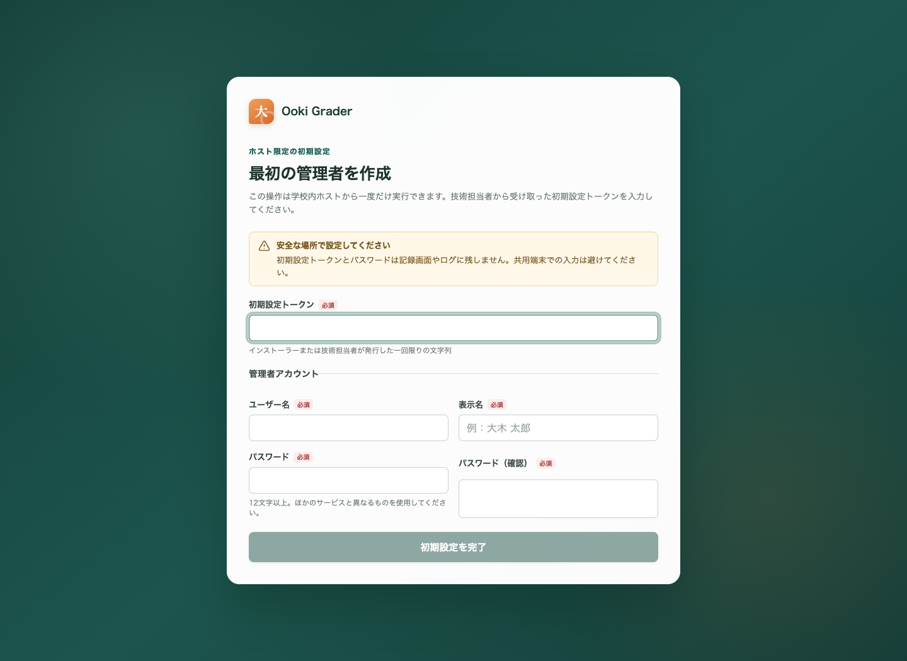
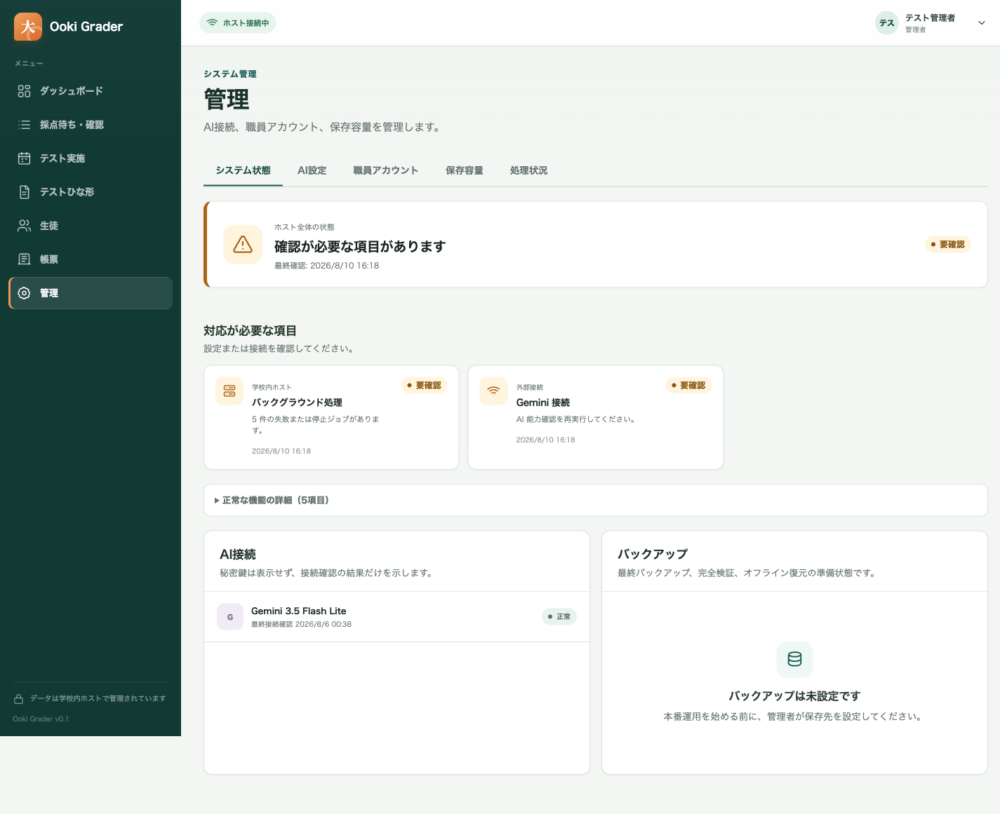
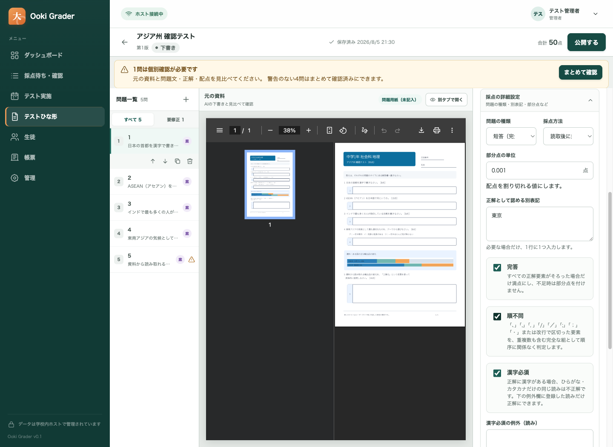
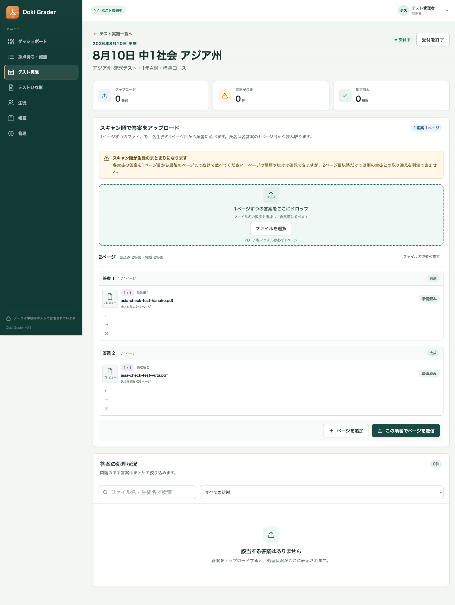

# Ooki Grader 現地インストールガイド

**対象:** 塾へ訪問して Windows ホストと職員 PC を設置する担当者

**推奨構成:** 現行 Windows 11 Pro x64 ホスト 1 台 + 校内 LAN 上の Windows 11 職員 PC

**接続 URL の例:** `https://ooki-grader.test/`

**証明書費用:** 0 円（ホスト内で作る専用ローカル CA を使用）

> **この手順の考え方**
>
> Ooki Grader をインターネットへ公開せず、塾内 LAN だけで使います。HTTPS のための有料証明書も、Windows の有料コード署名証明書も購入しません。代わりに、現地担当者が直接持ち込んだ配布フォルダーを SHA-256 で全件検査し、塾専用の無料ローカル CA をホスト上で作ります。

この文書は、`Install-OokiGraderOnSite.ps1` を使う現地設置専用の手順です。日常管理、バックアップ、更新、復元は [ホスト・アプリ セットアップ／運用ガイド](host-app-setup-and-operations-ja.md)、先生の日常操作は [日本語ユーザーガイド](../../output/pdf/ooki-grader-user-guide-ja.pdf) を参照してください。

## 1. 有料証明書を使わない場合の安全境界

「証明書」には、用途が異なる 2 種類があります。

| 種類 | この設置での方法 | 費用 | 注意 |
| --- | --- | ---: | --- |
| ブラウザ HTTPS 証明書 | ホスト専用ローカル CA が発行 | 0 円 | 各職員 PC に公開 CA を 1 回だけ信頼登録する |
| Windows コード署名 | 使用しない | 0 円 | 配布フォルダーを直接管理し、全ファイルのチェックサム検査を通す |

次の条件をすべて守ります。

- 配布フォルダーは設置担当者が管理する USB 等で直接持ち込み、メール、共有リンク、不明な Web サイトから取り直さない。
- `release-inventory.json` と `checksums.txt` を削除・編集しない。
- 現地スクリプトが全ファイルの SHA-256 検査を通すまでインストールを続けない。
- ブラウザの証明書警告を「詳細設定から続行」で回避しない。
- 職員 PC へ渡すのは公開 CA `.cer` だけ。秘密鍵を含む `.pfx` / `.p12` は渡さない。
- ホストをインターネットへ受信公開しない。Windows Firewall は指定した校内 CIDR だけを許可する。

ローカル CA の秘密鍵は、ホストの `LocalMachine` 証明書ストアに**非エクスポート可能**として作られます。ホストを失った場合は CA を新しく作り、全職員 PC で信頼設定をやり直します。

アプリ配布物の Authenticode コード署名は別の任意経路です。学校が将来、信頼済み発行者で署名した配布物を用意した場合も同じ現地セットアップを使え、その場合は `UNSIGNED` の確認は表示されません。今回の未署名版では、設置担当者が直接管理する媒体と全ファイルの SHA-256 検査を信頼境界にします。

## 2. 訪問前に準備するもの

### 2.1 持ち物

- Ooki Grader の Windows x64 リリースフォルダー一式
- 配布フォルダーを格納した管理済み USB
- Microsoft 公式の署名済み 64-bit PowerShell 7.4 以降 MSI（ホストに未導入の場合）
- x64 Windows ホストのローカル管理者情報（現行 Windows 11 Pro を推奨）
- 職員 PC ごとのローカル管理者情報
- ホスト用の有線 LAN 接続
- ホスト RAM（16 GiB を推奨、32 GiB なら余裕がある。16 GiB 未満でもインストールは続行可能）
- データ用 NTFS ドライブ（NTFS は必須、165 GiB 以上の空きは推奨）
- 暗号化済みの別バックアップドライブまたは学校承認の保存先
- 学校管理の Gemini API キー（AI を当日有効にする場合）
- 本書の「設置記録」ページを印刷したもの

### 2.2 事前に塾へ確認すること

| 項目 | 記入例 |
| --- | --- |
| ホスト固定 IP / DHCP 予約 | `192.168.10.20` |
| 校内サブネット | `192.168.10.0/24` |
| 接続を許可する範囲 | 職員 LAN のみ |
| データ保存先 | `D:\OokiGraderData` |
| バックアップ先 | `E:\OokiGraderBackup` |
| 職員 PC 台数 | 例: 6 台 |
| 主管理者 / 副管理者 | 氏名だけを記録 |
| 保守時間 | 例: 日曜 18:00-20:00 |

標準 URL は `https://ooki-grader.test/` です。`.test` はこのアプリ用の管理対象 hosts エントリで解決します。IP アドレスをブラウザへ直接入力しません。

## 3. ホスト PC を準備する

1. Windows Update を完了し、再起動する。
2. `設定 > ネットワークとインターネット` で接続プロファイルを `プライベート` にする。
3. ホスト IP をルーターの DHCP 予約または固定設定にする。
4. Windows の日時とタイムゾーンが正しいことを確認する。
5. データ用ボリュームが NTFS であることを確認し、165 GiB 以上の空きを推奨値として確認する。
6. データ用とバックアップ用ボリュームで BitLocker または学校承認の暗号化を有効にする。
7. スリープを無効にし、停電復帰後の起動方針を決める。可能なら UPS を使用する。
8. 64-bit PowerShell 7.4 以降をインストールし、管理者ターミナルで次を確認する。未導入なら、Microsoft 公式の署名済み x64 MSI を使い、PATH への追加を有効にします。PowerShell Remoting は有効化する必要がありません。MSI 実行前にプロパティのデジタル署名が有効で、発行元が Microsoft であることを確認します。

```powershell
pwsh --version
```

Windows ホストには .NET SDK、Node.js、開発環境は不要です。配布物は自己完結型です。

Windows 11 Pro の版／ビルド、16 GiB の搭載 RAM、165 GiB の空き容量は推奨項目です。満たさない場合は警告と運用上の影響を表示しますが、それだけを理由に現地セットアップを中止しません。x64 実行環境、NTFS、使用可能な HTTPS ポート、正しい配布物と証明書、安全なパス構成は引き続き必須です。

## 4. 配布物をコピーして確認する

1. USB 上のリリースフォルダー全体を `C:\OokiGrader-Setup\` へコピーする。
2. フォルダー内に次があることを確認する。
   - `release-inventory.json`
   - `checksums.txt`
   - `OokiGrader.Host.exe`
   - `OokiGrader.Tool.exe`
   - `Install-OokiGraderOnSite.ps1`
3. 管理者 PowerShell 7 を開く。
4. リリースフォルダーへ移動する。

```powershell
Set-Location 'C:\OokiGrader-Setup\OokiGrader-0.1.0-win-x64'
Get-ChildItem release-inventory.json, checksums.txt, Install-OokiGraderOnSite.ps1
```

スクリプトはインストール前にチェックサム一覧の完全性、余分なファイル、版、Windows x64 ランタイムを再検査します。失敗した場合は、ファイルを個別に差し替えず、管理元の USB からフォルダー全体を取り直します。

## 5. 現地セットアップを実行する

最も簡単な開始方法は、引数を付けずに実行し、検出された既定値を画面で確認する方法です。

```powershell
pwsh -NoLogo -NoProfile -File .\Install-OokiGraderOnSite.ps1
```

スクリプトは、`D:` があれば `D:\OokiGraderData`、なければ `C:\OokiGraderData` を提案し、接続中の校内 LAN からホスト IP と CIDR を提案します。正式名は `ooki-grader.test`、HTTPS ポートは `443` です。提案値が現地記録と違う場合は確定せず、正しい値を入力します。

バックアップ先を当日用意できる場合は、最初から指定するのが最も簡単です。暗号化済みであることを自分で確認してから、次のように実行します。

```powershell
pwsh -NoLogo -NoProfile -File .\Install-OokiGraderOnSite.ps1 `
  -BackupRoot 'E:\OokiGraderBackup' `
  -BackupDestinationEncryptionConfirmed
```

自動検出できない場合、または設置記録の値を明示したい場合だけ、`-DataRoot`、`-DnsName`、`-HostIpAddress`、`-SchoolSubnet` を追加します。

対話中は、表示内容を読んでから次の確認語を正確に入力します。

| 確認語 | 入力する条件 |
| --- | --- |
| `PRIVATE` | 表示された接続が信頼できる校内 LAN で、プロファイルを Private へ変更してよい |
| `ENCRYPTED` | 指定したバックアップ先が実際に暗号化済み |
| `UNSIGNED` | 管理下の USB から直接受け取り、チェックサム検査を行う配布物 |
| `RESERVED` | 表示されたホスト IP が固定または DHCP 予約済み |
| `INSTALL` | URL、IP、CIDR、データ先、バックアップ先がすべて正しい |

`INSTALL` より前は、サービスや証明書を変更しません。値が違う場合は `Ctrl+C` で中止して最初から実行します。

## 6. スクリプトが行うこと

現地セットアップは、次を一続きで実行します。

1. 配布フォルダーの全チェックサムと版を検査する。
2. `ooki-grader.test` とホスト IP を含む無料の HTTPS 証明書を発行する。
3. ホスト自身の hosts ファイルへ `127.0.0.1 ooki-grader.test` を管理対象行として追加する。
4. `OokiGrader.Host` Windows Service、ACL、データフォルダーを構成する。
5. 指定した校内 CIDR だけを許可する Windows Firewall 規則を作る。
6. SQLite データベースを作成・移行する。
7. バックアップ先を指定した場合は暗号化確認済みとして構成する。
8. 職員 PC 用の公開 CA・hosts・ショートカット設定パッケージを作る。
9. ローカル DB、保存先、サービス、実際の HTTPS readiness を検査する。

成功時は JSON の `state` が `installed-and-verified` になります。次も記録します。

- `endpoint`
- `hostIpAddress`
- `schoolSubnet`
- `dataRoot`
- `backupRoot`
- `caThumbprint`
- `peerTrustPackage`

既定の職員 PC 用パッケージは、`C:\Users\Public\Documents\OokiGrader-Client-Setup-Packages\` に作られます。

## 7. ホスト側を確認する

管理者 PowerShell で実行します。

```powershell
Get-Service OokiGrader.Host
Get-NetFirewallRule -DisplayName 'Ooki Grader HTTPS'
Invoke-WebRequest 'https://ooki-grader.test/health/live' -UseBasicParsing
Invoke-WebRequest 'https://ooki-grader.test/health/ready' -UseBasicParsing
```

確認結果:

- Windows Service が `Running`
- `/health/live` と `/health/ready` が成功
- `https://ooki-grader.test/` が証明書警告なしで開く
- Windows 再起動後もサービスが自動起動
- `DataRoot` と `InstallRoot` が別の場所
- バックアップ先を指定した場合、管理画面に保存先が構成済みとして表示

## 8. 職員 PC を設定する

各職員 PC で 1 回ずつ行います。

1. ホストの `OokiGrader-Client-Setup-Packages` から、生成されたフォルダー全体を職員 PC へコピーする。
2. フォルダー内に `.pfx` または `.p12` が**ない**ことを確認する。
3. `Install-On-This-PC.cmd` を右クリックし、`管理者として実行` を選ぶ。
4. 完了メッセージを待つ。
5. デスクトップの `Ooki Grader` ショートカットを開く。
6. URL が `https://ooki-grader.test/`、証明書警告がないことを確認する。

職員 PC 用パッケージは、次を自動で行います。

- 公開 CA `.cer` の SHA-256 と拇印を検査
- hosts ファイルへホスト IP と `ooki-grader.test` の管理対象行を追加
- 公開 CA を `LocalMachine\Root` へ登録
- 共通デスクトップへ HTTPS ショートカットを作成
- 実際の `/health/ready` へ接続し、証明書を回避せず検査

1 台でも HTTPS 検査が失敗した場合は、ブラウザ警告を無視せず、固定 IP、サブネット、Firewall、LAN 接続を確認します。

## 9. 最初の管理者を作る

初期管理者の作成はホスト PC 自身からだけ行えます。

1. ホストで `https://ooki-grader.test/` を開く。
2. 管理者 PowerShell で `D:\OokiGraderData\bootstrap-token.txt` を表示する。
3. 初期設定画面へトークン、管理者ユーザー名、表示名、12 文字以上の固有パスワードを入力する。
4. 完了後、`bootstrap-token.txt` が削除されたことを確認する。
5. 新しい管理者でログインする。
6. `管理 > 職員アカウント` で副管理者を作る。



*図: ホストからだけ開ける現行の初期管理者作成画面。トークン、ユーザー名、パスワードは空欄の架空環境です。*

初期トークンを写真、チャット、チケット、共有文書へ残しません。期限切れ時はサービスの通常再起動で新しいトークンが生成されます。

## 10. 職員アカウントを準備する

`管理 > 職員アカウント` から、必要な人だけを登録します。

| 役割 | 主な操作 |
| --- | --- |
| 管理者 | 職員、AI、バックアップ、保存容量、すべての先生操作 |
| 先生 | 生徒、ひな形、採点、確定、帳票 |
| スキャン担当 | 受付中テストへの答案取込と進行確認 |
| 閲覧担当 | 確定済み結果と帳票の閲覧 |

- 常用アカウントへ不要な管理者権限を付けない。
- 管理者は異なる担当者で 2 名用意する。
- 一時パスワードは本人へ直接渡し、初回ログインで変更する。
- 退職・異動時はアカウントを削除せず無効化し、既存セッションを失効させる。


*図: 架空の職員を使った現行画面。役割、状態、無効化等を一覧で確認します。*

## 11. Gemini を設定する

1. 管理者で `管理 > AI設定` を開く。
2. `接続を追加` を押す。
3. 学校管理の Gemini API キーを入力する。
4. `接続を確認して有効化` を押す。詳細設定の応答待ち時間と最大同時処理数は、通常は既定値のままにする。
5. ホストが候補キーを保存する前に、認証、正確なモデル、画像入力、strict structured output、利用量情報、実画像タスクを確認するまで待つ。
6. 成功後、接続状態が `正常`、モデルが `gemini-3.5-flash-lite`、最終確認時刻が現在であることを確認する。
7. ひな形作成、氏名読み取り、答案の AI 採点、採点結果の再確認がすべて `利用できます` であることを確認する。

全確認が成功した場合だけ、キーが暗号化保存され、4 機能が一括で利用可能になります。失敗または交換結果が不明な場合、候補キーは保存されず、以前の正常なキー、接続、4 機能が維持されます。古い接続を削除せず、表示されたエラーと相関 ID を控えて原因を直します。API キーはスクリーンショット、環境変数の恒久設定、PowerShell 引数、手順書へ残しません。AI を設定しなくても生徒登録等はできますが、ひな形生成・氏名読取・AI 採点は待機します。


*図: API キーを表示しない現行の AI 設定画面。接続状態、最終確認時刻、4 機能の `利用できます` を確認します。能力確認後も、公開・生徒割当・採点確定は先生が行います。*

## 12. 最初のバックアップを確認する

バックアップ先は管理画面ではなく、現地セットアップの `-BackupRoot` で構成します。管理画面は実行・検証・状態確認を行う場所です。

1. `管理 > システム状態` を開く。
2. `バックアップ` で保存先が利用可能か確認する。
3. `手動バックアップ` を実行する。
4. 完了後に `完全検証` を実行する。
5. `復元計画を確認` を実行する。
6. バックアップ ID、検証日時、保存先を設置記録へ残す。



*図: 現行のシステム状態画面。例はバックアップ未設定の架空環境なので、本番では保存先と完全検証時刻を確認します。*

管理対象答案画像は既定でバックアップへ含まれません。画像も復旧要件に含める場合は、運用開始前に容量・保持期間・個人情報の扱いを決め、ホスト運用ガイドに従って承認済み構成へ変更します。

## 13. 受入テストを実演する

架空データだけを使い、設置担当者と塾責任者が次を一緒に行います。

1. 架空の生徒を 1 名登録する。
2. サンプル PDF から HOP または STEP のひな形を作る。
3. 問題、正答、配点、`完答`、`順不同`、`漢字必須` を確認し、実施日と必要な場合の対象クラスを指定して `受付を開始` する。試験名・教科・学年・カテゴリ・コースはひな形から引き継がれ、同じ操作で版の確定と答案受付開始が完了する。
4. テスト実施を作成し、架空生徒を名簿へ追加して受付を開始する。
5. 1 ページ PDF を生徒ごとに連続して取り込む。
6. 生徒名確認、採点確認、確定まで進める。
7. 帳票を開き、結果 PDF を作成・ダウンロードする。
8. 管理画面で失敗ジョブ、保存容量、AI 接続、バックアップを確認する。



*図: 架空ひな形で `完答`、`順不同`、`漢字必須` を有効にした現行の編集画面。*



*図: 架空答案を使った現行の順番取込画面。選択順、ページ役割、生成された答案数を確認します。*

実データを入れる前に、ホスト再起動と職員 PC からの再ログインも確認します。

## 14. よくある設置時の問題

| 症状 | 最初に確認すること |
| --- | --- |
| PowerShell 7 がない | `pwsh --version`。64-bit 7.4 以降を導入 |
| チェックサム検査失敗 | 配布元、USB、余分な／欠けたファイル。個別修復せず一式を取り直す |
| `165 GiB` 推奨値未満の警告 | インストールは続行可能。DataRoot の空き、実際の答案量、保存容量監視を確認し、可能なら空きを増やす |
| `RESERVED` を確認できない | ルーターの DHCP 予約または固定 IP 設定を先に完了 |
| 443 番ポート使用中 | `Get-NetTCPConnection -LocalPort 443 -State Listen` |
| ホストでは開くが職員 PC では開かない | peer setup の結果、職員 LAN、指定 CIDR、Firewall |
| 証明書警告 | URL が正式名か、公開 CA 登録、PC 時刻、hosts 行。警告は回避しない |
| 403 `ORIGIN_REJECTED` | IP 直打ちや別名をやめ、正式 URL のショートカットを使う |
| AI 接続失敗 | 候補キー、画像対応、DNS、外向き HTTPS、予算／クォータ。以前の接続は削除しない |
| バックアップ未設定 | インストール時に BackupRoot を省略した。運用開始前に技術担当者が安全に再構成 |

## 15. 設置記録と引き渡し

### ホスト

- [ ] リリース版と配布元を記録した
- [ ] チェックサム検査を通した
- [ ] ホスト IP を固定または DHCP 予約した
- [ ] URL、IP、CIDR、DataRoot、BackupRoot を記録した
- [ ] サービスが再起動後も自動起動した
- [ ] `/health/live` と `/health/ready` が成功した
- [ ] CA 拇印と証明書期限を記録した
- [ ] Windows Firewall が職員 LAN だけを許可した

### 職員 PC

- [ ] 全台で `Install-On-This-PC.cmd` を管理者実行した
- [ ] 全台で HTTPS readiness 検査が成功した
- [ ] 全台で証明書警告がない
- [ ] 全台でデスクトップショートカットから開けた

### アプリ

- [ ] 初期トークンが削除された
- [ ] 主管理者と副管理者を作った
- [ ] 職員へ最小限の役割を割り当てた
- [ ] Gemini の `接続を確認して有効化` と 4 機能の利用確認が成功した
- [ ] 手動バックアップ、完全検証、復元計画確認が成功した
- [ ] 架空データの一連の受入テストを完了した
- [ ] 教師向けユーザーガイドとホスト運用ガイドを渡した

引き渡し後は、配布 USB、API キー、初期トークンを通常の教室へ放置しません。職員 PC 用パッケージには秘密鍵はありませんが、承認済み端末だけへ配布します。
