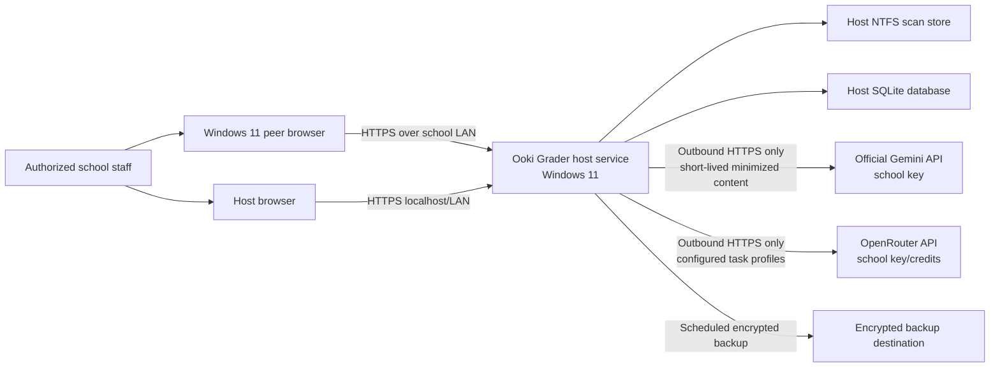
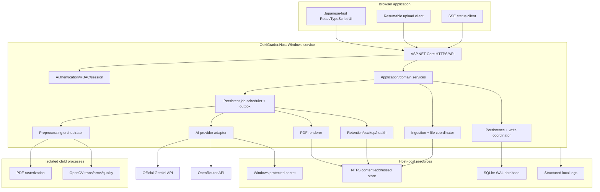
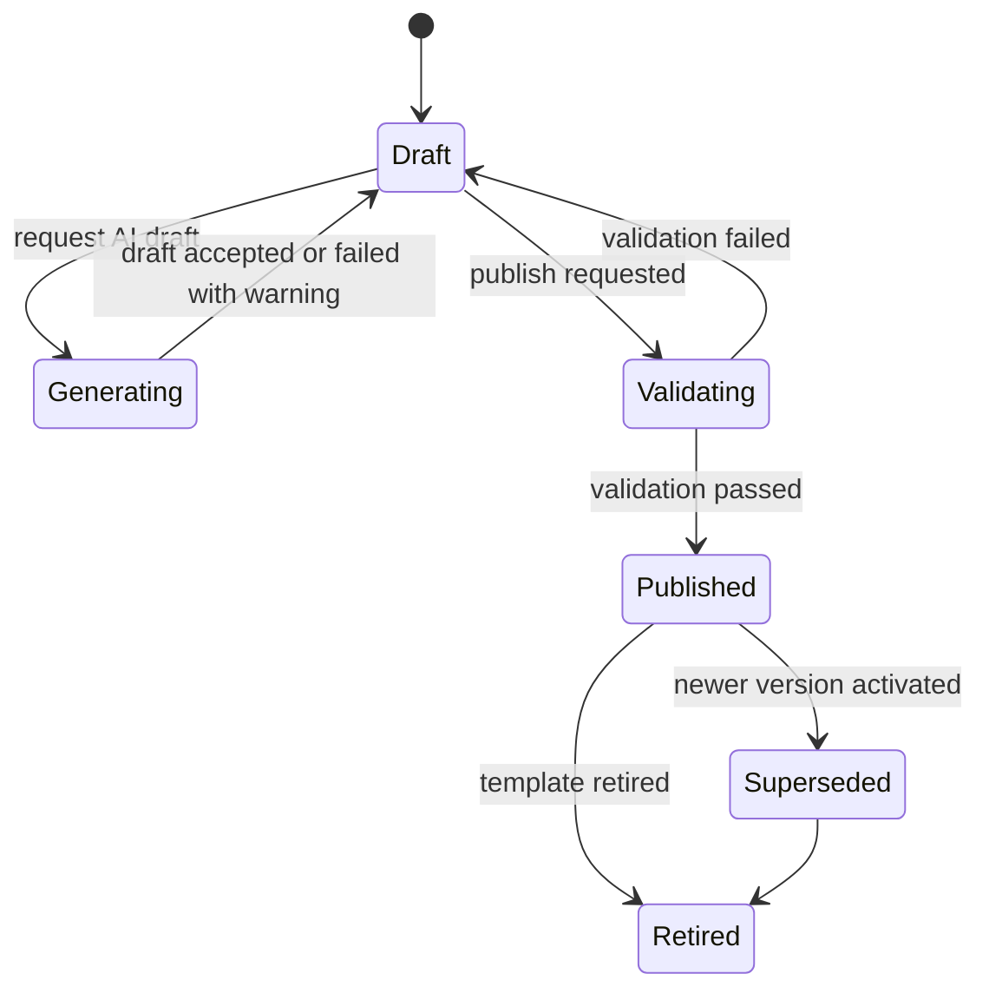
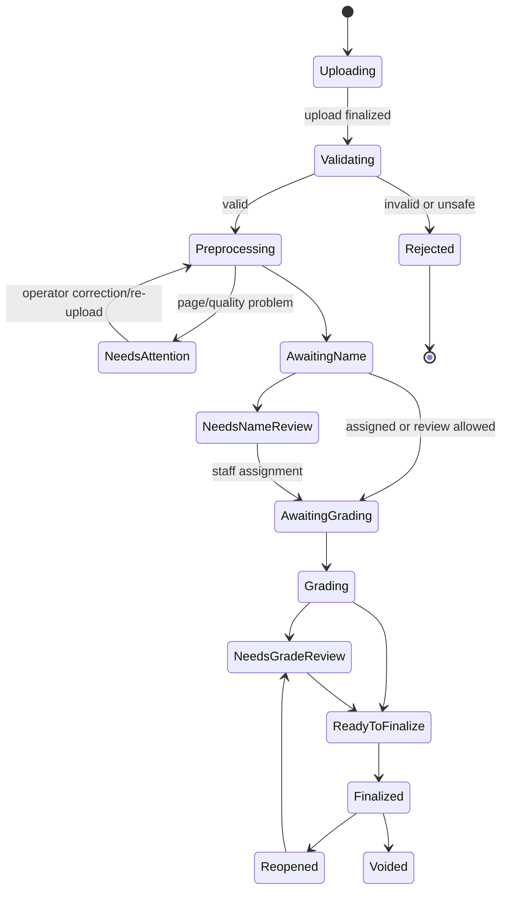
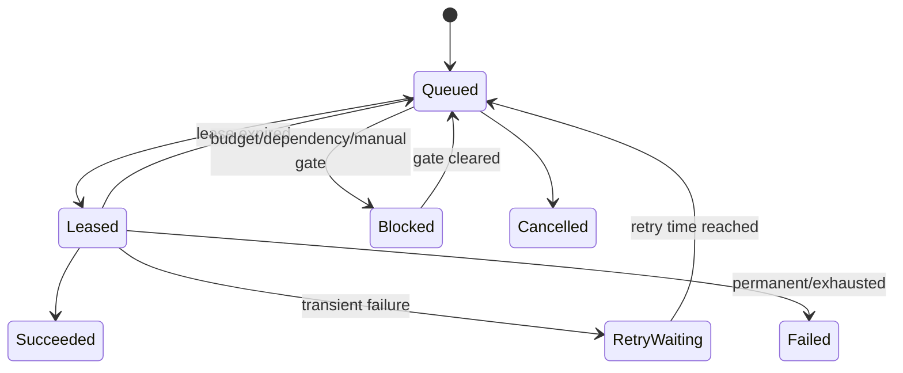
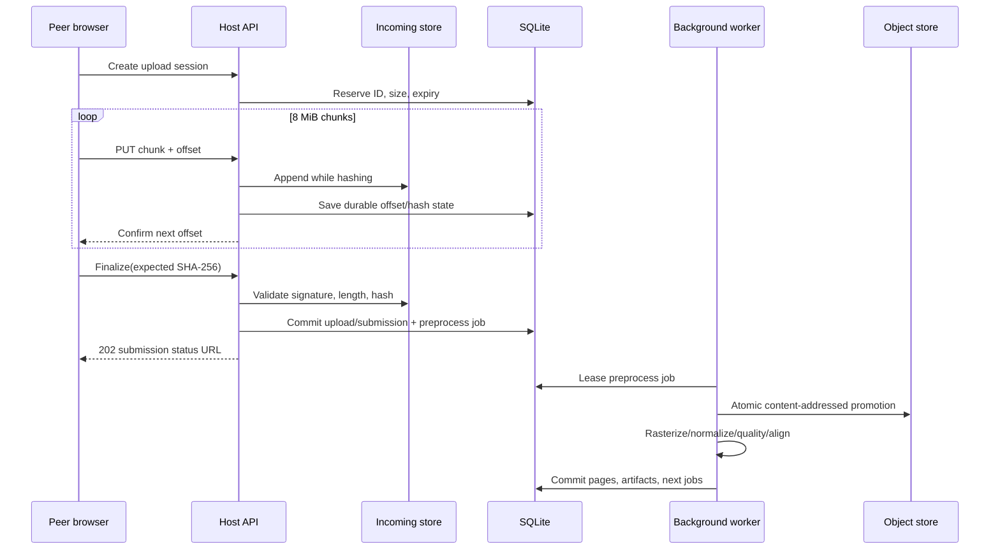
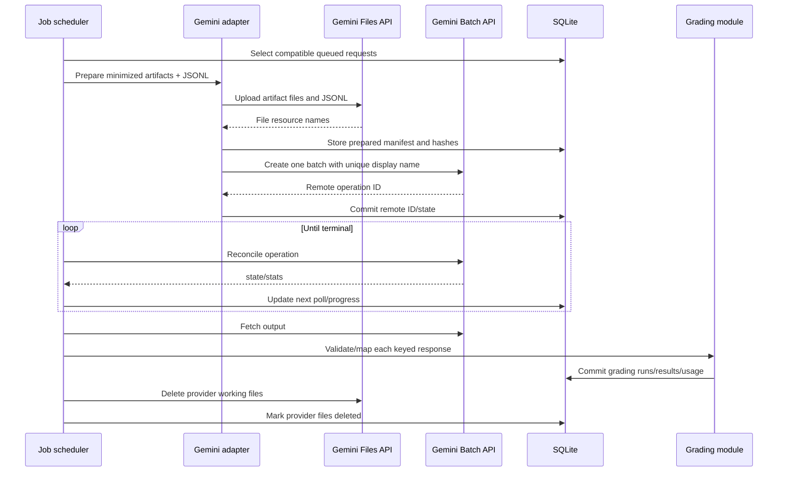
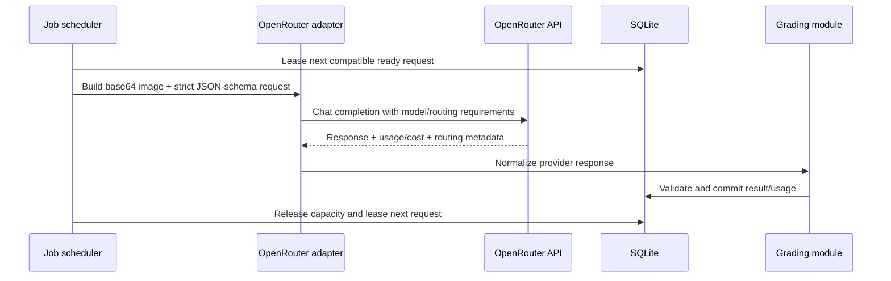

# System architecture

## 1. Architecture summary

Ooki Grader is a modular monolith installed as one Windows service on the designated host. The service hosts:

- an HTTPS web application and versioned REST API;
- all authorization and business logic;
- durable background-job orchestration;
- scan preprocessing orchestration;
- official Gemini and OpenRouter integration;
- report rendering;
- retention, backup coordination, and health monitoring;
- the only connection to the SQLite database and managed filesystem.

Peer computers are untrusted clients relative to the host. They run a supported browser and never mount the data directory, open the database, or call an AI provider directly.

This is deliberately not a peer-to-peer data architecture. “Peer” describes where a teacher is sitting, not ownership of a replica.

## 2. Context diagram

## 3. Deployment topology

### 3.1 Host computer

The host MUST be a managed x64 Windows machine supported by the packaged
runtime. A current supported Windows 11 Pro release is recommended, but its
edition and build are not an installation gate. The host deployment profile
includes:

- wired Ethernet and a DHCP reservation or static address;
- a stable local DNS name, recommended `ooki-grader.<school-lan-domain>`;
- automatic Windows time synchronization;
- BitLocker enabled;
- a local NTFS data volume or directory, plus separate backup capacity;
- Windows Defender and normal security updates;
- outbound TCP 443 to required Google API endpoints;
- inbound TCP 443 from approved private subnets only.

The recommended machine profile is Windows 11 Pro, at least 16 GiB installed
RAM (32 GiB preferred), a dedicated data volume, and at least 165 GiB free on
that volume. OS edition/build, installed RAM, and free-capacity mismatches are
reported as advisory findings and MUST NOT abort installation. Lower-capacity
hosts require workload validation and closer storage monitoring. A UPS remains
strongly recommended.

The application does not require that a staff user remain logged into Windows.

### 3.2 Peer computers

Peers require:

- Windows 11;
- a current supported Edge or Chrome release;
- trust in the local installation certificate authority;
- network route to the host;
- no local Ooki Grader database, service, or API key.

A lightweight Start-menu shortcut MAY be installed. The application SHOULD be installable as a browser PWA, but its service worker may cache only versioned static assets and a generic offline shell—not student data, API responses, images, or PDFs.

### 3.3 Network and certificates

Production uses HTTPS even on the LAN. The installer creates or imports a school-local CA, issues a host certificate containing the configured DNS name and IP subject alternative names, and installs the CA certificate on peer computers. Certificate renewal warnings begin 60 days before expiry.

`.local`/mDNS naming SHOULD NOT be the only production discovery mechanism because Windows and network equipment behavior is inconsistent. Prefer router/local DNS; a technician may distribute a managed `hosts` entry as a documented fallback.

## 4. Logical containers

## 5. Technology baseline

Versions are pinned in source and upgraded through an architecture decision. The intended first implementation is:

| Layer | Choice | Rationale |
|---|---|---|
| Host runtime | .NET 10 LTS, ASP.NET Core | Supported Windows service hosting, strong HTTP/security stack, background services, single deployment toolchain |
| UI | React + TypeScript, built as static assets | Rich image-region editor and review workflow; no desktop deployment on peers |
| API | JSON REST under `/api/v1`, OpenAPI 3.1 | Testable, generated client, clear version boundary |
| Live status | Server-Sent Events (SSE) | One-way job/progress updates without WebSocket complexity |
| Metadata | SQLite in WAL mode through EF Core | One host process is the only writer; low administration and robust transactional semantics at target scale |
| IDs | ULID stored as canonical text | Globally unique, sortable, safe to generate before commit |
| Images | PDFium-compatible rasterizer, OpenCV-based alignment/quality | Local, reproducible preprocessing; isolates native work from API requests |
| PDF reports | PDFsharp/MigraDoc-compatible renderer with bundled Noto Sans JP | Offline rendering and embedded Japanese glyphs; final dependency/license validation required |
| AI | Provider-neutral port with `GeminiDirectAdapter` and `OpenRouterAdapter` | Supports both required BYO APIs while preserving one grading domain |
| Secrets | Windows DPAPI-protected envelope and strict ACL | Key never needs to leave host |
| Logging | Structured rolling JSON and Windows Event Log summary | Local supportability without logging student images/prompts |
| Installer | Signed MSIX/WiX-style bootstrapper plus PowerShell technician scripts | Installs service, data ACL, firewall, certificate, URL, and scheduled support tasks |

No dependency with incompatible, viral, or unexpectedly commercial licensing may enter a release. The exact PDF/image packages and bundled fonts require a software-bill-of-materials review before milestone M1.

## 6. Why a modular monolith

The workload belongs to one physical host and one school. Independent network services would add ports, certificate boundaries, service discovery, deployment order, and more failure modes without improving the required scale.

Modules still obey explicit boundaries:

- UI never opens the database;
- API controllers contain no grading rules;
- domain services do not depend on Gemini or OpenRouter DTOs;
- the AI adapter cannot mutate grades directly;
- the file store is accessed through a path-safe abstraction;
- every background operation is represented by a durable job;
- cross-module integration uses application commands/events and database transactions, not arbitrary table access.

If a future deployment exceeds the SQLite profile, the persistence module can move to PostgreSQL while preserving API/domain contracts. That is a planned migration path, not a v1 dual-database feature.

## 7. Host module responsibilities

### 7.1 Web/API module

- terminates TLS;
- applies request size, rate, authentication, CSRF, and authorization policy;
- validates request DTOs;
- returns RFC 9457-style `application/problem+json`;
- serves immutable hashed frontend assets;
- emits correlation IDs and security headers;
- streams authorized file responses with range support;
- exposes SSE events scoped to the current user.

It MUST NOT perform rasterization, AI inference, report rendering, or large file hashing on the request thread.

### 7.2 Identity and access module

- staff identities and role grants;
- password verification and lockout;
- server-side session records;
- anti-CSRF token issuance;
- authorization policies;
- bootstrap/credential reset;
- audit actor context.

### 7.3 Roster module

- student/alias lifecycle;
- Unicode and kana normalization;
- CSV staging/import;
- expected roster membership;
- duplicate and merge checks;
- recognition candidate indexing.

### 7.4 Template module

- source upload;
- normalized blank pages;
- question and region editor;
- version validation and publish;
- grading-mode/rubric/Kanji policy;
- prompt-input projection that excludes unrelated school data.

### 7.5 Session and submission module

- test sessions;
- resumable upload sessions;
- file integrity and deduplication;
- submission/page state machines;
- duplicate attempt handling;
- assignment and finalization coordination.

### 7.6 Grading module

- deterministic graders;
- AI input construction;
- structured-output validation;
- confidence policy;
- review/override workflow;
- local point arithmetic;
- grading-run versioning;
- progress invalidation events.

### 7.7 Analytics module

- finalized-result projections;
- date/subject/category filters;
- score and outcome series;
- no denormalized total without source revision;
- recalculation after correction.

### 7.8 Export module

- immutable export requests;
- Japanese PDF composition;
- font/resource validation;
- reproducible output hashing;
- secure streaming;
- supersession when source revision changes.

### 7.9 AI integration module

- provider capability probe;
- encrypted per-connection key access;
- candidate-first Gemini create/replace requiring full authentication,
  exact-model, image, strict-structured-output, usage, and representative
  image-task success before one atomic secret/connection/four-profile commit;
- zero commit and prior-working-state preservation on candidate failure,
  timeout, cancellation, or ambiguity;
- stored-key-test and startup reconciliation of exact-current active Gemini
  profile revisions while in-flight jobs remain pinned;
- direct Gemini Files/Batch/standard inference;
- OpenRouter multimodal Chat Completions with base64 private images, strict structured output, parameter-required routing, and usage/cost capture;
- direct-Gemini batch assembly/submission/reconciliation;
- OpenRouter durable queued parallel dispatch;
- exact-current capability-passed Gemini task profiles and advanced approved provider/model profiles/failover;
- schema and usage parsing;
- provider retries/circuit breaker;
- pricing-snapshot/cost ledger;
- payload minimization and redaction.

### 7.10 Operations module

- persistent job leasing;
- retention reconciliation;
- quota counters;
- health and readiness;
- backups and restore gates;
- database integrity checks;
- migration lock;
- maintenance mode;
- diagnostic bundle generation.

## 8. Request and background execution model

### 8.1 Fast request rule

An interactive request may:

- validate;
- stream bytes to a temporary file;
- commit metadata;
- enqueue durable work;
- query indexed data;
- return status.

It may not wait for external inference or full scan preprocessing. The upload finalize endpoint returns `202 Accepted` with the submission and first job identifiers.

### 8.2 Persistent jobs

Jobs live in the database, not memory. Each has:

- type and schema version;
- stable deduplication key;
- priority;
- serialized minimal payload containing entity IDs, not secrets;
- state;
- attempt count and next-attempt time;
- lease owner/expiry;
- progress;
- structured error;
- timestamps and causation/correlation IDs.

Workers claim jobs in a short transaction. A lease expires if the process crashes. Handlers MUST be idempotent: they inspect durable state and artifact hashes before work.

Default concurrency on recommended hardware:

| Work class | Concurrency | Notes |
|---|---:|---|
| Upload validation/hash | 2 | I/O bound |
| PDF rasterization | 1 | memory/CPU bound |
| Image transforms/alignment | 2 | CPU bound |
| Direct Gemini file upload | 2 | network bound |
| Direct Gemini batch submission/reconcile | 1 per credential | avoids duplicate/reconciliation races |
| OpenRouter request dispatch | 2–4 per credential | bounded by endpoint rate/cost and adaptive throttling |
| Expedite inference | 2 per active profile | bounded by budget/quota |
| PDF export | 2 | CPU/memory bound |
| Retention | 1 | exclusive deletion coordinator |

Concurrency is configurable but guarded by memory/disk-pressure checks.

### 8.3 Transactional outbox

When a domain change requires follow-up work, the same SQLite transaction writes:

- the domain state;
- an outbox event;
- a job record or event-to-job projection marker.

A dispatcher marks events delivered only after the downstream durable action exists. This prevents “grade committed but progress never updated” and “upload committed but preprocessing never queued” gaps.

## 9. State machines

### 9.1 Template version

Published content is immutable. “Edit” means create a new draft cloned from the published version.

### 9.2 Submission

Scan payload deletion is orthogonal: a finalized or voided submission may transition from `scan_available` to `deletion_pending` to `scan_deleted` without changing grade lifecycle.

### 9.3 Durable job

## 10. File ingestion sequence

Chunks are not individually committed as application files. A complete temporary file is promoted through rename within the same NTFS volume wherever possible.

## 11. Direct Gemini economy sequence

Because provider batch creation is not idempotent, the exact submission boundary receives special reconciliation described in the AI design.

## 11.1 OpenRouter queued sequence

OpenRouter has no general asynchronous discounted chat batch endpoint documented for this design. The host therefore retains its own durable queue and dispatches individual non-streaming multimodal requests:

Queue aggregation still improves operator experience, prompt reuse opportunities, throttling, and recovery, but the UI/cost ledger MUST NOT label it a provider-discounted batch.

## 12. Consistency and concurrency

### 12.1 Database access

- SQLite runs with foreign keys enabled and WAL journal mode.
- The service is the only process permitted to open the database for writes.
- A process-wide write coordinator serializes write transactions that could conflict; short independent writes may use optimistic concurrency.
- Busy timeout and bounded retry handle momentary lock contention.
- `PRAGMA integrity_check` runs during scheduled maintenance and after unclean-shutdown detection.
- All mutable aggregates have a revision integer used for optimistic concurrency and ETags.

### 12.2 Database/filesystem boundary

A database transaction cannot atomically commit an NTFS rename. Therefore every cross-boundary operation uses an explicit intent:

1. create database intent with target object hash/path and expected bytes;
2. materialize/rename the file;
3. mark intent complete and attach metadata;
4. startup reconciler completes or rolls back incomplete intent.

Garbage collection removes unreferenced objects only after a safety delay and reference-count verification.

### 12.3 Score consistency

- Awarded points use scaled integers (`points_milli`) to avoid binary floating-point behavior.
- Total equals the sum of current question-result revisions in one transaction.
- Percentage is derived for display and never the primary stored grade.
- A database constraint prevents negative or above-maximum points.
- Finalization checks all question IDs exactly match the template version.

## 13. Availability and degraded modes

| Failure | Available | Unavailable/limited | Recovery behavior |
|---|---|---|---|
| Internet down | sign-in, roster, uploads, preprocessing, existing results, review, export | new AI results | queue remains durable and resumes with backoff |
| Configured AI provider outage/rate limit | all local functions | affected AI jobs | per-provider circuit breaker, retry-after, optional validated failover |
| Low disk | reads, cleanup, limited admin | new upload/preprocessing | proactive cleanup; reject before reserve breached |
| Database write failure | static UI/diagnostics may load | mutations/finalization | readiness false; maintenance guidance |
| Native preprocessing crash | web service remains available | affected job | child process killed; job retried/quarantined |
| Expired TLS certificate | host console/repair tool | trusted peer access | renewal/replace workflow |
| Backup target absent | normal app operation | current backup | health warning escalates by age |
| API budget hard stop | all local functions | new AI submissions | jobs `budget_blocked`; admin resolution |

## 14. Scaling thresholds and migration path

SQLite remains acceptable while:

- one host service owns all writes;
- p95 database write wait remains under 250 ms;
- WAL checkpoints complete predictably;
- database size remains manageable for online backup;
- the school remains a single site.

A PostgreSQL profile should be designed only when sustained measurements show one or more:

- more than 50 simultaneous users;
- more than 10 write transactions per second sustained during school peaks;
- database larger than 20 GB;
- multiple application-service processes needed;
- multi-site replication required.

The migration uses:

- provider-neutral repository interfaces only where they protect domain boundaries;
- database migrations tested against an exported fixture;
- ULIDs and portable SQL types;
- filesystem object store unchanged;
- one planned downtime migration, not live dual writes.

## 15. Architecture fitness rules

CI and code review MUST enforce:

- browser bundle contains no Gemini/OpenRouter key, endpoint credential, or server secret;
- domain projects do not reference web/EF/provider DTO assemblies;
- API controllers do not call provider clients;
- native image/PDF work does not execute on request threads;
- every job handler declares an idempotency strategy;
- every new file category declares quota and retention classification;
- every new table containing student data declares deletion/export/audit behavior;
- every AI schema has a versioned validator and fixture;
- every external call has timeout, cancellation, retry classification, and correlation;
- no log property is permitted to contain full names, answers, images, or prompts by default.
