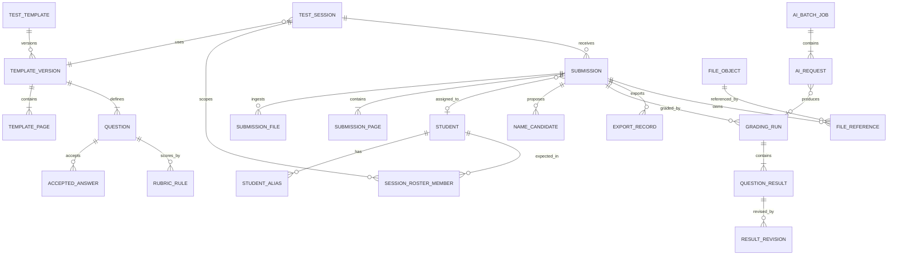

# Domain model, storage, and retention

## 1. Data design principles

1. The database stores facts, relationships, states, hashes, and provenance.
2. The filesystem stores byte payloads; large files are never stored as database BLOBs.
3. A published template and a grading run are immutable.
4. Human corrections append revisions rather than overwriting evidence.
5. Scan retention removes images, not academic result history.
6. Every file has an owner category, content hash, byte count, retention class, and lifecycle state.
7. Every timestamp is UTC; the site time zone is stored as an IANA identifier and defaults to `Asia/Tokyo`.
8. Scores use thousandths of a point as signed 64-bit integers; floating point is forbidden for persisted scores.
9. Student-facing/display labels are mutable; internal ULIDs are not.
10. Raw AI responses are short-lived diagnostic artifacts and are not the authoritative grade.

## 2. Aggregate map



## 3. Entity catalog

Fields listed are normative minimums. Implementation may add technical columns but may not weaken constraints.

### 3.1 `site_settings`

Singleton configuration:

- `id = 'site'`;
- `school_name`;
- `time_zone` default `Asia/Tokyo`;
- `locale` default `ja-JP`;
- `managed_scan_hard_limit_bytes` default `161061273600` (150 GiB);
- `managed_scan_cleanup_target_bytes` default `155692564480` (145 GiB);
- `managed_scan_warning_bytes` default `144955146240` (135 GiB);
- `physical_free_reserve_bytes` default 5 GiB;
- `scan_retention_calendar_months` fixed default 3;
- `data_root`;
- `backup_policy_id`;
- `active_ai_profile_set_id`;
- `maintenance_mode`;
- `revision`, `created_at`, `updated_at`.

The UI labels the quota as 150 GB but internally and operationally MUST state whether values are GiB. This specification uses binary GiB for deterministic enforcement.

### 3.2 `staff_user`

- `id`;
- `username_normalized` unique;
- `display_name`;
- `password_hash` and algorithm/version metadata;
- `status`;
- `failed_attempt_count`, `lockout_until`;
- `credential_changed_at`, `last_login_at`;
- `created_at`, `updated_at`, `revision`.

Roles use `role` and `staff_user_role` tables. Referenced users are disabled, not deleted.

### 3.3 `staff_session`

- random `id_hash`, never raw session token;
- `staff_user_id`;
- `created_at`, `last_seen_at`, `absolute_expires_at`, `idle_expires_at`;
- `source_ip_prefix`, `user_agent_hash`;
- `csrf_secret_hash`;
- `revoked_at`, `revoke_reason`.

Expired rows may be purged after audit requirements are met.

### 3.4 `student`

- `id`;
- `student_number` and normalized unique value among non-merged records;
- `family_name`, `given_name`;
- `family_name_kana`, `given_name_kana`;
- `display_name`;
- `school_class`, `course`, `grade_label`;
- `status`: `active`, `inactive`, `merged`, `erasure_pending`;
- `merged_into_student_id` nullable;
- `private_notes` nullable;
- `created_at`, `updated_at`, `revision`.

Names preserve original characters and normalized search forms. Do not destructively normalize the display value.

### 3.5 `student_alias`

- `id`, `student_id`;
- `alias_type`: `kanji`, `kana`, `romanized`, `old_name`, `spacing`, `handwriting_hint`, `other`;
- `display_value`, `normalized_value`;
- `recognition_enabled`;
- `created_by`, `created_at`.

Index `normalized_value`; warn on collisions across active students.

### 3.6 `test_template`

- `id`;
- `title`, `subject`, `category`, `course`, `grade_label`, `source`, `notes`;
- `state`: `draft`, `active`, `retired`, `archived`;
- `active_version_id`;
- `created_by`, `created_at`, `updated_at`, `revision`.

### 3.7 `template_version`

- `id`, `test_template_id`;
- monotonic `version_number` unique per template;
- `state`: `draft`, `generating`, `published`, `superseded`, `retired`;
- `based_on_version_id`;
- `target_total_points_milli` nullable;
- `default_allow_non_kanji`;
- `pipeline_version`, `ai_generation_provenance_id`;
- `published_by`, `published_at`;
- `content_hash` over canonicalized version content;
- timestamps and revision while draft.

No content row linked to a published version may update or delete except through a controlled template erasure procedure that first proves no result dependency.

### 3.8 `template_page`

- `id`, `template_version_id`, `page_number`;
- `width_px`, `height_px`, `dpi_x`, `dpi_y`;
- `source_file_reference_id`;
- `normalized_file_reference_id`;
- `page_fingerprint`;
- `orientation_degrees`;
- optional quality metadata.

Unique `(template_version_id, page_number)`.

`template_source` records each uploaded source with role `blank_test`,
`contains_model_answers`, `contains_non_model_answers`, or
`separate_answer_key`, the original file reference, ordering, and upload
provenance. The UI's per-file source-type select maps directly to this role; no
redundant model-answer boolean is persisted. `contains_non_model_answers`
explicitly makes visible written answers non-authoritative, so independently
solved answers use `ai_proposed` provenance unless a paired authoritative
source supplies the answer. `template_page` points back to its source.

### 3.9 `region`

Reusable normalized polygon/rectangle:

- `id`, owner type/id, page number;
- `region_type`: `question`, `answer`, `name`, `student_number`, `ignore`, `anchor`;
- coordinates as integer millionths of page width/height;
- rotation;
- `created_source`: `ai`, `teacher`, `system`;
- confidence.

Normalized coordinates make regions independent of raster DPI. A region must remain inside page bounds and have positive area.

### 3.10 `question`

- `id`, `template_version_id`;
- stable `logical_question_id` linking versions when teacher confirms equivalence;
- `order_index`, `display_label`;
- `question_text`;
- `question_type`: `multiple_choice`, `boolean`, `numeric`, `exact_short_text`, `semantic_short_text`, `multi_part`, `subjective`, `unsupported`;
- `grading_mode`: `deterministic`, `transcribe_then_rules`, `ai_rubric`, `manual`;
- `max_points_milli`;
- `allow_non_kanji`;
- `kanji_policy_note`;
- `question_region_id`, `answer_region_id`;
- `requires_review_always`;
- `ai_confidence`, `teacher_verified`.

Unique order and label rules apply within a version.

### 3.11 `accepted_answer`

- `id`, `question_id`;
- `answer_text`;
- `normalized_text`;
- `variant_type`: `canonical`, `equivalent`, `phonetic_exception`, `numeric`, `regex_restricted`, `choice`;
- `case_policy`, `width_policy`, `punctuation_policy`;
- `teacher_verified`;
- `answer_provenance`: `provided_model_answer`, `teacher_entered`, `ai_proposed`, or `derived_variant`;
- optional source file/page/region reference for provided answers;
- optional locale.

Regex variants are P1 and MUST be executed with timeout/non-backtracking protection. Arbitrary executable rules are prohibited.

### 3.12 `rubric_rule`

- `id`, `question_id`, `order_index`;
- `condition_type`;
- `description`;
- `points_milli`;
- `required_elements_json`;
- `mutually_exclusive_group`;
- `teacher_verified`.

Rubric totals cannot exceed question maximum.

### 3.13 `test_session`

- `id`, `template_version_id`;
- `title_override` nullable;
- `test_date` as local calendar date;
- `course`, `class_label`;
- `priority`: `economy`, `expedite`;
- `state`: `draft`, `open`, `closed`, `archived`;
- `expected_roster_enabled`;
- `created_by`, `created_at`, `closed_at`, `revision`.

### 3.14 `session_roster_member`

- `test_session_id`, `student_id`;
- `expected`;
- optional seat/order label.

Composite primary key.

### 3.15 `upload_session`

- `id`;
- owner user and test session;
- sanitized original name and client-declared MIME;
- expected/current bytes, expected/final SHA-256;
- durable offset and incremental-hash checkpoint strategy;
- incoming relative path;
- `state`;
- expiration;
- source IP;
- created/updated time.

Raw client paths are never stored.

### 3.16 `submission`

- `id`, `test_session_id`;
- `state` and `scan_payload_state`;
- `assigned_student_id` nullable;
- `assignment_method`: `auto`, `teacher`, `student_number`, `none`;
- `assignment_confidence` nullable;
- `attempt_number`, `canonical_for_session`;
- `uploaded_by`, `upload_completed_at`;
- `quality_summary_json`;
- `current_grading_run_id`;
- `finalized_by`, `finalized_at`;
- `voided_by`, `voided_at`, `void_reason`;
- `revision`.

Unique canonical submission per `(session, student)` where student is assigned and result is not void.

### 3.17 `submission_file`

- `id`, `submission_id`;
- `file_reference_id`;
- `kind`: `original_upload`, `additional_part`;
- original sanitized filename;
- MIME, page count;
- ordinal.

### 3.18 `submission_page`

- `id`, `submission_id`;
- logical page number and source page;
- template page match;
- alignment transform matrix;
- quality metrics;
- original/normalized/thumbnail file references;
- fingerprint;
- state and warnings.

### 3.19 `name_recognition`

- `id`, `submission_id`, run number;
- input crop hash;
- transcribed name/student number;
- provider/model/prompt/schema versions;
- confidence and quality;
- disposition;
- raw response diagnostic reference with short retention;
- created time.

`name_candidate` contains rank, student ID, local similarity features, model support score, final calibrated score, and rejection reasons.

### 3.20 `grading_run`

- `id`, `submission_id`;
- monotonic run number;
- `template_version_id`;
- `reason`: `initial`, `retry`, `template_regrade`, `teacher_reopen`, `migration`;
- `state`;
- provider/model/prompt/schema/pipeline versions;
- canonical input manifest hash;
- points total/max derived and cached with source revision;
- AI usage aggregation;
- created/finished time;
- `supersedes_grading_run_id`;
- activated/finalized metadata.

Only one run is current. Prior runs remain immutable.

### 3.21 `question_result`

Initial machine/system judgment:

- `id`, `grading_run_id`, `question_id`;
- transcribed and normalized answer;
- proposed points;
- maximum snapshot;
- outcome;
- method;
- confidence;
- `kanji_check`: `not_applicable`, `met`, `not_met`, `uncertain`, `explicit_exception`;
- reason code and bounded explanation;
- answer-crop reference;
- review requirement/status;
- model response item hash.

### 3.22 `result_revision`

Append-only effective judgment:

- `id`, `question_result_id`;
- revision number;
- awarded points and outcome;
- answer text correction if any;
- reason code and teacher note;
- source: `initial`, `teacher_override`, `regrade_adoption`, `system_correction`;
- actor and timestamp;
- `supersedes_revision_id`.

The current revision is the highest valid revision or an explicit pointer updated transactionally.

### 3.23 `ai_connection`

- `id`, revision;
- `provider`: `gemini_direct` or `openrouter`;
- endpoint/base URL profile from an allowlist;
- model ID;
- encrypted secret reference, never secret value;
- OpenRouter provider-routing policy and parameter requirements where applicable;
- timeouts and concurrency;
- capability-probe outcome/time;
- active state.

### 3.24 `ai_task_profile`

- `id`, name and revision;
- task type: template extraction, name transcription, initial grading, adjudication;
- `ai_connection_id`;
- model ID (direct Gemini ID or OpenRouter slug);
- processing strategy: `gemini_batch`, `queued_standard`, `expedite_standard`;
- prompt bundle and structured-schema versions;
- reasoning/media/input configuration;
- accuracy evaluation record and approval state;
- estimated price snapshot;
- optional validated fallback profile ID;
- active state and activation audit.

### 3.25 `ai_batch_job`

This table represents a **direct Gemini Batch API** operation only:

- `id`, task-profile/connection revision;
- unique local display name;
- compatibility key;
- state: `assembling`, `prepared`, `submitting`, `submitted`, `running`, `succeeded`, `partially_failed`, `failed`, `cancelled`, `reconcile_required`;
- input manifest and JSONL hashes/references;
- provider input file/resource names;
- provider operation ID;
- request/success/failure counts;
- attempt/reconciliation metadata;
- provider expiry deadlines;
- created/submitted/completed timestamps.

### 3.26 `ai_dispatch_group`

Application-side grouping for any provider:

- `id`, task profile revision;
- compatibility key;
- strategy: `gemini_batch` or `openrouter_queued`;
- request counts/states;
- queue priority/concurrency snapshot;
- cost estimate/actual aggregate;
- timestamps.

An OpenRouter dispatch group is not represented as a provider batch and has no claimed batch discount.

### 3.27 `ai_request`

- `id`, optional direct Gemini batch ID, dispatch group ID;
- request key unique within batch and globally traceable;
- purpose;
- entity ID/version;
- input manifest hash;
- provider file references;
- state/error;
- response schema version;
- usage and cost IDs;
- accepted response hash;
- timestamps.

### 3.28 `ai_usage`

- request/job IDs;
- requested provider/model and actual provider/model/endpoint where returned;
- input/cached/output/thinking tokens where reported;
- pricing snapshot ID;
- estimated USD micros and JPY micros;
- provider request/generation/operation identifiers;
- measured at.

### 3.29 `export_record`

- `id`, submission/result revision;
- type and renderer version;
- file reference;
- SHA-256, bytes, page count;
- state/error;
- created by/time;
- superseded time/reason.

### 3.30 `file_object`

- `id`;
- SHA-256 unique within storage class;
- bytes;
- verified MIME and extension;
- relative object path;
- storage class;
- retention class;
- managed scan bytes boolean;
- state: `pending`, `available`, `deletion_pending`, `deleted`, `quarantined`, `missing`;
- created/verified/deleted timestamps;
- reference count cache;
- encryption flag where applicable.

### 3.31 `file_reference`

- `id`, file object ID;
- owner type/ID;
- purpose;
- retention anchor timestamp;
- created at.

A file object is deletable only when all owning references allow deletion. Content deduplication must not let one old submission delete a file still referenced by a newer submission.

### 3.32 Operational tables

- `background_job`;
- `outbox_event`;
- `file_intent`;
- `audit_event`;
- `deletion_manifest` and `deletion_manifest_item`;
- `pricing_snapshot`;
- `backup_record`;
- `schema_migration_history`;
- `system_health_sample`;
- `idempotency_record`.

## 4. Required indexes

At minimum:

- student normalized number/name/kana and alias normalized value;
- template title/subject/state and version `(template_id, version_number)`;
- session `(test_date desc, state)` and template;
- submission `(session_id, assigned_student_id, state)`, upload time, scan payload state;
- grading run `(submission_id, run_number)`, state;
- question result `(grading_run_id, question_id)`;
- current progress lookup `(student_id, test_date desc)` through a result projection;
- job `(state, priority desc, next_attempt_at, created_at)`;
- outbox undelivered sequence;
- file object hash and state;
- file reference owner and retention anchor;
- audit `(occurred_at desc)`, actor, object;
- AI batch operation ID and state;
- AI request global key and state.

All query plans for baseline/p95 acceptance datasets must be captured in performance tests.

## 5. Filesystem layout

Configured root example:

```text
D:\OokiGraderData\
  database\
    ooki-grader.db
    ooki-grader.db-wal
    ooki-grader.db-shm
  objects\
    scan\
      ab\cd\<sha256>.bin
    template\
      ab\cd\<sha256>.bin
    report\
      ab\cd\<sha256>.pdf
    diagnostic\
      ab\cd\<sha256>.json.enc
  incoming\
    uploads\<upload-ulid>.part
    work\<job-ulid>\
  backup-staging\
  logs\
  diagnostics\
  quarantine\
```

Rules:

- only relative paths created by the file-store module enter the database;
- no user filename is used as a physical filename;
- the first four hash characters shard directories;
- extension is derived from verified content, not client input;
- incoming and object roots SHOULD be on the same NTFS volume for atomic rename;
- inherited ACLs are disabled and explicitly set;
- service identity has modify access; administrators have controlled recovery access; ordinary local users have none;
- uploads never execute or open through shell association;
- quarantine is outside static/download routes.

## 6. Storage classes and retention

| Storage class | Examples | Counts toward 150 GiB | Default retention |
|---|---|---:|---|
| `managed_scan_original` | completed-paper PDF/TIFF/JPEG | Yes | earlier of 3 calendar months or quota cleanup |
| `managed_scan_derived` | normalized page, thumbnail, answer/name crop, grading rendition | Yes | tied to owning scan; delete no later than original |
| `template_source` | blank PDF/image | No | until template administrative deletion |
| `template_derived` | normalized blank pages/thumbnails | No | tied to template |
| `result_report` | per-student PDF | No | school record policy, configurable |
| `ai_diagnostic` | bounded redacted response/error | No | 7 days default, max 30 |
| `temporary` | chunks, raster temp, JSONL | No, separately measured | 24 hours or immediately after job |
| `backup` | database/config/report backup | No | backup policy; never bypass scan retention |

“Not counted” does not mean unlimited. Operations health separately tracks every class and physical disk.

## 7. Retention algorithm

### 7.1 Scheduled age cleanup

Daily at 03:00 local time:

1. acquire the retention singleton lease;
2. calculate `cutoff = local_now.AddMonths(-3)` using the configured time zone;
3. select available managed scan references whose upload completion instant is before the cutoff;
4. exclude only records protected by an explicit legally reviewed hold feature; v1 has no ordinary “pin forever” control;
5. order by upload time and ID;
6. build bounded manifests, default 1,000 objects or 5 GiB each;
7. execute two-phase deletion;
8. reconcile byte counters from manifests and periodic physical scan;
9. record summary and alert failures.

### 7.2 Quota cleanup

The quota service maintains logical managed bytes from available file objects and periodically compares it with physical size.

- Warn at 135 GiB.
- Begin proactive cleanup at 145 GiB when configured.
- At/above 150 GiB, block scan-expanding work and delete oldest eligible scan payload until at/below 145 GiB.
- Age is not a precondition for quota deletion.
- Delete all scan derivatives for a selected submission consistently.
- Prefer finalized/voided submissions, then ready/review submissions, but hard-cap safety ultimately permits deletion of the oldest unfinalized scan. If that would occur, generate a critical alert and audit event first.

The admission controller estimates:

```text
required = remaining_upload_bytes
         + estimated_raster_expansion
         + job_temp_allowance
         + 5 GiB emergency reserve
```

Default raster expansion estimate is conservative and based on page count when known or a configurable multiple when unknown.

### 7.3 Two-phase deletion details

Within transaction A:

- set submission scan payload state to `deletion_pending`;
- create manifest with reason `age`, `quota`, `manual_erasure`, or `orphan_cleanup`;
- mark references pending;
- increment revision so active viewers receive a conflict.

Outside transaction:

- confirm canonical full path remains under the configured root;
- confirm object hash/path match;
- delete or treat already-missing as reconciled;
- do not follow reparse points/symlinks;
- record per-item outcome.

Within transaction B:

- set objects deleted when reference count reaches zero;
- clear scan file references but retain tombstone metadata/hash/bytes;
- set submission `scan_deleted`;
- decrement counters exactly once;
- append audit/deletion summary.

A startup reconciler resumes manifests. It never recreates a scan from provider working copies.

## 8. Deduplication semantics

- Compute SHA-256 over original bytes.
- A duplicate object may have multiple references.
- Logical managed bytes should reflect physical bytes once, but quota reporting also shows logical referenced bytes.
- Retention of a shared object is the maximum retention need of its active references.
- Deleting one reference does not remove shared bytes until the last eligible reference is deleted.
- Exact duplicate-submission detection remains a business rule even when physical deduplication saves space.
- A hash collision check also compares byte length and, in high-assurance paths, performs byte comparison before reusing an object.

## 9. Backup model

### 9.1 Backup contents

Daily metadata backup includes:

- consistent SQLite online backup;
- site configuration excluding plaintext secret;
- encrypted secret envelope and recovery instructions;
- template sources/derived pages;
- non-expired reports if configured;
- manifest with hashes, versions, and timestamps.

By default it **does not copy managed scan payload**. This keeps recovery aligned with deliberate short scan retention. A school may enable a seven-day rolling encrypted scan backup only after policy approval; backup cleanup must delete scan copies no later than the source retention deadline.

### 9.2 Backup consistency

- use SQLite online backup API or a maintenance-mode snapshot, never raw-copy a live database/WAL set casually;
- capture a database sequence and file-reference manifest;
- copy objects by hash and verify destination hash;
- mark backup complete only after manifest verification;
- write backup encryption/key metadata separately;
- never store plaintext Gemini or OpenRouter keys in backup;
- run quarterly restore drills.

### 9.3 Restore

Restore is host-local, maintenance-only, and requires:

1. verify signature/hash and compatible application/schema;
2. preserve the current data directory as a recoverable rollback snapshot;
3. restore into a new directory;
4. run database integrity, migrations if explicitly allowed, and object manifest checks;
5. rewrap secret to the new Windows host identity if recovery material permits;
6. atomically switch configured data root;
7. start read-only verification;
8. enable mutations after administrator sign-off;
9. record audit/Windows event.

Missing managed scans do not invalidate otherwise valid score records.

## 10. Data lifecycle by record

| Data | Creation | Mutable phase | Final/published phase | Deletion |
|---|---|---|---|---|
| Student | staff/import | profile updates | history remains linked | explicit policy/merge/erasure workflow |
| Template draft | upload/generation | fully editable | becomes immutable version | only if unreferenced or policy erasure |
| Submission scan | upload | preprocessing/re-upload | read-only evidence | age/quota/manual retention cleanup |
| Name candidate | recognition | review disposition | historical provenance | diagnostic detail may be minimized later |
| Grade | grading run | review through revisions | finalized current revision | academic-record policy, not scan cleanup |
| Audit | every sensitive event | never | append-only | long policy retention, admin cannot edit |
| Provider file/payload | AI job | until output reconciliation | none | direct Gemini files are explicitly deleted; OpenRouter uses request-scoped base64 payloads in v1 |
| Report | export | none; regenerate revision | immutable | report-record policy |

## 11. Data integrity invariants

Automated checks MUST enforce:

- a session references a published template version;
- every grading question/result belongs to that exact version;
- current awarded points are within snapshot maximum;
- final total equals current question-revision sum;
- finalized result has no blocking review;
- an auto-assigned student has stored policy version and evidence;
- active canonical result uniqueness per session/student;
- file byte counters never become negative;
- every available file reference resolves to an available object under the root;
- every deleted scan route returns `410 Gone`, not `404`, when an authorized tombstone exists;
- no provider resource is considered a durable file;
- a report references one exact result and template revision;
- a published template content hash remains unchanged.

## 12. Database migration policy

- Migrations are numbered, checksum-protected, and forward-only within a release line.
- Service startup obtains an exclusive migration lock before accepting HTTPS traffic.
- A verified backup is mandatory before a destructive/table-rewrite migration.
- Migrations do not call external providers or depend on the Internet.
- Large backfills are resumable jobs with checkpoints, not one startup transaction.
- A release documents minimum source schema and downgrade/restore method.
- Test fixtures include Japanese text, maximum-size score values, old states, and scan-deleted records.
