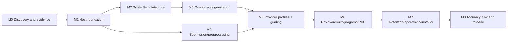

# Development plan and work breakdown

> **Current-flow note (2026-08-06):** Batch, priority, expedite, and automatic
> failover items in the original work breakdown are legacy history, not current
> UI or release requirements. New work uses one provider-neutral durable queue
> of standard requests.

## 1. Delivery strategy

Build Ooki Grader as a sequence of complete vertical slices, not separate piles of UI, database, and AI work. The first useful slice should upload one sample paper, attach it to one manually created grading key, produce deterministic mocked results, review them, and export a PDF. Provider automation is then inserted behind stable task contracts.

Priority:

1. grade/name accuracy and data integrity;
2. teacher workflow simplicity;
3. cost per finalized paper;
4. performance/operability;
5. optional flexibility.

Do not build speculative multi-school/cloud/mobile features during v1.

## 2. Team and schedule assumptions

Recommended core team:

| Role | Allocation |
|---|---:|
| Technical lead/backend/domain | 1.0 |
| Backend/Windows/image pipeline | 1.0 |
| Frontend/UX | 1.0 |
| AI evaluation/QA automation | 1.0 |
| Teacher product owner/domain reviewers | 0.1–0.2 combined |
| Designer/accessibility support | 0.2 during workflow milestones |

Expected elapsed time for a production pilot: **24–28 weeks**, followed by 4–8 weeks of monitored pilot/hardening. This is an estimate after source/test samples are available, not a commitment.

With one full-time engineer, plan roughly 12–18 months and reduce simultaneous scope; do not lower accuracy/integrity gates.

Two-week iterations, weekly teacher demo, daily CI.

## 3. Dependency roadmap



Frontend and backend tasks within milestones can overlap once contracts are frozen.

## 4. Repository structure

Proposed:

```text
/
  OokiGrader.sln
  src/
    OokiGrader.Domain/
    OokiGrader.Application/
    OokiGrader.Infrastructure/
    OokiGrader.Ai.Abstractions/
    OokiGrader.Ai.Gemini/
    OokiGrader.Ai.OpenRouter/
    OokiGrader.Preprocessing/
    OokiGrader.Reporting/
    OokiGrader.Host/
    OokiGrader.Cli/
    OokiGrader.Web/
  tests/
    OokiGrader.Domain.Tests/
    OokiGrader.Application.Tests/
    OokiGrader.Infrastructure.Tests/
    OokiGrader.ProviderContract.Tests/
    OokiGrader.IntegrationTests/
    OokiGrader.E2E/
    OokiGrader.Performance/
    fixtures/
      synthetic/
      provider-responses/
  evaluation/
    schemas/
    prompt-bundles/
    runners/
    reports/              # no private dataset in Git
  installer/
  tools/
  docs/
    specification/
    adr/
    runbooks/
  Directory.Build.props
  Directory.Packages.props
  global.json
```

Private evaluation scans live in an access-controlled external dataset location referenced by manifest hashes, never Git.

## 5. Milestone M0 — Discovery and technical evidence (weeks 1–2)

### Objectives

- validate actual school workflow and inputs;
- remove the highest technical/accuracy uncertainty;
- freeze v1 terminology and provider contracts.

### Tasks

#### M0.1 School samples

- collect school-approved representative blank tests;
- collect tests with model answers filled in;
- collect separate answer keys;
- collect completed student-style scans across scanners/pencils;
- document subjects, question types, pages, volume, peak times;
- identify current roster CSV;
- capture desired report branding.

#### M0.2 Scanner experiment

- test 200/300/400 dpi, grayscale/color;
- quantify file size and handwriting retention;
- select recommended settings;
- validate PDF rasterizer/OpenCV dependencies on Windows service;
- test child-process isolation.

#### M0.3 Provider spike

Build a disposable, non-production evaluator:

- official Gemini standard call;
- official Gemini Batch call;
- OpenRouter `chat/completions`;
- strict structured output on `gemini-3.5-flash-lite` and any separately validated OpenRouter model;
- 10–20 representative template/name/answer samples;
- crop/contact-sheet/full-page comparison;
- usage/cost/latency capture;
- model-answer source provenance prompt;
- Japanese Kanji preservation.

#### M0.4 Dependency/license spike

- PDF rasterizer;
- OpenCV binding;
- Japanese PDF renderer/font embedding;
- SQLite/EF backup behavior;
- installer technology;
- SBOM/license approval.

### Exit

- sample manifest and initial ground truth;
- provider adapter contract;
- baseline prompt/schema v0;
- scanner recommendation;
- dependency/license decisions;
- refined schedule;
- no unresolved feasibility blocker.

## 6. Milestone M1 — Host foundation and vertical skeleton (weeks 3–5)

### Backend

- solution architecture and dependency rules;
- ASP.NET Core Windows service;
- SQLite migrations/WAL/write coordinator;
- ULIDs, UTC clock, result/error conventions;
- file-store abstraction and safe roots;
- durable job/outbox/leases;
- structured logging/correlation;
- health endpoints;
- maintenance mode;
- configuration validation.

### Authentication

- host-only bootstrap;
- staff/roles/password/session/CSRF;
- lockout and audit;
- role-policy contract tests.

### Frontend

- React/TypeScript shell;
- generated API client;
- login/session expiry;
- navigation/role guards;
- Japanese design tokens/components;
- SSE connection/fallback;
- error/empty/loading/status patterns.

### DevOps

- CI build/test/analyzers;
- secret/dependency/license scan;
- unsigned internal Windows service package;
- developer seed/fixture command.

### Vertical slice

- create sample student/template/session;
- upload a small image through resumable API;
- mocked job produces one result;
- teacher finalizes;
- basic result page.

### Exit

- clean Windows VM installs/starts/reboots;
- peer browser connects;
- one vertical slice passes E2E;
- no API key/provider yet;
- architecture fitness tests active.

## 7. Milestone M2 — Roster and template core (weeks 6–8)

### Roster

- student/alias entities and search normalization;
- CRUD/deactivate;
- CSV encoding detection/mapping/staging/transaction;
- collision/duplicate UX;
- role constraints/audit.

### Template source

- template/version/source/page entities;
- upload source roles:
  - blank test;
  - contains model answers;
  - contains non-model answers (ignore visible answers and solve
    independently);
  - separate answer key;
- local page preprocessing;
- page thumbnail/order/rotate;
- version cloning;
- manual question/answer/points/Kanji editor;
- region canvas and keyboard coordinate alternative;
- validation/publish immutability.

### Tests

- Japanese names/CSV;
- four-choice source-role selector and authority semantics;
- region coordinate/property tests;
- immutable published version;
- long template performance.

### Exit

- teacher can create/publish a grading key completely manually;
- source role/provenance persists;
- no AI required.

## 8. Milestone M3 — Automatic grading-key generation (weeks 9–12)

### Provider-neutral task

- `template_extract_v3` canonical input/output;
- strict JSON schema/validators;
- prompt bundle versioning;
- proposal storage separate from draft;
- model-answer source mapping/provenance;
- missing/conflict/unmatched warnings;
- optional non-authoritative solved comparison;
- proposal-to-draft selection.

### Provider implementation

Start with whichever connection won the M0 spike, then implement both before M5 exit:

- direct Gemini standard template call;
- OpenRouter template call;
- generic usage/cost record;
- capability probe;
- retry/error normalization.

### UI

- generate economical/now action;
- proposal vs supplied-answer badges;
- exact source-region link;
- conflict side-by-side resolution;
- per-question verification;
- publish checklist.

### Accuracy iteration

- question detection/text;
- regions;
- supplied answer transcription/mapping;
- prevent supplied-answer overwrite;
- compare PDF vs raster/crop strategies.

### Exit

- both providers pass contract fixtures;
- selected profile meets initial grading-key gates on holdout-sized pilot set or is clearly labeled pilot;
- all published questions teacher-verified;
- supplied-answer authority invariant proven.

## 9. Milestone M4 — Submission ingestion and preprocessing (weeks 10–14, overlaps M3)

### Upload/session

- test sessions/roster/priority;
- resumable chunk protocol;
- hash/signature/limits;
- duplicate content/business detection;
- 30-file board;
- exact lifecycle/SSE.

### Preprocessing

- PDF/image validation and isolated rasterizer;
- orientation/deskew/crop/contrast;
- page matching/order;
- quality metrics;
- template alignment transform;
- answer/name/context crops and contact sheets;
- full-page fallback profile;
- thumbnails;
- retry/operator correction.

### File consistency

- object store;
- file intents/startup reconciliation;
- byte accounting;
- temp cleanup;
- low-disk admission.

### Exit

- 30 representative papers process on target hardware;
- page/crop accuracy supports AI evaluation;
- process kills do not lose acknowledged uploads;
- corrupt/malicious-size files fail safely.

## 10. Milestone M5 — Provider adapters, recognition, and grading (weeks 13–17)

### Common AI application layer

- connection and task-profile entities;
- encrypted secret store;
- profile capability/evaluation/activation;
- canonical AI request/response;
- schema validation;
- usage/pricing/budget ledger;
- provider circuit breakers;
- validated fallback semantics;
- provider simulator.

### Official Gemini adapter

- auth/model probe;
- Files API upload/delete;
- standard `generateContent`;
- JSONL Batch assembly;
- operation reconciliation/poll/output;
- non-idempotent create crash window;
- usage/error normalization;
- provider file cleanup.

### OpenRouter adapter

- bearer auth/model/endpoints probe;
- base64 multimodal `chat/completions`;
- strict `response_format=json_schema`;
- `require_parameters`;
- explicit fallback/routing;
- adaptive queued concurrency;
- error-in-200 and `Retry-After`;
- usage/cost/generation metadata;
- actual route/model capture.

### Name

- `name_transcribe_v1`;
- local normalization/candidate scoring;
- calibration and thresholds;
- expected roster/duplicate conflict;
- name review UX.

### Grading

- deterministic multiple choice/numeric/exact engine;
- Japanese normalization/Kanji policy;
- `answer_transcribe_grade_v1`;
- rubric/semantic result;
- confidence feature/calibration;
- unreadable/blank;
- immutable grading run/results.

### Exit

- both provider connections are configurable/testable;
- provider-neutral Gemini/OpenRouter standard queued paths pass fault tests;
- candidate active profiles pass applicable calibration gates;
- no model calculates total/finalizes;
- budget hard stop works.

## 11. Milestone M6 — Teacher review, results, progress, and PDF (weeks 18–20)

### Review

- name review;
- question-first and paper-first grading review;
- claim/revision conflicts;
- answer/crop/rubric side-by-side;
- override reason/revision;
- duplicate submission resolution;
- finalize/reopen/void/regrade.

### Results

- exact total/current revision;
- result detail/history;
- scan-deleted state;
- progress projection and invalidation;
- inclusive date/subject/category filters;
- graph/table accessibility.

### PDF

- Japanese template/font embedding;
- question text from exact template version;
- answer/result/score;
- page-break rules;
- async render/provenance/hash;
- superseded report behavior.

### Exit

- teacher UAT completes full workflow;
- correction never loses history;
- all total/progress invariants;
- PDF visual/glyph tests pass.

## 12. Milestone M7 — Retention, administration, installer, and recovery (weeks 21–23)

### Storage/retention

- managed class counters;
- warning/low/hard thresholds;
- three-calendar-month selection;
- two-phase manifests;
- quota oldest-first cleanup;
- physical reserve/admission;
- deletion reconciliation/audit;
- deleted result UX.

### Operations

- health/admin dashboards;
- jobs/dispatch/batch diagnostics;
- provider connection/profile UI;
- budgets/usage;
- backup/verify/restore;
- integrity checks;
- diagnostic bundle;
- certificate warnings.

### Deployment

- signed internal installer;
- service identity/ACL;
- CA/certificate/firewall/DNS scripts;
- upgrade/rollback;
- peer package;
- commissioning report.

### Exit

- clean install/upgrade/restore on Windows 11;
- 150 GiB synthetic quota test;
- scan deletion preserves grades/reports as specified;
- operational runbooks executed.

## 13. Milestone M8 — Evaluation, pilot, and release (weeks 24–28+)

### Evaluation

- finish minimum golden dataset;
- evaluate direct Gemini and OpenRouter candidate profiles;
- choose per-task defaults by accuracy/ease/cost;
- calibrate name/grading confidence;
- benchmark input context strategies;
- run adversarial/model-answer challenge set;
- produce signed evaluation reports.

### Pilot

Start with:

- one class or course;
- teacher review required for every paper;
- no auto-finalization;
- name auto-assignment off until precision is proven;
- daily support/metric review;
- dual manual/legacy grade comparison for sampled papers.

Expand only after gates.

### Hardening

- fix top override/error causes;
- optimize teacher review;
- tune concurrency/cost;
- run performance/resilience/security baseline;
- documentation/training;
- backup/restore drill;
- release candidate/rollback rehearsal.

### Exit

- quality gates in testing spec;
- UAT and school sign-off;
- production installer signed;
- provider budgets/keys/profiles commissioned;
- support ownership and recovery documented.

## 14. Work breakdown by epic

### EP-01 Platform

- architecture projects/dependency tests;
- configuration/migrations;
- job/outbox;
- time/IDs/errors;
- health/logging.

### EP-02 Identity

- bootstrap;
- staff/roles;
- sessions/CSRF;
- audit actor.

### EP-03 Roster

- students/aliases;
- CSV;
- search;
- matching projections.

### EP-04 Grading key

- four source roles and answer-authority rules;
- page/region/editor;
- questions/answers/rubrics/Kanji;
- AI proposals/provenance/conflicts;
- publish/version.

### EP-05 Ingestion

- sessions;
- resumable upload;
- object store/dedup;
- preprocessing/quality/alignment;
- status/recovery.

### EP-06 AI platform

- connections/secrets;
- profiles/prompts/schemas;
- Gemini direct;
- OpenRouter;
- usage/cost/budgets;
- evaluation activation.

### EP-07 Recognition/grading

- name transcription/local match;
- deterministic graders;
- semantic proposal;
- confidence/review;
- runs/revisions/totals.

### EP-08 Results

- finalize/reopen/regrade;
- progress;
- PDF/export.

### EP-09 Operations

- retention/quota;
- backup/restore;
- jobs/health;
- installer/update/diagnostics.

### EP-10 Quality

- fixtures/simulators;
- golden dataset/evaluator;
- E2E/performance/resilience;
- teacher UAT.

Each story links to FR/NFR IDs and tests.

## 15. Feature flags

Server-side, admin-only:

- `Ai.TemplateGeneration`;
- `Ai.GeminiDirect`;
- `Ai.OpenRouter`;
- `Ai.ValidatedFailover`;
- `Recognition.AutoAssign`;
- `Grading.Semantic`;
- `Grading.AutoFinalize`;
- `Input.FullPageFallback`;
- `Retention.Proactive145GiB`;
- `Reports.Pdf`.

Flags cannot bypass security, score constraints, template publication, audit, or hard disk reserve. Pilot defaults keep auto-assign/finalize off.

## 16. Coding and review standards

- nullable/type safety enabled;
- no synchronous blocking of async I/O;
- cancellation and explicit timeouts for external/native work;
- dependency injection at module boundaries;
- no provider DTOs in domain;
- no raw paths outside file-store module;
- no binary floating score;
- no unversioned prompt/schema/job payload;
- no logger interpolation of domain text;
- exhaustive state/enum handling;
- database transaction boundary documented;
- every job handler states idempotency;
- migrations and public API reviewed by two engineers;
- grading/Kanji policy changes reviewed with a teacher and tests.

## 17. Definition of done

A change is done only when:

- requirement/acceptance criteria are linked;
- Japanese UX copy is final enough for test;
- unit/component/integration/E2E coverage is appropriate;
- accessibility/keyboard behavior checked;
- failure/idempotency/retry considered;
- audit/data/retention/usage implications declared;
- metrics/logs contain no content leakage;
- docs/OpenAPI/migration/fixtures updated;
- provider-specific behavior has simulator tests;
- code review and CI pass;
- teacher demo/sign-off when business behavior changes.

## 18. Release branch and versioning

- trunk-based development with short branches;
- semantic application versions;
- database migration sequence embedded;
- prompt/schema/pipeline versions independent and recorded;
- provider task-profile revisions are data/configuration, activation audited;
- release candidate tags immutable;
- hotfix retains compatibility and runs targeted full invariants.

## 19. Rollout stages

### Lab

Synthetic/de-identified data, both providers, unrestricted debugging. No operational grades.

### Shadow pilot

Real workflow with teacher manual grade as authority; compare AI invisibly or clearly as draft.

### Assisted pilot

AI drafts visible; all papers teacher-finalized; no automatic identity until calibrated.

### Limited production

High-confidence objective questions may pass without per-question review; paper still teacher-finalized.

### General school use

Optional auto-finalization only after sustained precision and school approval. Drift monitoring can automatically fall back to review.

## 20. Post-launch maintenance

Weekly first month, then monthly:

- teacher correction reasons;
- name/grade precision sample;
- provider model/route changes;
- cost per paper;
- queue/latency;
- scan quality;
- storage/backup;
- dependency/provider deprecations.

Quarterly:

- golden-set regression;
- restore drill;
- installer/update test;
- profile/cost comparison;
- training/help review.

Never switch to a newer/cheaper model solely because it appears in a provider list.
