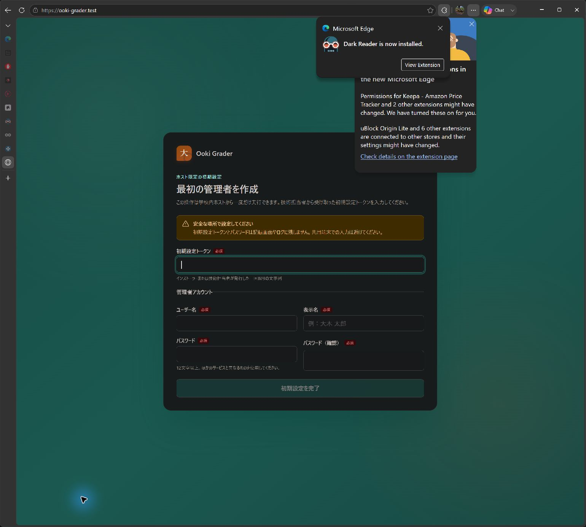
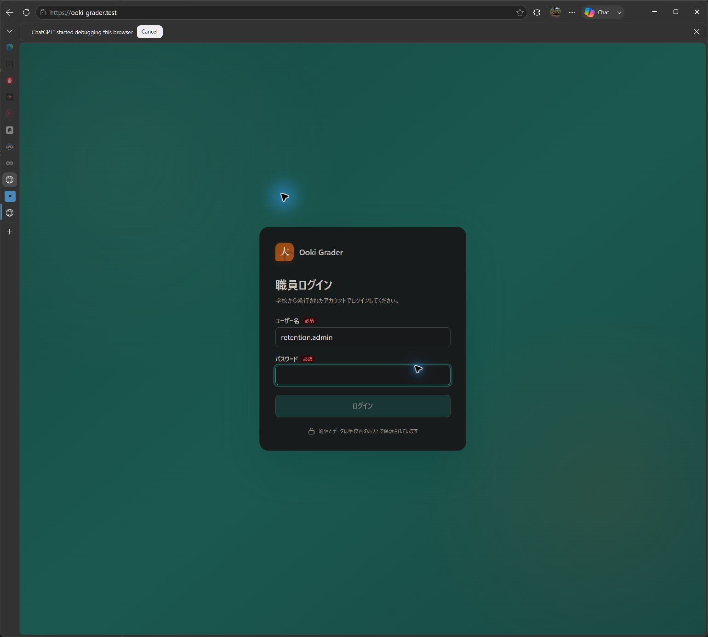
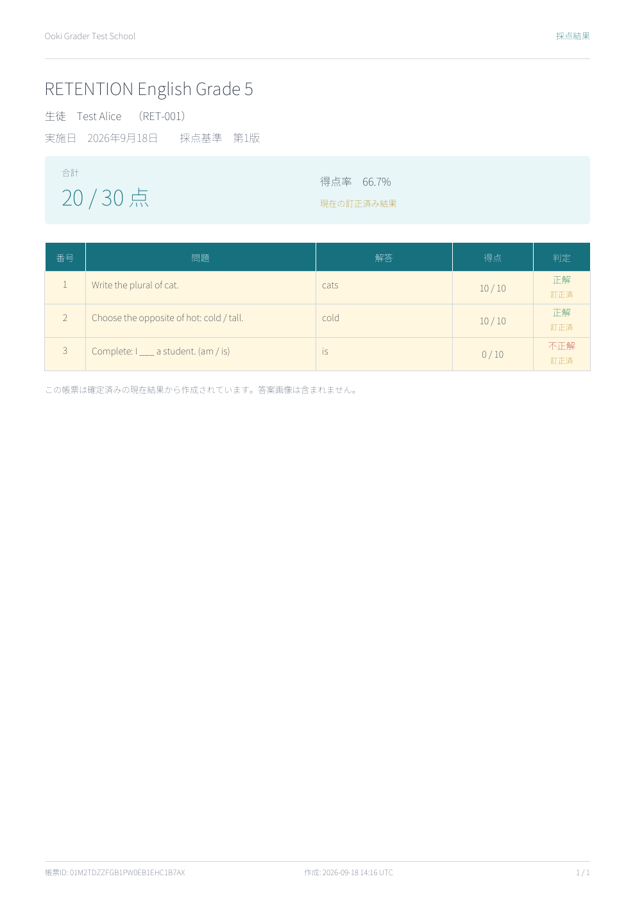

# Gemini 3.8 fix and full automated retest

Date: 19 September 2026, Asia/Tokyo.

**Expanded follow-up:** [134-page real-life workflow and test guide](../../../output/pdf/OokiGrader-Real-Life-Workflow-and-Test-Guide-2026-09-19.pdf?raw=true), with [new evidence and detailed results](workflow/README.md). This follow-up adds 64 original screenshots, 50 workflows and 38 live API assertions. It reproduces two UI defects. It also corrects any earlier inference that HTTP 200 proved installed School Manager or class-matrix API availability: those routes return the HTML application shell on installed 0.9.8, not JSON.

[Download the comprehensive 15-page PDF report with screenshots](../../../output/pdf/OokiGrader-Comprehensive-Test-Report-2026-09-19.pdf?raw=true).

**Code fix and automated validation: PASS. Installed upgrade, seeded retention comparison, and live end-to-end validation: INCOMPLETE.**

## Changes

- The shared model catalog recognizes Gemini 3.8 Flash, including preview/version suffixes and case-insensitive names, as not supporting MINIMAL thinking. Image capability probes, batch capability probes, and newly configured non-template task profiles therefore use LOW. Template extraction retains MEDIUM.
- Gemini 3.7 classification now uses its explicit family name rather than depending on a default-model constant that may change independently.
- Regression tests inspect the actual outgoing HTTP probe payload, exercise automatic activation of all four profiles for 3.8, and verify changing a connection to 3.8 retains its stored credential.
- Regenerated the committed OpenAPI client to include School Manager settings/delivery endpoints and its settings request type. This resolves the previously observed generated-client drift.

The fix follows [Google's Gemini 3.8 documentation](https://ai.google.dev/gemini-api/docs/models/gemini-3.8-flash), which supports LOW/MEDIUM/HIGH and rejects MINIMAL. The previous day's live request also demonstrated that rejection.

The tested source changes are based on commit 9e2490aaeab3018846e39f5afdc5678a0bd85406 and are included with this report. The local installer was built from that base plus thinking-fix.patch before the changes were committed. Publishing this report does not mean the installed update or remaining live checks have completed.

## Executed checks

| Check | Result |
|---|---|
| Entire .NET solution, Release | 1,078 passed, 0 failed, 7 skipped |
| Frontend suite | 178 passed across 26 files |
| Frontend type check | Passed, including after generated-client update |
| Frontend production build | Passed; existing chunk-size warning remains |
| OpenAPI generated-client drift | Passed |
| Installer source parsing | Passed |
| git diff --check | Passed |
| Local Windows package build | Passed: 0.9.15-local.1 |
| Complete package checksum validation | Passed: 513 files |
| Live fixed Gemini capability probe | Provider unavailable; no successful image-generation/grading result claimed |
| Installed fixed update | Not run: Windows canceled UAC launch |
| Seeded update retention | Not run; populated 0.9.8 remains intact |

Total automated passes: **1,256**, ten more than the previous run due to the added regression cases. Seven skipped tests still require live provider/accuracy or external handwriting fixtures. The normal solution run did not inject the real API key into those tests or mislabel their skips as passes.

Commands and results are preserved in dotnet-test.log, test-results/*.trx, frontend-*.log, openapi-check.log, package-build.log and package-verification.json.

## School Manager automation

**25 relevant checks passed:** 16 School Manager unit cases, one encrypted-persistence case, and eight automation integration cases. See school-manager-test-results.json for individual names.

Coverage includes exact recipient identity matching and ambiguity rejection; grade/class filtering; removal of student identifiers from distributable tables; workbook validation; PDF rendering; encrypted settings and queue persistence; one combined PDF/delivery for eligible finalized results; exclusion of historical finalized results; recovery after invalid imports; dry-run validation without marking delivery sent; Tokyo daily limits; and reserving limits after interrupted or unknown delivery outcomes.

The integration tests substitute the external School Manager client. They do **not** prove the current live site's login/selectors, real guardian records, file upload or send behavior. A dedicated test account and dummy student/guardian were requested but not provided. No guardian messages were sent, and no live recipient-selection success is claimed.

## Live Gemini boundary

An external console harness referenced the newly compiled provider DLLs and read the supplied API key through standard input. The recorded result confirms supportsMinimal=false for gemini-3.8-flash, but the provider returned gemini_provider_unavailable. Evidence: live-fixed-probe.json. A later retry exceeded the automation tool's timeout and its result was not captured; it is inconclusive, not a pass.

Accordingly, successful live template extraction, rotation analysis, name transcription, grading, adjudication and batch processing remain unverified. The passing regression tests establish the requested thinking configuration and profile behavior, not provider accuracy or current availability.

## Installed-app and retention boundary

The installed service remains the restored **0.9.8** instance. It contains the previous day's synthetic administrator, three students, a student alias, uploaded source sheets, a published three-question template, a three-student roster, one preprocessed completed paper, three teacher corrections, a finalized 20/30 result, and a verified one-page PDF. The API credential is already in its encrypted store. None of these data were discarded during this turn.

The newly built package remains in the local evidence directory at releases/OokiGrader-0.9.15-local.1-win-x64; installer binaries are not included in the downloadable report bundle. It is an unsigned local test build, not a published upstream release. Its provenance is the base commit plus thinking-fix.patch, with all file hashes recorded in its release inventory.

Update-Fixed-WithCheckpoint.ps1 is prepared to stop the service, enter maintenance using the official offline command, require populated fixture tables, inventory row/file hashes, copy and hash-verify a protected cold checkpoint, and run the documented updater. The normal Windows RunAs launch returned 'The operation was canceled by the user.' No elevation bypass or repeat launch followed that cancellation.

Test-Installed-AfterUpdate.ps1 is prepared to compare retained students, aliases, template/questions, original image bytes, school settings, finalized score and report PDF bytes; test credential decryption/authentication; and exercise installed feature endpoints and security checks. It has not executed against the fixed installed package.

Before-update artifacts were copied from the prior evidence directory for comparison. Their filenames ending in '-before' are historical baseline evidence, not new post-update results. No new successful application screenshot is claimed.

## Remaining work

1. Approve a new Windows UAC launch of the prepared fixed updater, then run the seeded retention and installed feature checks.
2. Retry Gemini 3.8 when the provider is available, activate the retained connection with testAndEnable, and execute the live synthetic-paper workflows.
3. Supply a School Manager test account and dummy recipient for live dry-run. Actual sending needs explicit authorization for that dummy recipient.

Passwords, API keys, session cookies and credential envelopes are excluded from the evidence files and bundle.

## Download and screenshots

[Download the full report and evidence ZIP](OokiGrader-Full-Test-Report.zip?raw=true). The archive includes this report, all nine .NET TRX files, test/build logs, safe result summaries, test scripts, the source patch, synthetic baseline data and fixtures, the exported baseline PDF, and the three screenshots below. It excludes installed databases, credentials, cookies, and release binaries.

These screenshots were captured on 18 September before the fixed update. They document the initial setup screen, the seeded instance login screen, and the exported synthetic result. They do not demonstrate successful post-update retention or live AI/School Manager behavior.

### Initial setup screen

### Seeded instance login screen

### Exported synthetic result

